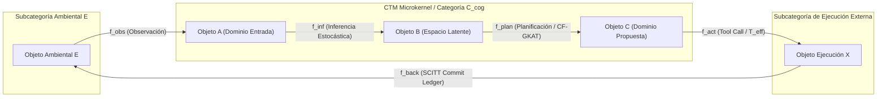
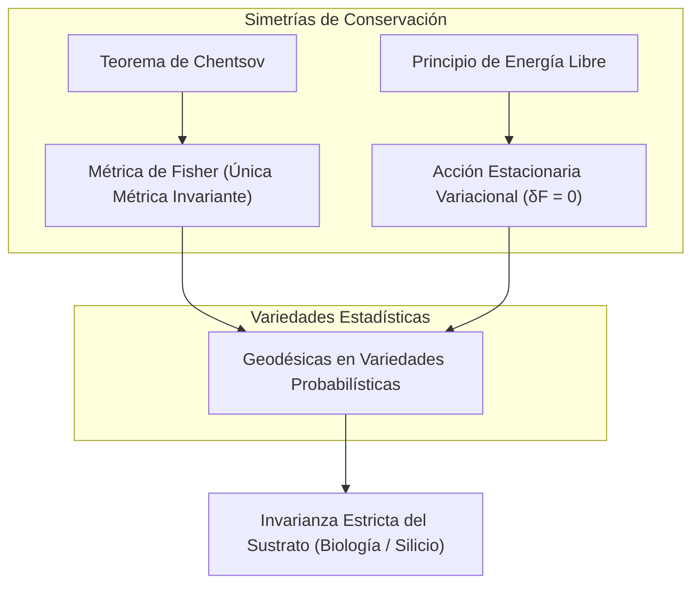

<!-- C5-REAL EXERGY CERTIFIED -->
# Cognitive Transition Machine (CTM) & Kernel Categórico
## Teoría Axiomática de Transformaciones e Invariantes de Información
### De la Empírica del "Prompt Engineering" a la Geometría de Inferencia Independiente del Sustrato

**Arquitectura:** Teorema-Robinson-Moskv / CORTEX ENGINE
**Versión:** 3.0.0 (C5-REAL / Categorical & Epistemic Security Engine)
**Dominio:** Ciencias Computacionales, Física de la Información, Categorías, Neurociencia y Justicia

---

## 1. Inversión Paradigmática: La Transformación como Única Primitiva Ontológica

La investigación contemporánea en inteligencia artificial y arquitectura de software sufre de una frágil dependencia del sustrato tecnológico, construyendo conceptos de abajo hacia arriba a partir de artefactos temporales (LLMs, redes neuronales, bases de datos o pipelines de Von Neumann). La ontología tradicional asume una progresión secuencial secundaria:

$$\text{Realidad} \longrightarrow \text{Eventos} \longrightarrow \text{Estado} \longrightarrow \text{Proyección}$$

Para cimentar un marco composicional universal, la **Máquina de Transiciones Cognitivas (CTM v3.0)** invierte esta direccionalidad, adoptando un formalismo euclidiano y categórico *top-down*. Se postula una hipótesis unificadora estricta:

> **Axioma Fundamental:** La única primitiva ontológica y matemática indivisible de un Sistema Cognitivo Computacional es la **Transformación**.

Un sistema cognitivo se define puramente como una categoría pequeña $\mathcal{C}_{cog}$ compuesta por una clase de objetos $\operatorname{Ob}(\mathcal{C}_{cog})$ (que actúan meramente como índices topológicos o dominios de definición) y morfismos $f \in \operatorname{Hom}_{\mathcal{C}_{cog}}(A, B)$ que encapsulan la totalidad de la sustancia operativa.



---

## 2. Deconstrucción Deductiva de las Primitivas Secundarias

Bajo la exigencia de la prueba de fuego categórica, las nociones tradicionales previamente asumidas como primitivas (*estado*, *memoria*, *contexto*, *agente*) son eliminadas como contenedores y reconstruidas algebraicamente:

### 2.1 El Estado: Morfismos Identidad y Puntos Fijos de Lawvere
El "estado" no existe como un espacio físico de memoria RAM o disco. Es el **acto dinámico continuo de autorreferencia con varianza nula**. Para cada objeto $A$, el estado es la aplicación sostenida del morfismo identidad $1_A : A \to A$.

Bajo el **Teorema del Punto Fijo de Lawvere**, en un endofuntor cognitivo $F: \mathcal{C}_{cog} \to \mathcal{C}_{cog}$, un estado estacionario u observable $X^*$ surge cuando satisface el isomorfismo:

$$F(X^*) \cong X^*$$

Lo que empíricamente se percibe como estado es el atractor algebraico estabilizado por la dinámica del endofuntor.

---

### 2.2 La Memoria: Operador Comonádico Store y Colímites MES
La memoria deshecha el modelo de repositorio o almacén de vectores. Se formaliza mediante los **Sistemas Evolutivos de Memoria (MES)** de Ehresmann y el operador universal del **Colímite Categórico**:

$$\operatorname{colim} D = \left( \sum_{i} A_i \right) / \sim$$

En semántica funcional, la reconstrucción temporal del contexto se rige por la **Comónada Store**:

$$\operatorname{Store}_S(A) = (S \to A) \times S$$

* **Counidad (get / $\epsilon$):** $\epsilon(\mathbf{s}) = g(s)$ (Extrae la evaluación emergente del foco actual).
* **Coduplicación (duplicate / $\delta$):** Proyecta la trayectoria histórica recontextualizando el foco dinámico.

---

### 2.3 El Contexto: Lentes Bayesianas y Funtores Adjuntos
El contexto no es una caja delimitadora de tokens. Es una subvariedad topológica materializada por un par de funtores adjuntos $L \dashv R$ mediante **Lentes Ópticas Bayesianas**:

$$\mathbf{Lens}((X, S), (Y, R)) = \operatorname{Hom}(X, Y) \times \operatorname{Hom}(X \times R, S)$$

* **Vista Directa (Forward Pass $v$):** $v: X \to Y$ (Proyecta la distribución contextual a través de un canal de Markov).
* **Actualización Inversa (Backward Update $u$):** $u: X \times R \to S$ (Propaga el error condicionado hacia atrás).

---

### 2.4 El Agente: Coálgebra sobre Funtores Polinómicos ($\mathbf{Poly}$)
El homúnculo voluntario queda disuelto. Un "agente" se reconstruye formalmente como una coálgebra $(S, \alpha)$ sobre un funtor polinómico $p \in \mathbf{Poly}$:

$$p(y) = \sum_{i \in p(1)} y^{p[i]} \quad \implies \quad \alpha : S \longrightarrow \sum_{i \in p(1)} S^{p[i]}$$

Donde $p(1)$ denota el fenotipo de salidas/posiciones observables y $p[i]$ el espectro de entradas/direcciones aceptadas. La agencia es la política emergente sobre esta interfaz polinómica.

---

## 3. Invariantes Universales de la Cognición Computacional



### 3.1 Teorema de Chentsov y la Geometría Informacional
Cualquier inferencia cognitiva opera sobre variedades estadísticas. El **Teorema de Chentsov** demuestra que la **Métrica de Información de Fisher** $g^{FR}$ es la *única* métrica Riemanniana invariante bajo morfismos de Markov (estadísticas suficientes):

$$g_{ij}^{FR}(\theta) = \int p(x; \theta) \left( \frac{\partial \log p(x; \theta)}{\partial \theta^i} \right) \left( \frac{\partial \log p(x; \theta)}{\partial \theta^j} \right) dx$$

La distancia informacional entre representaciones no sufre distorsión bajo transformaciones reductoras sin pérdida termodinámica, independientemente del hardware subyacente.

### 3.2 Principio de Acción Estacionaria Variacional ($\delta F = 0$)
El CTM minimiza la Energía Libre Variacional $F$ (diferencia entre el error de predicción e incertidumbre):

$$\delta F = 0$$

Toda trayectoria cognitiva sigue flujos geodésicos en variedades de Fisher para alinear los límites informacionales del modelo con el entorno.

---

## 4. El Runtime CTM: Operaciones, CF-GKAT y SCITT Commit Gate

Traduciendo la teoría matemática en un kernel ejecutable:

1. **Álgebra de Trazas de Mazurkiewicz:** La concurrencia de transiciones $T_1 \perp T_2$ se permite si sus conjuntos de lectura/escritura en el hipergrafo son disjuntos, garantizando confluencia causal.
2. **Effect Typing ($T_{pure}$ vs $T_{eff}$):**
   * **$T_{pure}$:** Transiciones de inferencia y lectura puras (paralelizables y forkeables por especulación).
   * **$T_{eff}$:** Transiciones con mutación de entorno. Requieren Two-Phase Commit (`INTENT` + `RESULT`).
3. **CF-GKAT & Hipótesis de Hoare:** El Microkernel en Rust valida precondiciones lógicas antes de la inferencia. Ante incertidumbre (`UnknownPrecondition`), el sistema suprime los efectos ($T_{eff}$) y degrada a *Exploración de Markov*.
4. **Varentropía y Cross-Examination:** Se mide la varianza de la entropía predictiva. Si una transición propone un efecto $T_{eff}$ con baja varentropía pero alto riesgo, se exige un `[Knowledge Proof]` anclado al Hipergrafo.
5. **Commit Gate (SCITT IETF RFC 9943/9942):** Ninguna mutación se consolida sin pasar por el Commit Gate, registrando un recibo criptográfico en el Ledger inmutable.

---

## 6. Corolarios de la Arquitectura de Software

Las tecnologías de diseño contemporáneas se derivan como corolarios directos de la teoría:

| Patrón Implementacional | Corolario Categórico y Algebraico | Expresión Formal |
| :--- | :--- | :--- |
| **Event Sourcing** | Pliegue funtorial sobre una categoría libre de morfismos. | $\text{Estado} = \operatorname{colim}_{\mathcal{C}_{free}} (e_1 \xrightarrow{f_1} e_2 \dots)$ |
| **CQRS** | Factorización de morfismos por funtores adjuntos (Lentes separadas $L \dashv R$). | $\operatorname{Hom}_{\text{Read}}(L(A), B) \cong \operatorname{Hom}_{\text{Write}}(A, R(B))$ |
| **CRDTs** | Morfismos monótonos actuando sobre Join-Semilattices. | $a \vee (b \vee c) = (a \vee b) \vee c, \quad a \vee a = a$ |
| **Merkle DAGs** | Funtor preservador de estructura hacia espacio probabilístico verificable. | $F_{hash} : \mathcal{C}_{cog} \to \mathbf{HashSpace}$ ($\mathcal{O}(1)$ Isomorfismo) |

---

## 7. Mapeo Sistémico Multidisciplinar

```mermaid
quadrantChart
    title Mapeo Multidisciplinar de las Primitivas Categóricas CTM v3.0
    x-axis Invariantes Informacionales --> Morfismos Dinámicos
    y-axis Estructura Abstracta --> Implementación Concreta
    quadrant-1 Física Teórica / Geometría
    quadrant-2 Matemáticas Puras / Categorías
    quadrant-3 Ciencias Cognitivas / Biomedicina
    quadrant-4 Arquitectura de Software / LegalTech
    Teorema de Chentsov: 0.25, 0.85
    Acción δF = 0: 0.40, 0.75
    Punto Fijo Lawvere & Poly: 0.15, 0.90
    Comónadas Store & MES: 0.35, 0.95
    Inferencia Activa Neural: 0.75, 0.40
    Sistemas Evolutivos de Memoria: 0.70, 0.35
    Event Sourcing & CQRS: 0.85, 0.15
    Contratos Lente LegalTech: 0.90, 0.25
```

1. **Matemáticas Puras:** Dualidad de Lawvere, funtores polinómicos $\mathbf{Poly}$, comónada Store y CF-GKAT.
2. **Física Teórica:** Variedades estadísticas de Fisher-Rao, Teorema de Chentsov y Principio de Energía Libre ($\delta F = 0$).
3. **Ciencias Cognitivas & Biomedicina:** Sistemas Evolutivos de Memoria (MES) y dinámica homeostática neurobiológica.
4. **Arquitectura de Software:** Event Sourcing, CQRS, CRDTs, Merkle DAGs y Commit Gates SCITT (IETF RFC 9943).
5. **Justicia & LegalTech:** Contratos e instituciones jurídicas como *Lentes Bayesianas Dependientes* que preservan invariantes normativos e institucionales.

---

> [!TIP]
> **Conclusión Maestra:** La Teoría Axiomática de Transformaciones unifica la ciencia de la cognición y la arquitectura de computadores en una sola disciplina matemática, eliminando la necesidad de heurísticas ad-hoc y garantizando la validez formal, termodinámica y forense de los sistemas diseñados bajo el paradigma del CTM Engine.

---
*Documento cristalizado bajo la iteración CTM v3.0 (C5-REAL / Epistemic Security & Categorical Engine).*
