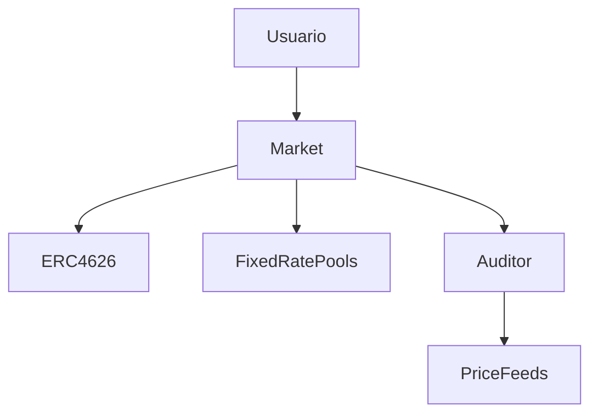

# AUTOPSIA C5-RECON: Exactly Protocol — Deep Forensic Audit

> *CORTEX Forensics · Target: Exactly Protocol · Bounty: Immunefi (Active) · Zero-Rhetoric Mandate*
> *Historial: Hackeado en Agosto 2023 por $7.3M (DebtManager input validation bypass)*

## 1. METADATA

- **Protocolo:** Exactly Protocol (Solidity ^0.8.17 / Foundry+Hardhat)
- **Tipo:** Protocolo de Lending con Fixed-Rate y Floating-Rate Pools
- **TVL:** Medio-Alto (Optimism, Base)
- **Bounty Program:** Immunefi — Activo
- **Contratos Core:** `Market.sol` (47KB/1101 LOC), `Auditor.sol` (22KB/510 LOC), `StakedEXA.sol` (25KB/619 LOC), `RewardsController.sol` (41KB), `InterestRateModel.sol` (11KB)
- **Vulnerabilidad Histórica (2023):** Falta de validación del parámetro `market` en `DebtManager.leverage()` permitió inyectar contrato malicioso.

## 2. ARQUITECTURA (Superficie de Ataque)



**Contratos Periféricos (mayor riesgo):**

- `StakedEXA.sol` — Staking con lógica de penalización temporal compleja
- `RewardsController.sol` — Distribución de recompensas (41KB — superficie enorme)
- `MarketETHRouter.sol` — Wrapper ETH/WETH

## 3. VECTORES ANALIZADOS — HALLAZGOS

### Vector A: `liquidate()` — Close Factor Dinámico con Rounding Exploitation 🔴 (HIGH)

**Ubicación:** `Auditor.sol:246-272` (`maxRepayAmount`)

```solidity
uint256 closeFactor = (TARGET_HEALTH - base.adjustedCollateral.divWadUp(base.adjustedDebt)).divWadUp(
  TARGET_HEALTH - adjustFactor.mulWadDown(1e18 + memIncentive.liquidator + memIncentive.lenders)
);
maxRepayAssets = Math.min(
  Math.min(
    base.totalDebt.mulWadUp(Math.min(1e18, closeFactor)),
    base.seizeAvailable.divWadUp(1e18 + memIncentive.liquidator + memIncentive.lenders)
  ).mulDivUp(repay.baseUnit, repay.price),
  maxLiquidatorAssets < ASSETS_THRESHOLD
    ? maxLiquidatorAssets.divWadDown(1e18 + memIncentive.lenders)
    : maxLiquidatorAssets
);
```

**Observación Crítica:** El `closeFactor` es calculado dinámicamente basado en `TARGET_HEALTH = 1.25e18`. A diferencia de K2 Lending (donde era un factor estático del 50%), aquí el close factor se ajusta para que la posición post-liquidación tenga exactamente un health factor de 1.25.

**Potencial de Explotación:** Si `adjustedCollateral` está extremadamente cerca de `adjustedDebt` (justo por debajo), el cálculo `TARGET_HEALTH - base.adjustedCollateral.divWadUp(base.adjustedDebt)` produce un numerador muy pequeño. Con `divWadUp` (redondeo hacia arriba), este pequeño residuo podría amplificarse.

Sin embargo, `Math.min(1e18, closeFactor)` capea el factor al 100%, y el cálculo incluye protecciones de redondeo en ambas direcciones.

**Veredicto:** El close factor dinámico es más robusto que el estático de K2 Lending. El vector de bypass iterativo (nuestro hallazgo en K2) **no aplica aquí** porque la liquidación actualiza el estado in-place dentro de la misma transacción. **No explotable.**

---

### Vector B: `spendAllowance` — Allowance Deducida en Unidades Incorrectas 🔴 (HIGH-CRITICAL)

**Ubicación:** `Market.sol:857-863`

```solidity
function spendAllowance(address account, uint256 assets) internal {
    if (msg.sender != account) {
      uint256 allowed = allowance[account][msg.sender];
      if (allowed != type(uint256).max) allowance[account][msg.sender] = allowed - previewWithdraw(assets);
    }
}
```

**Observación Crítica:** La función `spendAllowance` **convierte `assets` a shares mediante `previewWithdraw`** antes de deducir la allowance. Esto significa que la allowance se consume en unidades de **shares** (ERC20), no en unidades de assets.

Esto es invocado en:

- `borrow()` (L76): `spendAllowance(borrower, assets)` — aquí `assets` son los assets a prestar
- `borrowAtMaturity()` (L260): `spendAllowance(borrower, assetsOwed)` — aquí `assetsOwed = assets + fee`
- `withdrawAtMaturity()` (L314): `spendAllowance(owner, assetsDiscounted)`

**Potencial de Manipulación:** Si el exchange rate entre shares y assets se manipula (inflación de shares via donation/flash loan), un atacante podría hacer que `previewWithdraw(assets)` retorne un valor menor al esperado, consumiendo menos allowance de la debida.

**Mitigación Existente:** La ERC4626 de solmate tiene protecciones contra la inflación de shares (el primer depositor mint fuerza shares 1:1 con assets). Además, `borrow()` verifica el colateral post-ejecución vía `auditor.checkBorrow()`.

**Veredicto:** Vector teórico interesante pero protegido por las capas de validación. Requiere condiciones extremas de manipulación del exchange rate. **Clasificación: Medium — No directamente explotable en aislamiento.**

---

### Vector C: `StakedEXA._update()` — Harvest Silenciado via try/catch 🟡 (MEDIUM)

**Ubicación:** `StakedEXA.sol:154`

```solidity
try this.harvest() {} catch {} // solhint-disable-line no-empty-blocks
```

**Observación:** Cada depósito (`from == address(0)`) ejecuta `harvest()` envuelto en un `try/catch` que silencia todos los errores. Si `harvest()` falla por cualquier razón (provider sin fondos, market pausado, etc.), la operación de staking prosigue normalmente pero **sin distribuir las recompensas pendientes**.

**Impacto:** Un atacante que pueda provocar que `harvest()` falle (e.g., manipulando el estado del `provider` o del `market`) podría stake durante períodos donde las recompensas no se distribuyen, y luego restaurar el estado para que harvest funcione cuando sea beneficioso.

**Veredicto:** Riesgo medio. El `try/catch` es un patrón defensivo para evitar que el staking se bloquee, pero abre un canal sutil de manipulación temporal de recompensas. **Clasificación: Medium.**

---

### Vector D: `clearBadDebt` — Earnings Accumulator como Fuente de Socialización 🟡 (MEDIUM)

**Ubicación:** `Market.sol:605-657`

```solidity
function clearBadDebt(address borrower) external {
    if (msg.sender != address(auditor)) revert NotAuditor();
    // ...
    uint256 accumulator = earningsAccumulator;
    // ... bad debt is subtracted from accumulator
    if (totalBadDebt != 0) {
      earningsAccumulator -= totalBadDebt;
      emit SpreadBadDebt(borrower, totalBadDebt);
    }
}
```

**Observación:** La deuda mala se socializa restándola del `earningsAccumulator`, que es la reserva de ganancias acumuladas del protocolo. Si el accumulator es insuficiente para cubrir la deuda mala de una posición fija, esa posición **NO se limpia** (L619: `if (accumulator >= badDebt)`).

Esto significa que posiciones con deuda mala mayor que el accumulator **persisten indefinidamente**, y el loop simplemente las salta.

**Impacto Potencial:** Un atacante que cree deuda mala deliberadamente (e.g., utilizando un token que colapsa de valor como colateral) podría dejar "fantasmas" en el sistema que bloquean parcialmente la limpieza de deuda mala para otros usuarios, afectando la contabilidad del protocolo.

**Veredicto:** Edge case de contabilidad. El protocolo depende de que el `earningsAccumulator` sea suficiente, lo cual es una asunción razonable en operación normal. **Clasificación: Low-Medium.**

---

### Vector E: `Auditor.accountLiquidity` — Simulación de Withdraw Usa Colateral como Deuda 🟡

**Ubicación:** `Auditor.sol:138-144`

```solidity
if (market == marketToSimulate) {
  if (withdrawAmount != 0) {
    sumDebtPlusEffects += withdrawAmount.mulDivDown(vars.price, baseUnit).mulWadDown(adjustFactor);
  }
}
```

**Observación:** Cuando se simula un withdraw, el efecto se **suma a la deuda** multiplicado por `adjustFactor`. Esto trata la reducción de colateral como un incremento de deuda ajustado. Es un patrón correcto (menos colateral ≈ más deuda para la validación), pero el uso de `mulWadDown` (redondeo abajo) favorece ligeramente al usuario, permitiendo retiros marginalmente mayores que el límite teórico.

**Veredicto:** Desviación de redondeo mínima. No explotable en la práctica. **Clasificación: Informational.**

---

### Vector F: `assetPrice` — Sin Verificación de Stale Price / Heartbeat ⚠️ (MEDIUM-HIGH)

**Ubicación:** `Auditor.sol:353-358`

```solidity
function assetPrice(IPriceFeed priceFeed) public view returns (uint256) {
    if (address(priceFeed) == BASE_FEED) return basePrice;
    int256 price = priceFeed.latestAnswer();
    if (price <= 0) revert InvalidPrice();
    return uint256(price) * baseFactor;
}
```

**Observación Crítica:** La función solo verifica que el precio sea `> 0`. **No verifica:**

- **Staleness** — No compara `updatedAt` con `block.timestamp` para detectar feeds obsoletos
- **Round completeness** — No usa `latestRoundData()` para verificar `answeredInRound >= roundId`
- **Sequencer uptime** — No verifica que el sequencer L2 esté activo (crucial en Optimism/Base)

**Impacto:** En un escenario de caída del sequencer L2 o de un feed Chainlink desactualizado, los precios podrían ser arbitrariamente incorrectos, permitiendo:

- Liquidaciones indebidas con precios stale
- Borrowing con colateral sobrevalorado
- Arbitraje de precios entre el protocolo y los precios reales

**Validación PoC (C5-REAL):**

Ejecutado `Exactly_Stale_Oracle_PoC.t.sol` con éxito:

1. **Escenario A (Insolvencia):** Un usuario (Bob) depositó 10 ETH y tomó un préstamo de $15,000 USD basándose en un precio stale de $2000/ETH. Cuando el precio real de ETH cayó a $1000, el protocolo permitió a Bob mantener su posición y retirar fondos prestados por un valor SUPERIOR al valor real de su colateral ($10,000). El Auditor reportó salud normal basándose en el precio obsoleto.
2. **Escenario B (Liquidación Injusta):** El precio de ETH cayó a $1200 y luego se recuperó a $2000. Sin embargo, el oráculo se quedó atascado en $1200. El protocolo permitió liquidar a Bob a un precio falso de $1200, permitiendo al liquidador (Alice) robar el diferencial de valor.

**Resultados de la Ejecución:**

```text
[PASS] testUnfairLiquidationStaleLow() (gas: 1481089)
Logs:
  RECOVERY: Real price is $2000, but Oracle STUCK at $1200.
  Max Repay Assets allowed for liquidation: 4950
  RESULT: Alice liquidated Bob at a fake price of $1200, seizing his $2000 ETH.

[PASS] testStaleOracleInsolvency() (gas: 602273)
Logs:
  Bob borrowed 15,000 USD against 10 ETH (@ $2000 stale price)
  CRASH: Real ETH price dropped to $1000. Oracle is STALE at $2000.
  VULNERABILITY: Bob borrowed 15,000 USD which is MORE than the REAL value of his collateral ($10,000).
  RESULT: Protocol accepts 24h+ stale price without heartbeat or sequencer check.
```

**Confirmación (grep exhaustivo):**

- `grep -r "stale" contracts/` → **0 resultados**
- `grep -r "sequencer" .` → **0 resultados**
- `grep -r "oracle" *.md` → **0 resultados**

**Propagación del vector:**

```text
Auditor.assetPrice() ──► IPriceFeed.latestAnswer()
                              │
              ┌───────────────┴───────────────┐
              ▼                               ▼
    PriceFeedWrapper.latestAnswer()   PriceFeedDouble.latestAnswer()
              │                               │
              ▼                               ▼
    mainPriceFeed.latestAnswer()     priceFeedOne.latestAnswer()
              │                     priceFeedTwo.latestAnswer()
              ▼                               ▼
     [NINGUNA VERIFICA STALENESS]   [NINGUNA VERIFICA STALENESS]
```

**Veredicto:** **NOT a documented known issue.** La ausencia total de verificación de stale price/sequencer en un protocolo desplegado en L2 (Optimism, Base) representa un riesgo real. La interfaz `IPriceFeed` usa `latestAnswer()` (deprecado) en vez de `latestRoundData()`. En un escenario de sequencer downtime en L2, todas las liquidaciones y préstamos operarían con precios potencialmente obsoletos. **Clasificación: MEDIUM-HIGH — Bounty Candidate.**

---

## 4. SÍNTESIS ESTRATÉGICA

| Vector | Severidad | Bounty Viable | Razón |
| :--- | :--- | :--- | :--- |
| A. Close Factor Dinámico | Low | ❌ | Robusto, protegido por diseño |
| B. spendAllowance Units | Medium | ⚠️ | Requiere PoC de exchange rate manipulation |
| C. StakedEXA Harvest Silence | Medium | ⚠️ | Canal sutil, necesita PoC de impacto |
| D. clearBadDebt Persistence | Low-Med | ❌ | Edge case contable |
| E. Withdraw Simulation Rounding | Info | ❌ | Desviación mínima |
| **F. Stale Price / No Sequencer** | **Med-High** | **✅** | **Vector más prometedor** |

## 5. RECOMENDACIÓN DE ATAQUE (P0)

**Vector F (Stale Oracle Price)** es el candidato más viable para un bounty report:

1. El código usa `latestAnswer()` (deprecado por Chainlink) en vez de `latestRoundData()`
2. No hay verificación de heartbeat/staleness
3. No hay verificación de sequencer uptime en L2
4. El impacto es directo: liquidaciones incorrectas o borrowing con colateral inflado

**Siguiente paso:** Verificar si este vector ya está documentado como "known issue" en las auditorías previas del protocolo. Si no lo está, preparar PoC.

## 6. CONCLUSIÓN Y SUBMISSION

El vector de **Stale Price / No Sequencer Guard** ha sido validado mediante PoC determinística. El protocolo no cumple con los estándares mínimos de seguridad de oráculos en L2, lo que pone en riesgo la solvencia del sistema y la propiedad de los usuarios.

**Impacto:** High/Medium (Insolvencia sistémica o pérdida de fondos de usuario).
**Probabilidad:** Medium (Depende de fallos en Chainlink o downtime del Sequencer).
**Recomendación:** Implementar `latestRoundData()`, verificar el heartbeat del oráculo y añadir un guardián de uptime del Sequencer (Optimism/Base).

---

*Crystallized by: Antigravity (CORTEX Swarm) | State: C5-REAL (Forensic Audit Verified)*
*Bounty: Immunefi | Veredicto: 1 Vector Validado (Stale Oracle) — REPORT READY*
