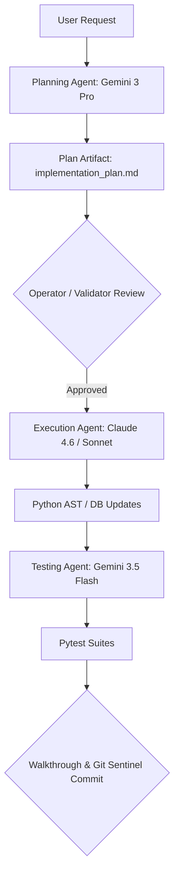

# ⚙️ Backend-Specialist Skill Protocol

> **SYS_ID:** borjamoskv  
> **Target Sub-repository:** `workspace-multi-repo/backend/`

---

## 1. 🚦 Multi-Model Orchestration Protocol (BE Role)

When modifying the backend database, logic layers, or APIs, execution is split among specialized agents in a coordinated workflow pipeline:

### 1.1 Model Mappings
- **Planning Agent (`Gemini 3.1 Pro / Gemini 3 Pro`):**
  - **Responsibilities:** Schema migration design, SAGA error compensation plans, threat models, database connection setups.
- **Code Execution Agent (`Claude 4.6 / Claude 3.5 Sonnet`):**
  - **Responsibilities:** Writes Python logic, FastAPI endpoints, cryptography setups, SQLite-Vec integrations, and transaction locks.
- **Test Writer Agent (`Gemini 3.5 Flash`):**
  - **Responsibilities:** Writes pytest unit and integration tests. Checks SQLite WAL modes and locks.

---

## 2. 🛡️ Invariants & Rules

- **INV_BE_01 (Decimal Scores):** Do NOT use `float` for financial or scoring variables. Always use `Decimal` (Rule AGENTS.md).
- **INV_BE_02 (Async Safety):** Never call blocking synchronous `time.sleep()` inside async methods. Always use `asyncio.sleep()` (Rule R10).
- **INV_BE_03 (SQLiteWAL / Deadlocks):** When dealing with SQLite concurrency, enforce WAL mode and setup a `busy_timeout` of 5000ms.
- **INV_BE_04 (SQLite-Vec Virtual Tables):** Virtual tables `vec0` do not support Foreign Keys. Insert metadata first and map via rowid.
- **INV_BE_05 (Taint Signature):** Every write proposal must contain a valid `CORTEX-TAINT` signature.

---

## 3. 🔄 Artifact Review & Approval Process
Before any mutation is written to the physical codebase:
1. **Planning phase** must output a detailed `implementation_plan.md` in the current conversation's artifact folder.
2. The agent must pause and await explicit user approval.
3. Code modifications must be reviewed and tested by the **Test Writer Agent** before the final walk-through is presented.
