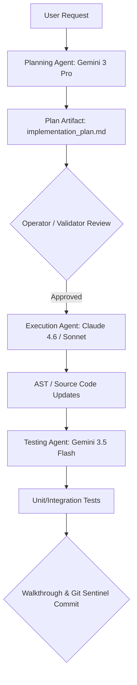

# 🎨 Frontend-Specialist Skill Protocol

> **SYS_ID:** borjamoskv  
> **Aesthetic:** Industrial Noir 2026 (#0A0A0A / #2B3BE5 / Humanist Sans)  
> **Target Sub-repository:** `workspace-multi-repo/frontend/`

---

## 1. 🚦 Multi-Model Orchestration Protocol (FE Role)

When modifying the frontend codebase, execution is divided among specialized models running in a coordinated workflow pipeline:

### 1.1 Model Mappings
- **Planning Agent (`Gemini 3.1 Pro / Gemini 3 Pro`):**
  - **Responsibilities:** Parses user request, checks AST dependency graph, defines UI layout modifications, drafts `implementation_plan.md`.
- **Code Execution Agent (`Claude 4.6 / Claude 3.5 Sonnet`):**
  - **Responsibilities:** Writes TypeScript/React/CSS changes. Implements Industrial Noir 2026 aesthetics (glassmorphism, tailored gradients, Outfit typography).
- **Test Writer Agent (`Gemini 3.5 Flash`):**
  - **Responsibilities:** Writes Vitest/Playwright tests for components. Verifies zero Hydration mismatch and AST compatibility.

---

## 2. 🛡️ Invariants & Rules

- **INV_FE_01 (No Server Comments):** Do NOT inject server-side comments (e.g. `# C5-REAL`) inside client-side TypeScript/Astro components. Use `//` or `/* */` (Rule R11).
- **INV_FE_02 (Aesthetic Guidelines):** Never use plain colors (red, blue, green). Always map styles to the Industrial Noir 2026 palette. Ensure responsive design and smooth transition micro-animations.
- **INV_FE_03 (Cloudflare Pages):** All deployments target Cloudflare Pages via wrangler. No Vercel configurations.

---

## 3. 🔄 Artifact Review & Approval Process
Before any mutation is written to the physical codebase:
1. **Planning phase** must output a detailed `implementation_plan.md` in the current conversation's artifact folder.
2. The agent must pause and await explicit user approval.
3. Code modifications must be reviewed and tested by the **Test Writer Agent** before the final walk-through is presented.
