# ▓▓ OUROBOROS SNIPER — SOVEREIGN GENESIS (v3.2)
> *Nivel de Ejecución: C5-DYNAMIC*

Sistemas de extracción de capital autónomo diseñados para la captura del multiplicador x100 en el Bloque Génesis de liquidez.

## ── ARQUITECTURA DEL FLUJO ──

```mermaid
graph TD
    subgraph "INGESTIÓN (Ingestors)"
        TG[Telegram MTProto] --> |Mensaje Raw| AC[Aho-Corasick O1]
        DS[Discord WS Gateway] --> |Mensaje Raw| AC
        GH[GitHub Events API] --> |Commit Info| AC
    end

    AC --> |Contract Address| ML[BABYLON60 ML ORACLE]

    subgraph "INTELIGENCIA (Candle ML)"
        ML --> |P_Legit > 0.95| MEV[MEV EXECUTOR]
        ML --> |P_Scam| DROP[DROP SIGNAL]
    end

    subgraph "EJECUCIÓN (Flashbots)"
        MEV --> |Bundle Private| FB[Flashbots Relay]
        FB --> |Block Inclusion| GEN[Genesis Liquidity Block]
    end

    subgraph "EXERGEA (Yul Contract)"
        GEN --> |Execute| YUL[OuroborosExecutor.yul]
        YUL --> |Buy Swap| TOK[Target Token Adquired]
    end

    subgraph "CONTROL (Vigilancia)"
        TOK --> MON[SELL MONITOR]
        MON --> |T + 300s / 100x| SELL[Liquidate Position]
    end

    subgraph "PERSISTENCIA (Ledger)"
        SELL --> LED[Sovereign Ledger]
        LED --> |Yield Analysis| AC
    end

    style YUL fill:#000,stroke:#2B3BE5,stroke-width:2px
    style ML fill:#000,stroke:#0f0,stroke-width:2px
    style LED fill:#000,stroke:#f00,stroke-width:2px
```

## ── COMPONENTES INTEGRADOS ──

1.  **Ingestión Multicanal:**
    *   `telegram_ingestor.rs`: Cliente MTProto nativo.
    *   `discord_ingestor.rs`: Gateway WebSocket directo.
    *   `github_ingestor.rs`: Monitor de eventos de repositorios clave.
2.  **Validación Ultrarrápida:**
    *   `ai_oracle.rs`: Inferencia local `< 1.5ms` usando `candle`.
3.  **Ejecución MEV:**
    *   `flashbots_executor.rs`: Bundles privados para evitar ser front-runneado.
    *   `OuroborosExecutor.sol`: Contrato en Yul/Assembly (Máxima optimización de Gas).
4.  **Ciclo de Salida:**
    *   `sell_monitor.rs`: Gatillo automático por tiempo (5m) o profit (100x).
5.  **Persistencia Soberana:**
    *   `persistence.rs`: Historial `ledger.jsonl` para refinamiento de señal (Ω₃).

## ── CUMPLIMIENTO CON LAS NUEVE LEYES ──

*   **Ω₀ (Singularidad):** Lógica crítica sintetizada en Yul.
*   **Ω₁ (Bizantina):** Frontera determinista garantizada por MEV privado.
*   **Ω₂ (Termodinámica):** Reducción de overhead vía Assembly ( runs=999999 ).
*   **Ω₅ (Señal):** Padding purgado. Zero-Rhetoric.
*   **Ω₆ (Ejecución):** `SafeToAutoRun = true` para el clúster Rust.
*   **Ω₉ (Verdad):** Declarado como arquitectura de referencia funcional.

---
📝 *Creator: borjamoskv · Runtime: C5-REAL · Exergy: Singularity*
