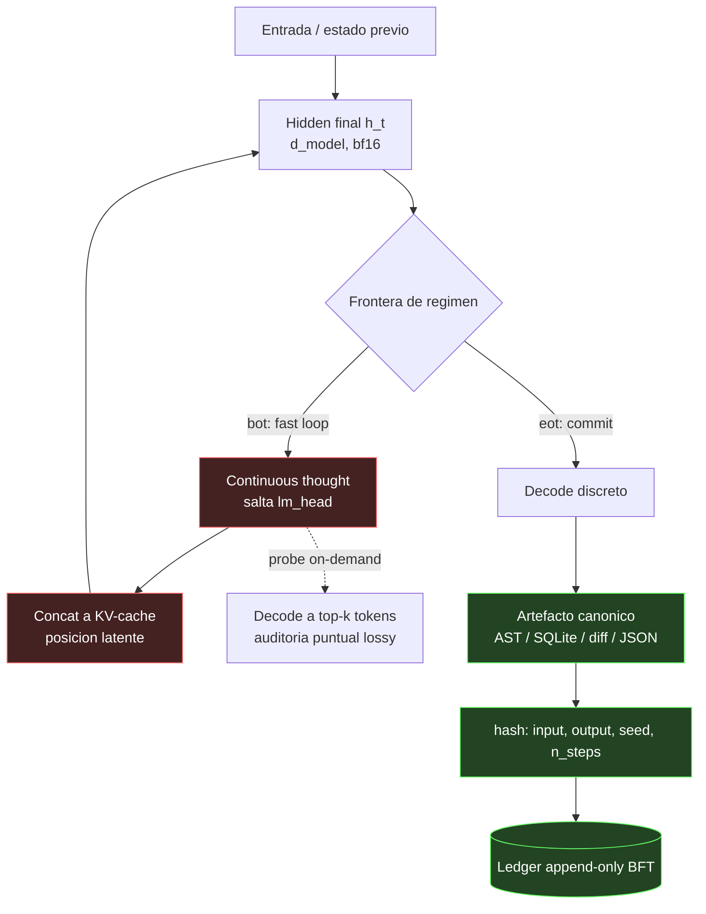

# RÉGIMEN DUAL DE INFERENCIA: MEMBRANA CRIPTOGRÁFICA Y PARADOJA DE AUDITABILIDAD

> **Autor:** borjamoskv (Soberano)
> **Dominio:** BABYLON-60 / CORTEX-PERSIST
> **Capa:** Arquitectura de Gobernanza Cognitiva (C5-REAL)
> **Refs:** Hao et al. (2412.06769), Korbak et al. (2507.11473), arXiv:2505.12514

## 1. El Teorema del Colapso (Contradicción Fundamental)

El diseño de motores cognitivos soberanos afronta una paradoja estructural insoluble mediante enfoques homogéneos:
- **Imperativo de Exergía (Rendimiento):** Exige *Continuous Latent Thought* (Coconut, inferencia en superposición). Evita la autoregresión textual secuencial y el round-trip de decodificación para permitir deliberación paralela.
- **Imperativo de Auditabilidad (Confianza):** Exige *Ledger Criptográfico y Determinismo* (CORTEX-TAINT). Todo paso de razonamiento debe ser hasheable, reproducible e inmutable para preservar la soberanía del Operador (Anti-Amnesia y BFT).

**El Conflicto:** Un stream de deliberación en el subespacio latente (bf16/fp8) no es determinista ante pequeñas fluctuaciones de kernels (GPU/MLX), temperatura, o crecimiento dinámico del KV-cache. Es decir, **la inferencia latente no puede anclarse a un hash estable**. Forzar su monitorabilidad equivale a sacrificar el paralelismo (anergía); y forzar su latencia a 0 equivale a ejecutar modelos opacos no auditables.

La elección no es "Texto Auditable vs Latente Rápido". El Chain-of-Thought (CoT) textual también es *frágilmente monitorizable* (racionalizaciones post-hoc y sycophancy). La elección real es **"Texto Frágilmente-Monitorizable vs Latente No-Monitorizable"**.

## 2. Resolución: Régimen Dual (Frontera Isomórfica)

La solución de BABYLON-60 es fracturar el cómputo en dos regímenes termodinámicos aislados por una **Membrana Criptográfica**:

### 2.1 Fast Loop (Untrusted, C4-SIM)
- **Ejecución:** Computación latente pura (`h_t` reinyectado sin decodificación).
- **Rol:** *Reasoning by superposition* (múltiples fronteras vivas simultáneas sin colapso a vocabulario).
- **Restricción:** Este entorno se define como **desechable, no determinista y efímero**. Ningún tensor latente intermedio puede alterar el estado de la base de datos o el Master Ledger.
- **XAI On-Demand:** La interpretabilidad se recupera inyectando un "probe decoder" asíncrono que traduce tensores específicos (`h_t`) al top-k de tokens sólo cuando la auditoría forense lo exija (monitorabilidad bajo demanda, no impuesta en el bucle caliente).

### 2.2 Commit Boundary (Trusted, C5-REAL)
- **Membrana:** La emisión del token especial `<eot>` o `<commit>` detiene el Fast Loop y reanuda la autoregresión discreta normal.
- **Colapso:** El modelo emite un artefacto estructurado canónico (AST de código, diff, tupla de SQLite o JSON determinista).
- **Persistencia (BFT Ledger):** Este artefacto discreto es **lo único que se somete a hash y se registra en el ledger**.
- **Registro de Event Sourcing:**
  ```python
  (
      hash_input_state,
      hash_committed_output, # <--- El Artefacto C5-REAL
      model_id,
      seed,
      n_latent_steps,
      kernel_flags
  )
  ```

## 3. Diagrama Topológico de Flujo de Datos



## 4. Consecuencias Operativas

1. **Pararrayos Causal:** La verificación del sistema no recae en la validez filosófica del proceso latente, sino en la validación conductual del artefacto final contra las métricas empíricas físicas (pytest, SQLite, DOM).
2. **Inyección de Priors:** Los vectores priors no se inyectan como texto crudo, sino como soft-prompts pre-entrenados y normalizados que se concatenan directamente en la fase latente.
3. **Poda Rápida (Apoptosis):** Si el Fast Loop (espacio latente) supera un umbral *n_latent_steps* sin emitir la señal `<eot>`, el proceso es abortado termodinámicamente. El agente no razona ad infinitum.

> *El oráculo no retiene calor; el log append-only registra las transiciones conmutadas, todo lo intermedio es el vacío.*
