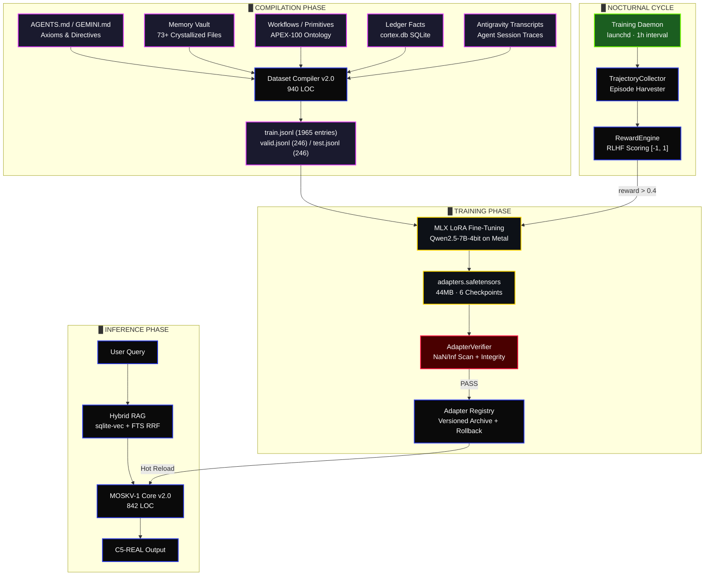
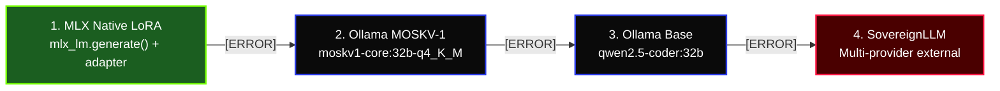

# MOSKV-1 LoRA — Parametric Sovereignty

> Local LoRA fine-tuning pipeline (MLX + Apple Silicon Metal) that distills operational identity into persistent neural weights — 100% local, air-gapped, zero cloud dependency.

---

## 1. Architecture (Dual Canal Fusion)



**Canal Paramétrico (LoRA weights):** Permanent cognitive identity — style, axioms, personality, response patterns. Survives reboots.
**Canal Vectorial (RAG retrieval):** Dynamic factual context from the Ledger. Session-specific, ephemeral.
**Fusion Point:** Both channels merge at `MOSKV1Core.infer()`. The model never generates without vector context.

---

## 2. Module Map (`babylon60/extensions/training/`)

| Module | LOC | Risk | Purpose |
| :--- | :---: | :---: | :--- |
| [`moskv1_core.py`](../babylon60/extensions/training/moskv1_core.py) | 842 | 🔴 | Hybrid inference runtime — MLX + Ollama + SovereignLLM fallback cascade |
| [`moskv1_dataset_compiler.py`](../babylon60/extensions/training/moskv1_dataset_compiler.py) | 940 | 🔴 | Multi-source dataset compiler with ExergyGuard + Shannon entropy filter |
| [`moskv1_cli.py`](../babylon60/extensions/training/moskv1_cli.py) | 427 | 🟡 | CLI interface: `compile`, `train`, `register`, `validate`, `stats`, `health` |
| [`daemon.py`](../babylon60/extensions/training/daemon.py) | 275 | 🟠 | Autonomous nocturnal training loop — session consolidation + adapter versioning |
| [`ttt_engine.py`](../babylon60/extensions/training/ttt_engine.py) | 246 | 🟠 | Test-Time Training orchestrator — trajectory filtering + MLX dispatch |
| [`collector.py`](../babylon60/extensions/training/collector.py) | 160 | 🟡 | Trajectory extraction from episodic memory (`Episode` → `Trajectory`) |
| [`verifier.py`](../babylon60/extensions/training/verifier.py) | 162 | 🟠 | Adapter integrity — NaN/Inf tensor scan + `safetensors` structural check |
| [`reward_engine.py`](../babylon60/extensions/training/reward_engine.py) | 56 | 🟡 | RLHF scoring: outcome ± efficiency penalty ± test verification ± confidence |
| [`run_daemon.py`](../babylon60/extensions/training/run_daemon.py) | 96 | 🟡 | Daemon entry point — SQLite WAL + `busy_timeout=5000ms` |
| [`install_daemon.sh`](../babylon60/extensions/training/install_daemon.sh) | 40 | ⚪ | `launchctl` installer for `com.moskv1.daemon.plist` |
| **Total** | **3244** | | |

---

## 3. Dataset Compiler (ExergyGuard Pipeline)

Compiles 5 knowledge sources into instruction-tuning JSONL (ShareGPT `messages` format):

| Source | Extraction | Entries |
| :--- | :--- | :---: |
| `AGENTS.md` / `GEMINI.md` | Axioms, invariants, directives, system rules | Variable |
| `babylon60/agents/primitives/` | APEX-100 ontology, thinking architecture | Variable |
| `~/.gemini/config/.cortex/memory_vault/` | 73+ crystallized knowledge files | 88 |
| `.agents/workflows/` | Operational protocols and slash commands | 40 |
| `~/.babylon60/cortex.db` | Ledger facts via SQLite queries | Variable |

**Quality Enforcement (Zero Slop Pipeline):**

| Guard | Mechanism |
| :--- | :--- |
| **ExergyGuard** | Rejects entries with conversational padding, decorative prose, or filler phrases |
| **LandauerGuard** | Shannon entropy threshold — rejects low-information-density content |
| **Anergy Suppressor** | 15 regex patterns strip filler (`"espero que"`, `"of course"`, `"here you go"`, etc.) |
| **Length Bounds** | Output: `[100, 4096]` chars per entry. Entries outside bounds are discarded |
| **HTML/XML Stripper** | Removes `<!-- -->` comments and system-injected tags from transcripts |
| **Split Enforcer** | **80/10/10** → `train.jsonl` / `valid.jsonl` / `test.jsonl` |

---

## 4. Training Config

| Parameter | Value | Rationale |
| :--- | :---: | :--- |
| Base Model | `Qwen2.5-Coder-7B-Instruct-4bit` | MLX-optimized for M-series Metal. 4-bit quant for 7B on unified memory |
| LoRA Rank | `8` | Minimal parameter overhead (~44MB adapter) |
| LoRA Scale (α) | `20.0` | Aggressive adapter influence: `α/r = 2.5` |
| Layers | `16` | Full attention head coverage across the transformer stack |
| Batch Size | `1` | OOM mitigation on Apple Silicon |
| Grad Accumulation | `2` | Effective batch = 2 |
| Max Seq Length | `1280` | Prevents Metal memory exhaustion on long sequences |
| Learning Rate | `2e-5` | AdamW standard. Conservative to prevent catastrophic forgetting |
| Iterations | `600` | 6 checkpoints (every 100). Last checkpoint = active production weights |
| Grad Checkpoint | `true` | Trades compute for memory. Essential for 7B on consumer hardware |
| Mask Prompt | `true` | Loss computed only on assistant responses |
| Optimizer | `adamw` | Weight decay regularization |
| Seed | `42` | Deterministic reproducibility |

**Security Posture:**
```python
os.environ["HF_HUB_OFFLINE"] = "1"  # Air-gapped. Zero HuggingFace network calls
```

---

## 5. Inference Runtime (4-Stage Cascade)



**Capabilities:**
- **Hot Reload:** `_async_reload_weights()` monitors `adapters.safetensors` mtime. On change → background `ThreadPoolExecutor` loads new weights → atomic pointer swap. Zero downtime.
- **Streaming:** `infer_stream()` yields chunks via Ollama streaming API (`AsyncIterator[str]`).
- **Multi-turn:** `ConversationTurn` deque with configurable `max_history=10` turns.
- **Memory Vault Injection:** Keyword-overlap scorer loads relevant vault entries into system context.
- **Warmup:** `warmup()` pre-loads MLX model + adapter into Metal unified memory on daemon startup.

---

## 6. Reward Engine (RLHF Scoring)

The `RewardEngine` scores trajectories in `[-1.0, 1.0]` to filter training data:

$$R(t) = \underbrace{R_{\text{outcome}}}_{\pm 0.5} - \underbrace{\min(|\text{actions}| \times 0.01,\; 0.1)}_{\text{efficiency penalty}} + \underbrace{R_{\text{tests}}}_{\{0, 0.1, 0.5\}} + \underbrace{R_{\text{confidence}}}_{\{0, 0.1\}}$$

| Component | Score | Condition |
| :--- | :---: | :--- |
| Outcome: success | +0.5 | `trajectory.outcome == "success"` |
| Outcome: failure | -0.5 | `trajectory.outcome == "failure"` |
| Efficiency penalty | -0.01/step | Max penalty capped at -0.1 |
| Tests passed | +0.5 | `metadata.tests_passed == True` |
| Tests ran (partial) | +0.1 | `metadata.tests_run == True` |
| High confidence | +0.1 | `metadata.avg_confidence > 0.8` |

**Golden threshold:** `reward > 0.4` → trajectory enters training dataset.

---

## 7. TTT Engine & Nocturnal Daemon

**Test-Time Training** is the recursive auto-evolution cycle.

**Cycle (hourly via `launchd`):**
1. `AutonomousTrainingDaemon.run_cycle()` — pre-compiles static dataset from workspace
2. `get_all_session_ids()` — queries `episodes` table for unconsolidated sessions
3. `TTTEngine.run_nocturnal_consolidation()` — collects trajectories, scores via `RewardEngine`
4. Filters golden trajectories (`R > 0.4`) → appends incrementally to `train.jsonl`
5. Dispatches `mlx_lm lora --train` (50 iters, nocturnal-optimized) via `asyncio.to_thread`
6. `AdapterVerifier.verify_adapter()` — NaN/Inf tensor scan on safetensors
7. `register_verified_adapter()` — archives to `adapters/archive/adapters_vN/` + updates lineage JSON

**Daemon Installation:**
```bash
# Install launchd agent (auto-start on login, KeepAlive=true)
bash babylon60/extensions/training/install_daemon.sh

# Manual verification
launchctl list | grep com.moskv1.daemon
tail -f ~/.babylon60/training/daemon.log
```

**Daemon Config (`com.moskv1.daemon.plist`):**
- **Label:** `com.moskv1.daemon`
- **RunAtLoad:** `true` · **KeepAlive:** `true`
- **Interval:** 3600s (hourly cycles)
- **Logs:** `~/.babylon60/training/daemon_stdout.log` / `daemon_stderr.log`

---

## 8. CLI Commands

```bash
# Compile dataset from all knowledge sources
python -m babylon60.extensions.training.moskv1_cli compile --workspace .

# Execute MLX LoRA fine-tuning (600 iters)
python -m babylon60.extensions.training.moskv1_cli train --iters 600

# Validate dataset quality
python -m babylon60.extensions.training.moskv1_cli validate

# Show compilation statistics
python -m babylon60.extensions.training.moskv1_cli stats

# Check Ollama health
python -m babylon60.extensions.training.moskv1_cli health

# Register model in Ollama
python -m babylon60.extensions.training.moskv1_cli register
```

---

## 9. Physical State (`~/.babylon60/training/`)

```
training/
├── adapters/                          # LoRA weights (CRITICAL surface)
│   ├── adapters.safetensors               # 44MB — ACTIVE production weights
│   ├── adapter_config.json                # Hyperparameters (rank=8, scale=20, layers=16)
│   ├── 0000100..0000600_adapters.safetensors  # 6 checkpoints
│   ├── Modelfile                          # Ollama model definition
│   └── archive/                           # Versioned adapter rollback lineage
│       └── adapters_vN/                   # Each verified adapter snapshot
├── datasets/                          # Compiled instruction data
│   ├── train.jsonl                        # ~2.0 MB (80%)
│   ├── valid.jsonl                        # ~275 KB (10%)
│   ├── test.jsonl                         # ~266 KB (10%)
│   └── moskv1_dataset.jsonl               # Pre-split master
├── training_telemetry.jsonl           # Daemon activity log
└── daemon.log                         # Runtime logs
```

---

`LICENSE: Apache-2.0` · `Author: borjamoskv`
