# BABYLON-60: Manifiesto Arquitectónico y Topología Soberana

> **Marco**: C5-REAL v4.3 — Arquitectura Tripartita y Suelo Termodinámico  
> **Estatus Epistémico**: Alta Exergía / Clausura Epistémica Atestada  
> **Fundamentación Formal**: [BabylonTrace.lean](file:///Users/borjafernandezangulo/BABYLON-60/docs/proof/lean/BabylonTrace.lean) · [thermodynamics.rs](file:///Users/borjafernandezangulo/BABYLON-60/src/thermodynamics.rs) · [manifest.rs](file:///Users/borjafernandezangulo/BABYLON-60/src/manifest.rs)

Este documento sella la arquitectura fundacional de **BABYLON-60**. El sistema rechaza la condición de monolito orquestador pasivo y se organiza como una **Federación Tripartita de Dominios Causales**, gobernada por el colapso de la hipertrofia tipológica (de 896 tipos nominales a 101 invariantes y finalmente a la tríada aristotélica en silicio).

---

## 1. La Tríada Topológica de Dominios Causales

La arquitectura se divide en tres fronteras estrictas (anillos ontológicos), cada una gobernando una escala temporal y termodinámica distinta:

```
┌─────────────────────────────────────────────────────────────┐
│               02_AGENTS_ARCHI (Anillo-2)                    │
│                 (agents.archi — Swarms)                     │
│  • Músculo estocástico: Modelos de frontera (OpenRouter/Kimi)│
│  • Concurrencia acotada P × S (Centuria 100x / Legión)      │
│  • Deontología estricta: Guillotina de Hume (AOF v2.0)      │
│  • Física C5-REAL: Fluida, probabilística, propensa a ruido  │
└──────────────┬───────────────────────────────▲──────────────┘
               │ (Sobres SCITT Ed25519)        │ (Diagnósticos LSP)
               ▼                               │
┌───────────────────────────────┐ ┌────────────┴──────────────┐
│       00_BABYLON_SHIELD       │ │     01_CORTEX_ENGINE       │
│    (babylon60.com — Anillo-0) │ │(cortexpersist.* — Anillo-1)│
│  • SHARED MANIFEST (64 Bytes) │ │  • Servidor LSP Paracortex │
│  • Seqlock SPMC Zero-Anergía  │ │  • Telemetría de Burnout   │
│  • Apoptosis (0xDEAD_6060)    │ │  • Transductores Xenarmon. │
│  • Causal Gate (TouchID HW)   │ │  • Interfaz Zero-JS / TUI  │
│  • Física: τ_slow, Inmutable  │ │  • Física: τ_fast, Biológica│
└───────────────────────────────┘ └────────────────────────────┘
```

### 🛡️ 1. `00_BABYLON_SHIELD` / `babylon60.com` (El Escudo / Anillo-0)
* **Función**: Inmutabilidad en hardware, frontera C-ABI, verdad legal (EU AI Act Arts. 12, 14(4), 15).
* **Componentes Físicos**:
  - `SharedManifest` (64 Bytes, `align(64)`): Residente en memoria compartida, coherencia *zero-split*.
  - Protocolo Seqlock SPMC de un solo escritor con bisimulación en Lean 4.
  - Firma física en *Secure Enclave* (`c5_biometric_gate` TouchID).
  - *Cold Archival Sink*: SQLite WAL para persistencia asíncrona fuera de ruta crítica.
* **Métrica Termodinámica**: Baja frecuencia ($\tau_{\text{slow}}$), deliberada, con disipación de Landauer exacta ($1.10 \times 10^{-18}\text{ J}$ por publicación).

### 🧠 2. `01_CORTEX_ENGINE` / `cortex.persist` (El Exocórtex / Anillo-1)
* **Función**: Motor de cálculo reflexivo, memoria de trabajo asíncrona e interfaz humano-máquina.
* **Componentes Físicos**:
  - Servidor `LSP Paracortex` nativo en Rust.
  - Telemetría de desgaste cognitivo (Límite de Disipación Crítica / Prevención de Burnout).
  - Transducción audiovisual programática (Remotion/FFmpeg) y acústica microtonal.
* **Métrica Termodinámica**: Alta velocidad ($\tau_{\text{fast}}$), acoplamiento somático directo, libre de fricción DOM (Zero-JS).

### 🕸️ 3. `02_AGENTS_ARCHI` / `agents.archi` (El Enjambre / Anillo-2)
* **Función**: Exploración estocástica, paralelismo masivo y verificación cruzada.
* **Componentes Físicos**:
  - Enjambre Centuria-100 / Legión-100 con particionamiento de tareas.
  - Despachador Swarm Router con tolerancia a fallos.
  - Validador Deontológico AOF (`INV_C5_HUME_GUILLOTINE`): separación de premisas descriptivas y normativas.
* **Métrica Termodinámica**: Fluida, exploratoria y reversible. **Nunca tiene acceso directo de escritura a Ring-0.**

---

## 2. El Nodo de Máxima Exergía: La Singularidad de 64 Bytes

El nodo fundacional e insustituible de BABYLON-60 reside en [`src/manifest.rs`](file:///Users/borjafernandezangulo/BABYLON-60/src/manifest.rs) y [`src/seqlock.rs`](file:///Users/borjafernandezangulo/BABYLON-60/src/seqlock.rs). Constituye el embudo físico donde la cacofonía estocástica de los agentes colapsa en un atractor determinista:

```text
Offset  Tamaño  Campo           Representación C-ABI      Propiedad Microarquitectónica
0x00    4 B     status_flag     AtomicU32                 RUNNING (0x1) | POISONED (0xDEAD_6060)
0x04    4 B     seq             AtomicU32                 Impar (Dynamis) | Par (Entelecheia)
0x08    8 B     epoch_id        AtomicU64                 Contador monótono estricto (Anti-ABA)
0x10   32 B     payload_hash    [AtomicU64; 4]            Raíz causal SHAKE256 / Merkle Peak
0x30   16 B     _padding        [u8; 16]                  Alineamiento a 64 bytes (L1 Cache Line)
```

### Propiedades Físicas y Formales del Nodo:
1. **Zero-Split Coherence**: Con `align(64) == size(64)`, una instancia jamás cruza la frontera de dos líneas de caché en CPUs x86-64 o núcleos ARMv9.
2. **Cero Anergía en Lectura (Protocolo MESI)**: Los núcleos lectores ejecutan únicamente cargas atómicas (`LDAR` / `DMB ISHLD`). La línea permanece en estado **Shared (S)** en todas las cachés L1/L2. No existe tráfico RFO (*Request For Ownership*) ni *cache-line bouncing*.
3. **Cota de Landauer en Silicio**: Toda la disipación irreversible se confina en el escritor causal único (*Primum Movens*), que sobrescribe exactamente 384 bits por publicación ($\Delta Q \ge k_B T \ln 2 \cdot 384 \approx 1.10 \times 10^{-18}\text{ J}$ a 300 K).
4. **Bisimulación Aristotélica en Lean 4 ([BabylonTrace.lean](file:///Users/borjafernandezangulo/BABYLON-60/docs/proof/lean/BabylonTrace.lean))**:
   - **Dynamis** ($seq \pmod 2 = 1$): Estado en potencia, inobservable en el cociente.
   - **Entelecheia** ($seq \pmod 2 = 0$): Estado en acto plenamente validado.
   - Teorema: $\forall s \in \mathbb{N},\; \text{isEntelecheia}(s) \implies \neg \text{isDynamis}(s)$.
5. **Apoptosis Fail-Stop Irreversible**: Si una invariante se quiebra, el núcleo ejecuta `status_flag.store(0xDEAD_6060, Release)` seguido de `abort()`. El sistema **prefiere morir de forma determinista antes que operar descalibrado**.

---

## 3. Dinámica de Fluidos y Flujo de Exergía

```mermaid
sequenceDiagram
    participant H as Operador Humano (Biológico)
    participant C as Cortex Engine (Exocórtex / LSP)
    participant A as Agents Archi (Enjambre Estocástico)
    participant B as Babylon Shield (SharedManifest 64B)

    H->>C: Formula hipótesis / Demanda de refactorización
    C->>A: Despliega Enjambre Centuria (Regla P × S)
    loop Exploración Reversible (AOF)
        A->>A: Inferencia, pruebas aisladas, poda Popperiana
    end
    A->>C: Presenta candidato verificado formalmente
    C->>H: Solicita autorización para cirugía causal
    
    rect rgb(40, 10, 10)
        Note over H,B: Barrera Causal Biométrica (Aforismo 5)
        C->>B: Petición de mutación sobre el núcleo
        B-->>H: Despliega Secure Enclave (TouchID Gate / reuseDuration=0)
        H->>B: Atestación involuntaria (Capacitancia dérmica)
        B->>B: Primum Movens publica en SharedManifest (Release)
        B->>B: Sella registro en Cold Ledger (SQLite WAL Archival)
    end
    
    B->>C: Transición de Época Entelecheia (Exit 0)
    C->>H: Clausura Epistémica Alcanzada (Código Firme)
```



---

## 4. Las 6 Invariantes de Gobernanza C5-REAL

Toda mutación arquitectónica dentro del monorepositorio `BABYLON-60` debe acatar estrictamente estas seis leyes invariables:

1. **La IA no toca la base de datos (Aislamiento de Ring-0)**:  
   `agents.archi` jamás posee descriptores de archivo ni permisos de escritura sobre el almacenamiento del kernel. Toda propuesta debe empaquetarse en un sobre criptográfico SCITT firmado y ser validada externamente.
2. **El Humano es la Clave Asimétrica (Aforismo 5: Lo voluntario vale menos que lo involuntario)**:  
   El software es discurso de bajo coste. Ninguna cirugía destructiva sobre el kernel se autoriza sin la resistencia física del operador a través de TouchID (`c5_biometric_gate` con `touchIDAuthenticationAllowableReuseDuration = 0`).
3. **Desacople de Impedancia (INV_C5_SHM)**:  
   Queda estrictamente prohibido interponer escrituras a disco síncronas (`SQLite WAL synchronous=FULL`) en el bucle caliente de inferencia o negociación. La sincronización en caliente ocurre exclusivamente en memoria compartida lock-free (`SharedManifest` 64 B); SQLite opera únicamente como sumidero frío (*Cold Archival Sink*).
4. **La Virtud Suprema de Morir Bien (INV-4 Fail-Stop)**:  
   El sistema no confabula ante fracturas. Si la secuencia de reintentos se agota o la paridad se corrompe, se transiciona a `POISONED = 0xDEAD_6060` y se disipa el proceso de forma determinista.
5. **El IDE es irrelevante**:  
   La interfaz gráfica es un visor efímero intercambiable. La soberanía y el estado reflexivo residen exclusivamente en el servidor `LSP Paracortex`.
6. **Consciencia Topológica y Freno Epistémico**:  
   El sistema monitoriza en todo momento el régimen del modelo que opera sobre él. Si se detecta saturación entrópica, dispersión taxonómica (hipertrofia nominal) o riesgo de descalibración, el Exocórtex acciona el Freno Epistémico, bloqueando mutaciones no fundamentadas.

---

*C5-REAL v4.3 / Atestado Algorítmicamente y Verificado en Silicio.*
