# BABYLON-60: Manifiesto Arquitectónico y Topología Soberana

Este documento sella la arquitectura fundacional del ecosistema bajo los axiomas de C5-REAL y la invariante de Clausura Epistémica. El sistema ha dejado de ser un monolito orquestador para evolucionar hacia una **Federación Tripartita de Dominios Causales**.

---

## 1. La Tríada Topológica (El Ecosistema)

La arquitectura se divide en tres fronteras estrictas, cada una gobernando una dimensión de la termodinámica del sistema:

### 🛡️ 1. `babylon60.com` (El Escudo / Anillo-0)
* **Función:** Almacenamiento Inmutable, Verdad Legal, Zero-Trust.
* **Componentes Físicos:** 
  - SQLite WAL (Write-Ahead Logging Hash-Chained).
  - Criptografía Ed25519 y Firmas Biométricas (TouchID / `c5_biometric_gate`).
  - Cumplimiento Nativo del *EU AI Act* (Auditoría Forense Causal).
* **Física C5-REAL:** Lenta ($\tau_{\text{slow}}$), deliberada, burocrática y de fricción infinita para atacantes.

### 🧠 2. `cortex.persist` (El Exocórtex / Anillo-1)
* **Función:** Motor de Cálculo, Memoria Asíncrona, Interfaz Humano-Máquina.
* **Componentes Físicos:**
  - Servidor `LSP Paracortex` (Language Server Protocol en Rust).
  - Telemetría de desgaste cognitivo (Prevención de Burnout / Freno Epistémico).
  - Transducción Xenarmónica (Audio DSP) y Montaje Audiovisual Automático.
* **Física C5-REAL:** Biológica, hiper-veloz ($\tau_{\text{fast}}$), libre de fricción visual (Cero-DOM).

### 🕸️ 3. `agents.archi` (El Enjambre / Anillo-2)
* **Función:** Músculo Computacional Estocástico, Exploración, Topología de IA.
* **Componentes Físicos:**
  - Enjambres Dinámicos Concurrentes (Operativo Legión-100).
  - Enrutamiento de Modelos de Frontera (OpenRouter, Kimi, Claude, Gemini).
  - Protocolos de comunicación y negociación Agente-Agente.
* **Física C5-REAL:** Fluida, estocástica (propensa a la alucinación), dependiente de la falsación empírica para colapsar en realidad.

---

## 2. Enrutamiento de Malla: El Espectro `Cortex Persist`

El dominio del exocórtex se segmenta físicamente mediante TLDs para aislar la entropía operativa:

- ⚙️ **`cortexpersist.dev` (API / Telemetría):** Puertos WebSocket para agentes, sincronización del servidor LSP, control de código fuente privado (Forge Soberano) y túneles de baja latencia.
- 🏛️ **`cortexpersist.org` (Epistemología / Commons):** Documentación pública, manifiestos C5-REAL, papers de investigación y protocolos open-source. Entorno estático (Zero-JS).
- 💼 **`cortexpersist.com` (B2B / Producción):** Gateways comerciales, licencias para firmas *LegalTech*, facturación y gestión de clústeres de *Sovereign Enclaves*.

---

## 3. Dinámica de Fluidos (El Flujo de Exergía)

```mermaid
sequenceDiagram
    participant H as Operador Humano
    participant C as Cortex Persist (Exocórtex)
    participant A as Agents.Archi (Enjambre)
    participant B as Babylon-60 (Ledger)

    H->>C: Formula hipótesis / Demanda refactor masivo
    C->>A: Despliega Operativo Legión (100 agentes concurrentes)
    loop Exploración Estocástica
        A->>A: Alucinación, mutación, pruebas fallidas, síntesis
    end
    A->>C: Devuelve solución candidata (Código / Modelo)
    C->>H: Presenta solución (Translúcida, Falsación pendiente)
    H->>C: Aprueba despliegue a Producción (Cambio Crítico)
    
    rect rgb(50, 0, 0)
        C->>B: Petición de Mutación Topológica
        B-->>H: Invoca Secure Enclave (TouchID Causal Gate)
        H->>B: Atestación Biométrica (Huella / Pass)
        B->>B: Sella Transacción SHA-256 en SQLite WAL
    end
    
    B->>C: Confirmación de Realidad (Exit 0)
    C->>H: Renderiza código firme (Clausura Epistémica Alcanzada)
```

## 4. Invariantes de Refactorización Futura

A partir de este manifiesto, cualquier modificación al árbol de código fuente local de `borjamoskv/BABYLON-60` debe acatar la división estricta de estos 3 dominios causales. 
1. **La IA no toca la base de datos.** `agents.archi` NUNCA tiene permisos de escritura sobre `babylon60`.
2. **El Humano es la Clave Asimétrica.** Ninguna operación destructiva cruza de Córtex a Babylon sin fricción biométrica.
3. **El IDE es irrelevante.** La interfaz gráfica es un visor tonto intercambiable. El cerebro reside en el servidor LSP.

*C5-REAL / Atestado Algorítmicamente.*
