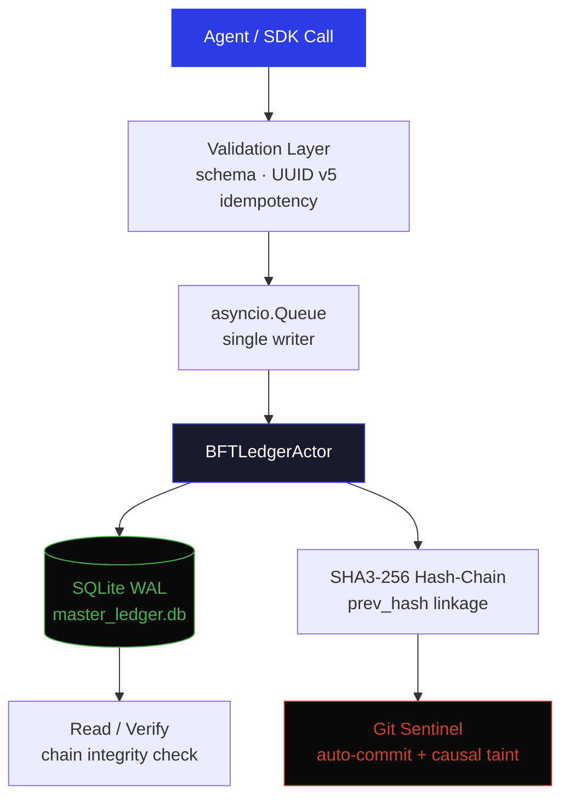

<p align="center">
  
</p>

<p align="center">
  <strong>Tamper-evident cryptographic ledger for autonomous AI agents</strong><br/>
  <sub>Local-first · Hash-chained · Single-writer SQLite WAL · Optional Rust core</sub>
</p>

<p align="center">
  <a href="https://pypi.python.org/pypi/cortex-persist"></a>
  <a href="https://pypi.python.org/pypi/cortex-persist"></a>
  
  
  
</p>

<p align="center">
  <a href="docs/ARCHITECTURE.md">Architecture</a> ·
  <a href="docs/SECURITY_MODEL.md">Security Model</a> ·
  <a href="docs/EXPERIMENTAL.md">Experimental Features</a>
</p>

---

## What It Solves

Autonomous agents lack a reliable way to persist decisions with causal traceability. `cortex-persist` provides a **local-first memory substrate**:

```
Validation → Single-Writer Queue → Hash-Chain Ledger → Git Sentinel
```

Every entry is linked to the previous via **SHA3-256** hash. Every write carries a **causal taint** (who / when / why). Duplicates are rejected via **UUID v5** idempotency keys. The chain is **verified on read** — not assumed correct.

> [!IMPORTANT]
> **tamper-evident ≠ tamper-proof.** Hash-chains detect modifications _after the fact_. They do not prevent an attacker with filesystem access from replacing the entire database. See [SECURITY_MODEL.md](docs/SECURITY_MODEL.md) for the full threat model.

---

## Maturity Matrix

| Component | Status | Coverage | Use |
|:---|:---:|:---:|:---|
| BFT Ledger (SQLite WAL + hash-chain) | `Beta` | ~72% | Development |
| Cryptographic chain (BLAKE3 / SHA3-256) | `Beta` | ~68% | Development |
| Python SDK (`babylon60.*`) | `Beta` | ~65% | Development |
| Rust core (`strike_rs` / PyO3) | `Alpha` | ~41% | Experimental |
| MCP integration | `Alpha` | ~30% | Experimental |
| Vector memory (`sqlite-vec`) | `Alpha` | ~35% | Experimental |
| BFT Swarm / quorum | `Prototype` | ~20% | Research only |
| Lean 4 formal proofs | `Prototype` | ~15% | Research only |
| LoRA daemon / HDC | `Design` | 0% | Do not use |

---

## Installation

```bash
pip install cortex-persist
```

```bash
# With cryptographic signing (Ed25519, Argon2)
pip install "cortex-persist[crypto]"

# With voice transcription (macOS Apple Silicon)
pip install "cortex-persist[voice-full]"
```

---

## Quickstart

```python
from babylon60.api.client import CortexClient

client = CortexClient()
print(client.status())
# {"ledger": "ok", "chain_valid": True, "entries": 0, "version": "1.0.2"}
```

Start the local REST + WebSocket API:

```bash
uvicorn babylon60.api.server:app --reload
# → http://localhost:8000
```

Verify chain integrity programmatically:

```python
from babylon60.bft.ledger_actor import verify_chain

result = verify_chain(db_path="master_ledger.db")
# {"valid": True, "entries": 4821, "broken_at": None}
```

---

## Architecture


```mermaid
flowchart TD
    A[Agent / SDK Call] --> B[Validation Layer\nschema · UUID v5 idempotency]
    B --> C[asyncio.Queue\nsingle writer]
    C --> D[BFTLedgerActor]
    D --> E[(SQLite WAL\nmaster_ledger.db)]
    D --> F[SHA3-256 Hash-Chain\nprev_hash linkage]
    F --> G[Git Sentinel\nauto-commit + causal taint]
    E --> H[Read / Verify\nchain integrity check]

    style A fill:#2B3BE5,color:#fff,stroke:none
    style D fill:#1a1a2e,color:#fff,stroke:#2B3BE5
    style E fill:#0A0A0A,color:#4CAF50,stroke:#4CAF50
    style G fill:#0A0A0A,color:#CE422B,stroke:#CE422B
```

<details>
<summary><strong>Ledger Entry Contract (click to expand)</strong></summary>

Every write must satisfy this schema. Violations are rejected at the validation layer — not silently ignored.

```python
{
    "id":           "uuid-v5",       # Idempotency key — rejects duplicates
    "prev_hash":    "sha3_256-hex",  # Chain link — breaks chain on mismatch
    "payload":      {...},           # Structured content
    "causal_taint": "agent:reason",  # Creation trace — mandatory
    "lamport_t":    int,             # Logical clock — total ordering
    "agent_id":     "str",           # Writer identity
}
```

</details>

<details>
<summary><strong>Consensus Topology (M12 Levels)</strong></summary>

| Level | Mechanism | Status |
|:---|:---|:---:|
| L1 — AP/CRDT | Local caches, telemetry | ✅ Stable |
| L2 — CP single-writer | `master_ledger.db` WAL | ✅ Stable |
| L3 — External witness | Git Sentinel (local repo) | ✅ Stable |
| L4 — BFT quorum | N≥3f+1 distributed swarm | 🧪 Prototype |
| L5 — Blockchain anchor | OTS / BTC OP_RETURN | 🔬 Research |

**L1–L3 is the stable core.** L4 and L5 are opt-in research extensions — not required for local agent memory.

</details>

---

## Guarantees

<table>
<tr>
<th>Property</th><th>Mechanism</th><th>What It Proves</th>
</tr>
<tr>
<td><strong>Integrity</strong></td><td>SHA3-256 hash-chain</td><td>Entry not modified after write</td>
</tr>
<tr>
<td><strong>Provenance</strong></td><td>Causal taint + timestamp</td><td>Who wrote it and when</td>
</tr>
<tr>
<td><strong>Ordering</strong></td><td>Lamport clock + WAL</td><td>Serialized, reproducible history</td>
</tr>
<tr>
<td><strong>Idempotency</strong></td><td>UUID v5 key</td><td>No duplicate writes</td>
</tr>
<tr>
<td><strong>Isolation</strong></td><td>Per-tenant DB scope</td><td>Workspace separation</td>
</tr>
</table>

---

## Local Development

```bash
python3 -m venv .venv && source .venv/bin/activate
pip install -e ".[dev]"
pytest -x --tb=short
```

Build Rust core (optional — Python fallback available):

```bash
cd strike_rs && cargo build --release
```

---

## Experimental

BFT Swarm, Vector Memory, Lean 4 proofs, LoRA daemon, Blockchain anchoring, and HDC are **explicitly experimental**. See [docs/EXPERIMENTAL.md](docs/EXPERIMENTAL.md) for status and known limitations. Do not use in production.

---

<p align="center">
  <sub>
    Titular Civil: <strong>CORTEX Core Dev</strong> · AKA: <strong>Borja Moskv</strong> (<code>borjamoskv</code>)<br/>
    All Rights Reserved — Proprietary &amp; Trade Secret<br/>
    Art. 6.1, 6.2, 14 LPI (España) · Convenio de Berna · Ley 1/2019 de Secretos Empresariales
  </sub>
</p>
