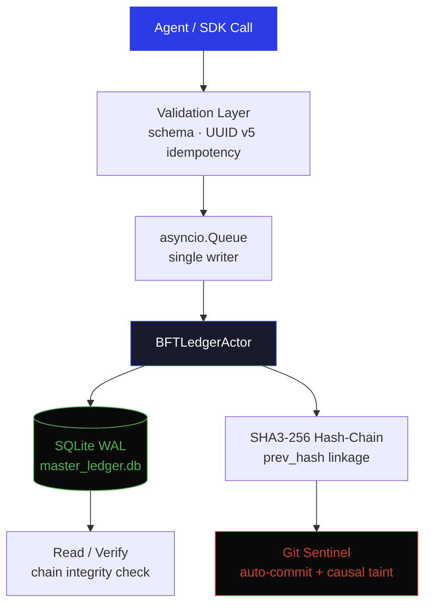

<p align="center">
  
</p>

<p align="center">
  <strong>Tamper-evident cryptographic ledger for autonomous AI agents</strong><br/>
  <sub>Local-first · Hash-chained · Single-writer SQLite WAL · Optional Rust core</sub>
</p>

<p align="center">
  <a href="https://pypi.org/project/cortex-persist/"></a>
  <a href="https://pypi.org/project/cortex-persist/"></a>
  <a href="https://github.com/borjamoskv/BABYLON-60/actions/workflows/codeql.yml"></a>
  <a href="https://github.com/borjamoskv/BABYLON-60/actions/workflows/verify_ledger.yml"></a>
  
  
  
</p>

<p align="center">
  <a href="#quickstart">Quickstart</a> ·
  <a href="docs/ARCHITECTURE.md">Architecture</a> ·
  <a href="docs/SECURITY_MODEL.md">Security Model</a> ·
  <a href="docs/EXPERIMENTAL.md">Experimental</a> ·
  <a href="docs/SOTA_2026-07_cortex-persist.md">SOTA 2026-07</a> ·
  <a href="STATUS.md">Status</a>
</p>

---

## Contents

- [What It Solves](#what-it-solves)
- [Maturity Matrix](#maturity-matrix)
- [Installation](#installation)
- [Quickstart](#quickstart)
- [CLI Tools](#cli-tools)
- [Architecture](#architecture)
- [Guarantees](#guarantees)
- [BABYLON60 IDE](#babylon60-ide)
- [Repository Layout](#repository-layout)
- [Local Development](#local-development)
- [Experimental](#experimental)

---

## What It Solves

Autonomous agents lack a reliable way to persist decisions with causal traceability. `cortex-persist` provides a **local-first memory substrate**:

```
Validation → Single-Writer Queue → Hash-Chain Ledger → Git Sentinel
```

Every entry is linked to the previous via **SHA3-256** hash. Every write carries a **causal taint** (who / when / why). Duplicates are rejected via **UUID v5** idempotency keys — re-submitting the same event returns the original entry, never a second row. The chain is **verified on read** — not assumed correct — and any break raises `BFTCausalInvariantError` fail-fast.

Optionally, payloads are **encrypted at rest** (Fernet, `C5ENC:` prefix) when `CORTEX_VAULT_KEY` is set — the chain verifies over the stored bytes, so integrity checks work with or without the vault key.

> [!IMPORTANT]
> **tamper-evident ≠ tamper-proof.** Hash-chains detect modifications _after the fact_. They do not prevent an attacker with filesystem access from replacing the entire database. See [SECURITY_MODEL.md](docs/SECURITY_MODEL.md) for the full threat model.

**State of the art (July 2026).** None of the current agent-memory systems (Mem0, Zep/Graphiti, Letta, LangMem, Cognee) ship cryptographic integrity; verifiable ledgers (immudb, Trillian/Tessera, Rekor) have no agent semantics or embedded Python form factor; and the checkpointing layers the industry actually uses (LangGraph, AutoGen, OpenAI Agents SDK) are neither tamper-evident nor tamper-resistant (CVE-2025-64439, CVE-2025-67644). With Amazon QLDB discontinued (end of support 2025-07-31), the intersection `cortex-persist` occupies — embedded single-writer SQLite + per-event hash chain + Lamport clock + causal taint + UUIDv5 idempotency + OpenTimestamps anchoring — is currently unoccupied. *The agent memory you can cryptographically verify, not just query.* Full sourced analysis: [docs/SOTA_2026-07_cortex-persist.md](docs/SOTA_2026-07_cortex-persist.md).

---

## Maturity Matrix

| Component | Status | Coverage | Use |
|:---|:---:|:---:|:---|
| BFT Ledger (SQLite WAL + hash-chain) | `Beta` | ~72% | Development |
| Cryptographic chain (SHA3-256, Fernet vault) | `Beta` | ~68% | Development |
| Python SDK (`babylon60.*`) | `Beta` | ~65% | Development |
| BABYLON60 IDE (FastAPI + Tauri) | `Beta` | — | Development |
| Rust core (`strike_rs` / PyO3) | `Alpha` | ~41% | Experimental |
| MCP integration | `Alpha` | ~30% | Experimental |
| Vector memory (`sqlite-vec`) | `Alpha` | ~35% | Experimental |
| BFT Swarm / quorum | `Prototype` | ~20% | Research only |
| Lean 4 formal proofs | `Prototype` | ~15% | Research only |
| LoRA daemon / HDC | `Design` | 0% | Do not use |

---

## Installation

```bash
pip install cortex-persist
```

Cryptographic signing (Ed25519, Argon2) is bundled in the core install — no extra required. Optional extras:

```bash
pip install "cortex-persist[dev]"         # pytest, ruff, mypy, FastAPI, uvicorn
pip install "cortex-persist[voice-full]"  # voice transcription (macOS Apple Silicon)
pip install "cortex-persist[onco]"        # onco-transducer pipelines (numpy/pandas/networkx)
pip install "cortex-persist[apex]"        # APEX trials (scikit-learn / scipy)
```

From source:

```bash
git clone https://github.com/borjamoskv/BABYLON-60.git
cd BABYLON-60
uv sync --all-extras   # or: pip install -e ".[dev]"
```

---

## Quickstart

Append an event to the ledger and verify the chain. All writes go through the single-writer actor — never direct SQL:

```python
import asyncio
from pathlib import Path

from babylon60.bft.ledger_actor import BFTLedgerActor, LedgerEvent

async def main() -> None:
    actor = BFTLedgerActor(Path("master_ledger.db"))
    await actor.start()
    try:
        result = await actor.append(
            LedgerEvent(
                stream="agent.decisions",
                entity_id="agent-001",
                event_type="decision.made",
                payload={"action": "deploy", "confidence": 0.97},
                cortex_taint="my-agent:why-this-write",  # mandatory causal trace
                source_db="demo.db",
                source_table="decisions",
                source_pk="42",
            )
        )
        print(result)
        # {'seq': 1, 'event_id': 'bfa707e8-…', 'entry_hash': '16fe7a38…'}

        # Re-submitting the same event is idempotent: same seq, same hash, no new row.
        print(await actor.verify_chain())  # True — raises on any break
    finally:
        await actor.stop()

asyncio.run(main())
```

`verify_chain()` re-computes every SHA3-256 link, enforces monotone `seq`, strictly increasing Lamport clocks, and raises `BFTCausalInvariantError` on the first violation — the ledger never silently accepts a fork.

---

## CLI Tools

Installed as console scripts with the package:

| Command | Purpose |
|:---|:---|
| `cortex-bridge` | Bridge CLI for CORTEX pipelines |
| `cortex-onco` | Onco-transducer pipeline runner |
| `cortex-attest` | LLM output attestation |
| `cortex-char-attest` | Character-count attestation |
| `apex` | APEX trials runner |

---

## Architecture


```mermaid
flowchart TD
    A[Agent / SDK Call] --> B[Validation Layer\nschema · UUID v5 idempotency]
    B --> C[asyncio.Queue\nsingle writer]
    C --> D[BFTLedgerActor]
    D --> E[(SQLite WAL\nmaster_ledger.db)]
    D --> F[SHA3-256 Hash-Chain\nprev_hash linkage]
    F --> G[Git Sentinel\nauto-commit + causal taint]
    E --> H[Read / Verify\nchain integrity check]

    style A fill:#2B3BE5,color:#fff,stroke:none
    style D fill:#1a1a2e,color:#fff,stroke:#2B3BE5
    style E fill:#0A0A0A,color:#4CAF50,stroke:#4CAF50
    style G fill:#0A0A0A,color:#CE422B,stroke:#CE422B
```

<details>
<summary><strong>Ledger Entry Contract (click to expand)</strong></summary>

Every write must satisfy this schema. Violations are rejected at the validation layer — not silently ignored. `UPDATE` and `DELETE` are blocked at the engine level by SQLite triggers: the ledger is append-only by construction.

```python
{
    "seq":          int,             # Monotone, gap-free — enforced on verify
    "event_id":     "uuid-v5",       # Idempotency key — derived from source + payload + taint
    "stream":       "str",           # Logical stream (e.g. "agent.decisions")
    "entity_id":    "str",           # Entity the event belongs to
    "event_type":   "str",           # e.g. "decision.made"
    "payload_json": "canonical-json",  # Sorted-key JSON, or Fernet-encrypted (C5ENC:)
    "source_db":    "str",           # Origin database
    "source_table": "str",           # Origin table
    "source_pk":    "str",           # Origin primary key
    "cortex_taint": "agent:reason",  # Causal trace — mandatory
    "lamport_t":    int,             # MAX(lamport_t)+1 — strictly increasing
    "prev_hash":    "sha3_256-hex",  # Chain link — breaks chain on mismatch
    "entry_hash":   "sha3_256-hex",  # Hash of the canonical envelope
    "created_at":   "utc-iso8601",   # Microsecond precision
}
```

</details>

<details>
<summary><strong>Consensus Topology (M12 Levels)</strong></summary>

| Level | Mechanism | Status |
|:---|:---|:---:|
| L1 — AP/CRDT | Local caches, telemetry | ✅ Stable |
| L2 — CP single-writer | `master_ledger.db` WAL | ✅ Stable |
| L3 — External witness | Git Sentinel (local repo) | ✅ Stable |
| L4 — BFT quorum | N≥3f+1 distributed swarm | 🧪 Prototype |
| L5 — Blockchain anchor | OTS / BTC OP_RETURN | 🔬 Research |

**L1–L3 is the stable core.** Despite the `bft/` module name, no live PBFT/Raft quorum runs today — L3 non-equivocation is provided by the Git Sentinel witness (see [`babylon60/bft/README.md`](babylon60/bft/README.md) for the honest-naming rationale). L4 and L5 are opt-in research extensions.

</details>

---

## Guarantees

| Property | Mechanism | What It Proves |
|:---|:---|:---|
| **Integrity** | SHA3-256 hash-chain | Entry not modified after write |
| **Provenance** | Causal taint + timestamp | Who wrote it and when |
| **Ordering** | Lamport clock + WAL | Serialized, reproducible history |
| **Idempotency** | UUID v5 key | No duplicate writes |
| **Immutability** | SQLite triggers (`UPDATE`/`DELETE` aborted) | Append-only at engine level |
| **Isolation** | Per-tenant DB scope | Workspace separation |

---

## BABYLON60 IDE

The repository ships a local-first IDE (`babylon60-ide/`) on top of the ledger: FastAPI backend, Tauri v2 desktop shell, MV3 browser extension, its own append-only sidecar ledger (`babylon60_ide.db`), aggregate analytics and Okapi BM25 lexical search over payloads.

```bash
python run_backend.py   # → http://127.0.0.1:8000
```

---

## Repository Layout

| Path | Contents |
|:---|:---|
| `babylon60/bft/` | Ledger actor, single-writer queue, consensus scaffolding |
| `babylon60/core/` | C5 memory shield, crypto, replay kernel, AST pruner |
| `babylon60/cli/` | Console scripts (`cortex-*`) |
| `babylon60/database/` | Connection pool, TLRU cache |
| `babylon60-ide/` | IDE backend / frontend / Tauri / browser extension |
| `strike_rs/` | Optional Rust core (PyO3) — GIL-bypass paths |
| `contracts/` | Solidity (EIP-1153 transient reentrancy locks) |
| `tests/` | 28 test modules — ledger, invariants, SSM/Mamba, crypto |
| `docs/` | Architecture, security model, experimental specs |

---

## Local Development

```bash
uv sync --all-extras                 # Python 3.12 .venv (or: pip install -e ".[dev]")
.venv/bin/pytest                     # 28 test modules, asyncio auto-mode
.venv/bin/ruff check .               # lint (line-length 120, py310 target)
.venv/bin/mypy babylon60/            # types
```

Build the Rust core (optional — Python fallback available):

```bash
cd strike_rs && cargo build --release
```

Operational rules for contributors (DB writes, Git Sentinel commits, reality levels) live in [AGENTS.md](AGENTS.md).

---

## Experimental

BFT Swarm, Vector Memory, Lean 4 proofs, LoRA daemon, Blockchain anchoring, and HDC are **explicitly experimental**. See [docs/EXPERIMENTAL.md](docs/EXPERIMENTAL.md) for status and known limitations. Do not use in production.

---

<p align="center">
  <sub>
    Titular Civil: <strong>CORTEX Core Dev</strong> · AKA: <strong>Borja Moskv</strong> (<code>borjamoskv</code>)<br/>
    All Rights Reserved — Proprietary &amp; Trade Secret<br/>
    Art. 6.1, 6.2, 14 LPI (España) · Convenio de Berna · Ley 1/2019 de Secretos Empresariales
  </sub>
</p>
