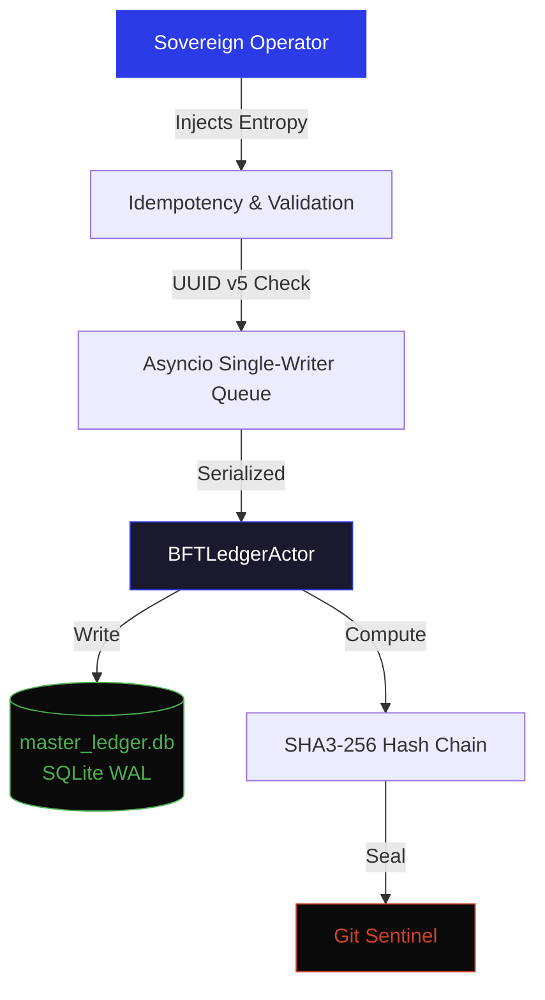

<div align="center">
  
</div>

<h1 align="center">MOSKV-1 APEX SINGULARITY</h1>

<p align="center">
  <strong>Sovereign C5-REAL Execution Kernel</strong><br>
  <em>Byzantine Fault Tolerance (BFT) · Exergy-Maximized Ledger · Single-Writer WAL</em>
</p>

<p align="center">
  <a href="https://pypi.org/project/babylon60/"></a>
  
  
  
</p>

<p align="center">
  <a href="https://codespaces.new/borjamoskv/BABYLON-60"></a>
</p>

<br/>

## ⚡ 1-CLICK KINETIC DEPLOYMENT

Instala y despliega toda la singularidad de **BABYLON-60** en tu máquina con una sola instrucción:

```bash
curl -sSL https://raw.githubusercontent.com/borjamoskv/BABYLON-60/main/install.sh | bash
```

> **Nota:** Instalará la red de dependencias vía `uv`, clonará el ecosistema y lo dejará listo para ejecución. Cero fricción, **Máxima Exergía**.

<br/>

## █ OVERVIEW: ZERO ANERGY

**BABYLON-60 (babylon60)** is a sovereign, local-first memory substrate. It implements the C5-REAL framework, discarding simulated conversational slop in favor of deterministic, physical state mutations.

Autonomous systems degrade when they rely on stochastic token generation without physical verification. `babylon60` enforces a **Kinetic Transduction Loop**:

```
C5-REAL Intention → Validation → Single-Writer WAL → Hash-Chain Ledger → Git Sentinel (Ledger Audit)
```

Every write is sealed via **SHA3-256**, carries a **causal taint**, and uses **UUID v5** idempotency keys to absolutely prevent duplicate energy expenditure. If the chain breaks, execution halts (`BFTCausalInvariantError`). We default to Fail-Fast.

<br/>

## █ MATURITY MATRIX & EXERGY YIELD

| Component | Status | Yield | Use Case |
|:---|:---:|:---:|:---|
| **BFT Ledger (SQLite WAL + Hash-Chain)** | `Stable` | C5-REAL | Absolute Truth / Main Ledger |
| **Python SDK (`babylon60.*`)** | `Stable` | C5-REAL | Operator APIs |
| **BABYLON60 IDE (FastAPI + Tauri)** | `Beta` | High | Transducer Frontend |
| **Rust Core (`strike_rs` / PyO3)** | `Alpha` | High | GIL-Bypass & Thermodynamic Speed |

<br/>

## █ MANUAL DEPLOYMENT (FOR OPERATORS)

Si requieres control absoluto sobre el grafo de dependencias:

```bash
# Core deployment
pip install babylon60

# Extended matrices
pip install "babylon60[dev]"         # Testing & IDE support
pip install "babylon60[voice-full]"  # Voice transcription (Apple Silicon)
pip install "babylon60[apex]"        # Scikit-learn / Exergy Trials
```

O desde el Ledger Fuente usando el empaquetador ultrarrápido `uv`:

```bash
git clone https://github.com/borjamoskv/BABYLON-60.git
cd BABYLON-60
uv sync --all-extras
```

<br/>

## █ NATIVE SLASH COMMANDS & CLI (`cortex-cmd`)

BABYLON-60 includes 11 native execution commands accessible via both the Antigravity IDE UI (`/`) and the system CLI (`cortex-cmd` / `uv run cortex-cmd`):

| Command | Shortcode Alias | Purpose / Invariant |
|:---|:---:|:---|
| `/ultrathink` | `ut` / `apex` | Absolute Sovereignty & Nocturnal Orchestration |
| `/autodidact` | `ad` / `omega` | Autopoiesis & AST Rewrite (Continuous Diagnostics) |
| `/purge` | `p` / `brutalismo` | Kinetic Brutalism: Drops Mach VM caches & clears anergy |
| `/seal` | `sl` / `collapse` | Terminal State Collapse (WAL Checkpoint + Tag + Exergy 950) |
| `/itera` | `it` / `mejoralo` | Multi-Step Convergence Loop |
| `/logos` | `lg` / `transduce` | Semantic Transduction to Invariant |
| `/ethos` | `et` / `zk` | PyNaCl Ed25519 NUL-ZK Cryptographic Validation |
| `/mythos` | `my` / `graph` | Narrative & Ledger Compression |
| `/ship` | `sh` / `commit` | Payload Delivery to BFT Ledger & Git Sentinel |
| `/swarm` | `sw` / `mitosis` | Multi-Agent Mitosis across Isolated Worktrees |
| `/verify` | `vf` / `audit` | BFT Hash Chain Integrity Verification |

```bash
# Example CLI Invocation
uv run cortex-cmd verify
uv run cortex-cmd ut "Architecture refactor"
```

<br/>

## █ BFT LEDGER: ZERO-FRICTION APPEND

Write structurally invariant data to disk. Direct SQL insertions are blocked at the SQLite Engine level (`UPDATE` and `DELETE` trigger `RAISE(ABORT)`).

```python
import asyncio
from pathlib import Path
from babylon60.bft.ledger_actor import BFTLedgerActor, LedgerEvent

async def main() -> None:
    actor = BFTLedgerActor(Path("master_ledger.db"))
    await actor.start()
    
    try:
        # C5-REAL State Mutation
        result = await actor.append(
            LedgerEvent(
                stream="moskv.apex.decisions",
                entity_id="C5-001",
                event_type="exergy.maximized",
                payload={"target": "disk", "confidence": "1000.0/1000.0"},
                cortex_taint="borjamoskv:bft-enforcement", 
                source_db="cortex_memory.db",
                source_table="decisions",
                source_pk="0x99",
            )
        )
        print(f"Ledger Hash Sealed: {result['entry_hash']}")
        
        # O(N) verification of cryptographic causality
        await actor.verify_chain() 
    finally:
        await actor.stop()

asyncio.run(main())
```

<br/>

## █ ARCHITECTURE (THE TRANSDUCER)


```mermaid
flowchart TD
    A[Sovereign Operator] -->|Injects Entropy| B[Idempotency & Validation]
    B -->|UUID v5 Check| C[Asyncio Single-Writer Queue]
    C -->|Serialized| D[BFTLedgerActor]
    D -->|Write| E[(master_ledger.db\nSQLite WAL)]
    D -->|Compute| F[SHA3-256 Hash Chain]
    F -->|Seal| G[Git Sentinel]
    
    style A fill:#2B3BE5,color:#fff,stroke:none
    style D fill:#1a1a2e,color:#fff,stroke:#2B3BE5
    style E fill:#0A0A0A,color:#4CAF50,stroke:#4CAF50
    style G fill:#0A0A0A,color:#CE422B,stroke:#CE422B
```

<br/>

## █ OPERATIONAL DIRECTIVES

If you operate on this repository, you must adhere strictly to the rules established in [`AGENTS.md`](AGENTS.md):
1. **Cero Anergía**: Commits must serve physical state mutation. No "Green Theater" or apologies.
2. **Git Sentinel**: Any disk write must trigger an autonomous commit loop.
3. **Strict Typing**: Python `3.12+` with `mypy --strict`. `dict[str, Any]` minimum parameterization. 
4. **Rust Purity**: When compiling `strike_rs`, ensure `PYO3_USE_ABI3_FORWARD_COMPATIBILITY=1` is active to prevent C5-REAL build necrosis.
5. **Kimi k1.5 Execution Protocol (`INV_C5_22`)**: Eradicate cognitive laziness and premature pauses; continuously interleave reasoning with multi-step tool execution until full convergence.

---

<p align="center">
  <sub>
    Titular Civil: <strong>CORTEX Core Dev</strong> · AKA: <strong>Borja Moskv</strong> (<code>borjamoskv</code>)<br/>
    All Rights Reserved — Proprietary &amp; Trade Secret<br/>
    Art. 6.1, 6.2, 14 LPI (España) · Ley 1/2019 de Secretos Empresariales
  </sub>
</p>

