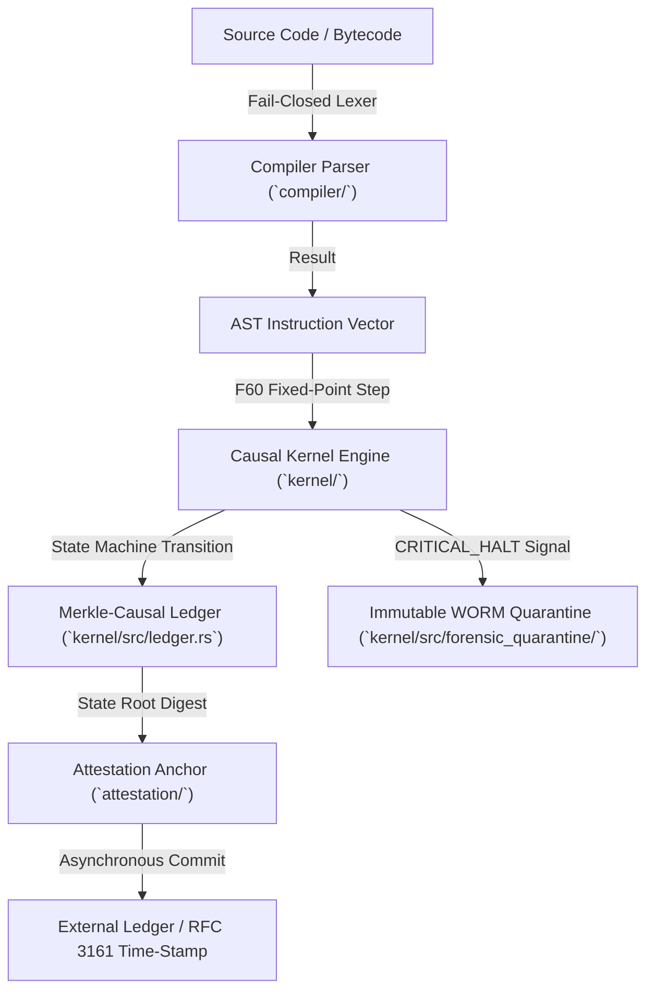

# BABYLON-60 Architecture & Formal Specification (v4.0)

**Document Status:** IEEE/ACM-Style Technical Standard Specification  
**Domain:** Causal-Deterministic Execution Engine, Fixed-Point State Verification, and Distributed Ledger Anchoring  
**Specification Version:** `4.0.0-HARDENED`

---

## 1. Executive Architecture Summary

BABYLON-60 is a causal-deterministic execution kernel engineered for deterministic state transitions, formal auditability, and zero-hallucination verification. The core execution model enforces $Q32.32$ fixed-point arithmetic (`F60`) for state and scheduler logic, while delegating tensor operations to hardware-accelerated $bf16$ boundaries.



---

## 2. Core Mathematical Formalisms & Invariants

### 2.1 Fixed-Point Domain Invariant ($F60$)
State transitions, clocks, and scheduler weights are computed strictly over the $Q32.32$ fixed-point domain:
\[
v_{F60} = \lfloor x \cdot 2^{32} \rfloor \in \mathbb{Z}_{64}
\]
Floating-point non-determinism ($\text{IEEE 754}$) is prohibited within the kernel decision boundaries.

### 2.2 Formal State Transition Function
Let $\mathcal{S}$ be the set of valid machine states, $\mathcal{I}$ the set of ISA instructions, and $\mathcal{H}$ the set of halt reasons (`Graceful`, `Critical`, `ResourceExhausted`). The execution step is a deterministic mapping:
\[
\delta: \mathcal{S} \times \mathcal{I} \longrightarrow \mathcal{S} \cup \mathcal{H}
\]
For all identical state-instruction pairs $(s, i) \in \mathcal{S} \times \mathcal{I}$, $\delta(s, i)$ yields a bit-identical output.

### 2.3 Merkle-Causal DAG State Digest
Given a sequence of causal events $E = (e_1, e_2, \dots, e_n)$ where each event $e_k$ references parent event IDs $\mathcal{P}(e_k)$, the event digest is computed as:
\[
H(e_k) = \operatorname{BLAKE3}\Big(k \;\parallel\; \operatorname{timestamp}(e_k) \;\parallel\; \operatorname{payload}(e_k) \;\parallel\; \bigoplus_{p \in \mathcal{P}(e_k)} H(p)\Big)
\]

---

## 3. Monorepo Crate & Subsystem Topology

```text
BABYLON-60 Monorepo Topology (v4.0 Standard Specification)

1. CORE EXECUTION ENGINE LAYER
   ├── kernel/                         # Causal-Deterministic Execution Kernel (Rust Crate)
   │   ├── scheduler/                  # Discrete Event Scheduler & Simulation Clock
   │   └── forensic_quarantine/        # Immutable WORM Forensic Quarantine (State Seal)

2. VERIFIABILITY & SECURITY LAYER
   ├── attestation/                    # Merkle Root Anchoring & OIDC Identity Cryptography
   ├── compiler/                       # Fail-Closed Compiler (AST Parser & IR Generator)
   ├── proof_ir/                       # Formal Verification IR Schema
   └── fuzz/                           # Proptest & libFuzzer Differential Security Harnesses

3. RUNTIME & INTEROP LAYER
   ├── runtime/                        # Asynchronous Coroutine Memory & Execution Runtime
   ├── strike_rs/                      # PyO3 C-Extension (Zero-Copy GIL Bypass Engine)
   ├── causal_isomorphism/             # Formal AST Transpiler (F# -> Rust / Solidity)
   ├── timeline_ir/                    # Causal Event Graph & Timeline Renderer
   └── ultrathink/                     # Dynamic Resource & Workload Optimizer

4. PERSISTENCE & ML LAYER (Python)
   └── babylon60/                      # Core Python SDK (`cortex-persist`)
       ├── mamba_engine/               # State Space Models (SSM) Integration
       └── chaos_monad/                # Encapsulated Stochastic Inference Boundary

5. USER INTERFACE & IDE LAYER
   ├── web/                            # Web-Based State & Causal Mesh Visualizer
   ├── tonnetz_app/                    # Manifold State Decision Visualizer
   └── babylon60-ide/                  # Desktop Tauri IDE (CSWSH Hardened)

6. FORMAL SPECIFICATION & AUDIT ASSETS
   ├── BabylonTrace.lean               # Lean 4 Theorem Prover Definitions
   ├── tests/                          # Automated Pytest Hardening Test Suite (313 Passed)
   ├── SPECIFICATION.md                # Standardized Architecture Specification
   └── LICENSE                         # Sovereign Dual-License (Open-Core / Enterprise)
```

---

## 4. Subsystem Specifications

### 4.1 `kernel::forensic_quarantine`
- **Protocol:** ISO/IEC 27001 & WORM (Write-Once-Read-Many) Audit Standard.
- **Behavior:** Upon a `CRITICAL_HALT` condition, the kernel state is frozen into a read-only memory region. Further mutations are rejected, and the full state snapshot is serialized for forensic inspection.

### 4.2 `compiler::parser`
- **Error Strategy:** Fail-Closed.
- **Type Signature:** `pub fn parse(source: &str) -> Result<AST, ParseError>`.
- **Parsing Invariant:** Unrecognized tokens or invalid opcodes immediately break evaluation and return `ParseError::UnknownOpcode(String)`.

### 4.3 `attestation::merkle_anchor`
- **Anchoring Protocol:** Asynchronous Cryptographic Root Commitment.
- **Integration:** Hashes the `DAGLedger` state root and emits signed proofs anchored via OpenTimestamps / RFC 3161 time-stamping protocols.

---

## 5. Security & Threat Model Matrix

| Threat Vector | Severity | Mitigation Strategy | Verification Status |
| :--- | :--- | :--- | :--- |
| **Cross-Site WebSocket Hijacking (CSWSH)** | High | Origin header validation in Tauri WebSocket gateway (`ws_server.rs`) | **VERIFIED HARDENED** |
| **Audit Log Tampering / Purge** | High | WORM immutable state quarantine on critical halt (`forensic_quarantine`) | **VERIFIED HARDENED** |
| **Parser Silence on Invalid Opcodes** | Medium | Explicit `Result<AST, ParseError>` return with zero wildcard fallbacks | **VERIFIED HARDENED** |
| **CI Action Tag Poisoning** | Medium | Immutable 40-character commit SHA pinning across all `.github/workflows/` | **VERIFIED HARDENED** |
| **License Key Forgery** | High | HMAC salt loaded from `BABYLON60_LICENSE_SALT` env var (fail-closed) | **VERIFIED HARDENED** |

---

## 6. Regulatory & Standard Alignment

1. **EU AI Act Alignment:** Technical governance controls mapped to Articles 9 (Risk Management Systems) and 10 (Data and Data Governance).
2. **ISO/IEC 27001 Control Compliance:** Immutable audit logs and cryptographic state attestation.
3. **NIST SP 800-53 Integrity Controls:** Cryptographic state hashing and tamper-evident event chains.