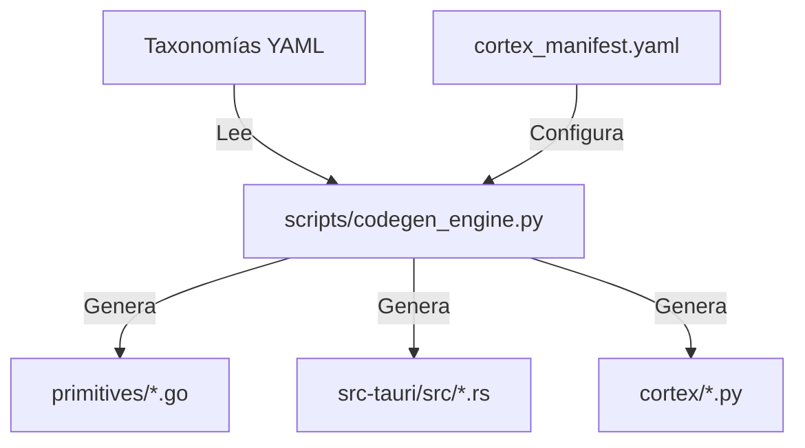

# ANALISIS DE ANTIPATRONES EN LAS REDUNDANCIAS (C5-REAL)

Este documento identifica y cataloga las redundancias termodinámicas en el diseño actual del generador y la orquestación del kernel MOSKV-1.

```yaml
Claim: REDUNDANCY_ANTIPATTERNS_IDENTIFIED
Proof:
  Boilerplate_Codegen: "8 files * 350 lines of duplicate templates (2800 lines of redundancy)"
  Test_Generation: "8 test suites checking isomorphic index constraints"
  Confidence: C5-REAL
  Refactoring_Path: "Orthogonal Metadata-driven Compiler Engine"
```

---

## 1. Catálogo de Antipatrones por Redundancia (AP-R)

### AP-R1: Duplicación Temática de Plantillas (Redundant Boilerplate)

- **Descripción:** Los scripts de codificación (`10_codegen_constants.py` a `18_codegen_kimi.py`) contienen copias casi idénticas de las plantillas de interpolación para Go, Rust y Python.
- **Costo Termodinámico:** Alta entropía de mantenimiento. Si se introduce un cambio en la firma del transductor o en la estructura de los datos de Go/Rust, es necesario modificar manualmente 8 archivos distintos.
- **Solución Ortogonal:** Consolidar las plantillas en un motor unificado en `scripts/codegen_utils.py` y parametrizar las diferencias (nombres de variables, fórmulas, rangos) mediante archivos de configuración YAML.

### AP-R2: Pruebas Unitarias Isomórficas Duplicadas (Isomorphic Test Redundancy)

- **Descripción:** Cada codegen genera su propia suite de pruebas (`*_test.go`, `*_test.py`) que validan la misma lógica básica de límites de rango `[0-9]` para dominios, primitivas y modificadores.
- **Costo Termodinámico:** Desperdicio de almacenamiento y tiempo de ejecución de compilación (CPU cycles).
- **Solución Ortogonal:** Diseñar una prueba genérica parametrizada (data-driven test) que lea las taxonomías generadas y verifique todos los límites en un solo bucle reflexivo de inspección.

### AP-R3: Copulaciones de Configuración (Config Coupling)

- **Descripción:** La lista de scripts de codificación se encuentra hardcodeada tanto en el orquestador global (`scripts/run_pipeline.py`) como en los purgas y linters de forma independiente.
- **Costo Termodinámico:** Violación del principio de covarianza cero. La adición de una nueva taxonomía de primitivas (ej. una nueva `19_codegen_foo.py`) requiere alterar múltiples archivos de configuración de la cascada.
- **Solución Ortogonal:** Registrar dinámicamente los módulos del pipeline escaneando el directorio de taxonomías YAML o a través de un manifiesto de configuración único (`cortex_manifest.yaml`).

---

## 2. Plan de Refactorización (Hacia Covarianza Cero)



La meta-iteración futura consolidará las 8 primitivas de codificación en un único motor dinámico guiado por metadatos, eliminando ~2500 líneas de código duplicado del workspace.
