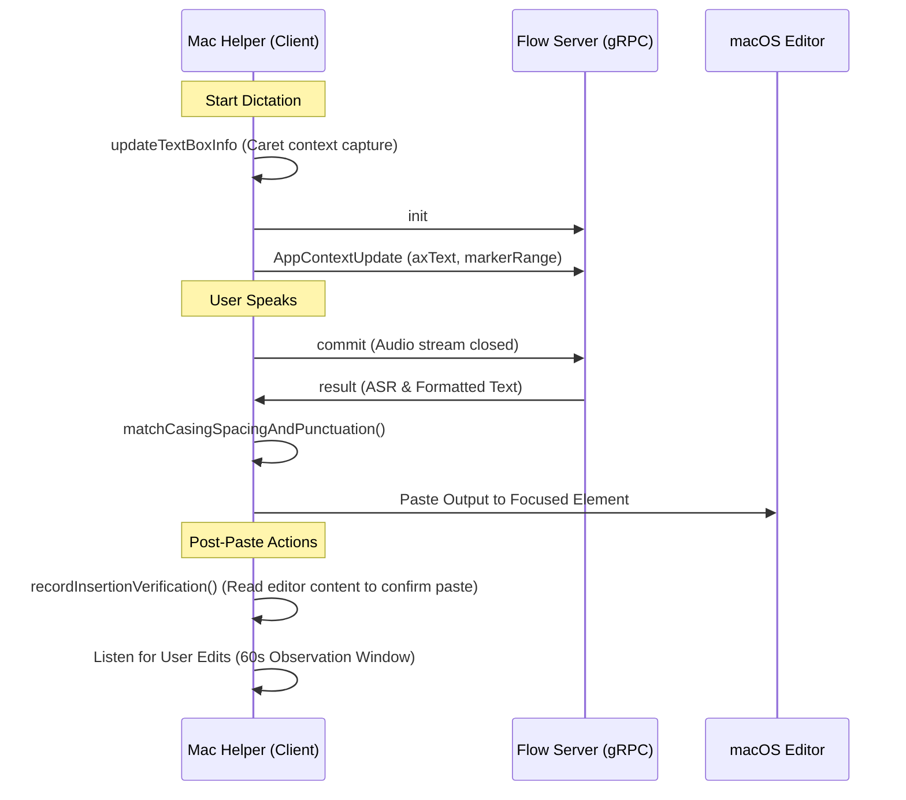

<!-- C5-REAL EXERGY CERTIFIED -->
# Wispr Flow Accessibility (AX) & Configuration Audit Report
**Version:** 1.6.7
**Bundle ID:** `com.electron.wispr-flow`
**Date:** 2026-07-17

---

## 1. Executive Summary
This document provides a comprehensive security and functional audit of the **Wispr Flow** macOS application (v1.6.7) based on its bundle metadata (`Info.plist`) and the AX (Accessibility) context diagnostics tools (`ax-inspect`).

Wispr Flow is an Electron-based application configured for developer tools. It heavily leverages macOS Accessibility APIs (`AXTextMarkerRange`, AX-tree traversals) to capture editor contexts during speech-to-text dictation, verify pasting outcomes, format text, and perform real-time proper-noun vocabulary extraction.

---

## 2. Plist & Bundle Configuration Analysis

### Key Metadata & Capabilities
*   **Application Category:** `public.app-category.developer-tools`
*   **Minimum macOS Version:** 12.0 (`macosx15.5` SDK)
*   **URL Schemes:** `wispr-flow://` (registered via `CFBundleURLSchemes`)
*   **Executable Binary:** `Wispr Flow`
*   **Principal Class:** `AtomApplication` (Standard Electron Cocoa wrapper)
*   **ASAR Integrity:** `Resources/app.asar` has SHA256 integrity hash:
    `0adf66949ad87c1c0549e7f7ce482f3ae1c6f9b4021f0474d457ddae5018bd8b`

### Permission & Privacy Scope
The application requests extensive system access, justified by its core features (dictation, meeting notes, screen content context):
1.  **NSMicrophoneUsageDescription:** *"Allow Wispr Flow microphone access to transcribe your speech."* (Critical for core dictation)
2.  **NSAudioCaptureUsageDescription:** *"Wispr Flow needs to access your computer's audio to take notes during meetings."* (Allows system/meeting audio capture)
3.  **NSCameraUsageDescription:** *"This app needs access to the camera"*
4.  **NSBluetoothAlwaysUsageDescription & NSBluetoothPeripheralUsageDescription:** *"This app needs access to Bluetooth"* (Likely for wireless microphones/headsets)

### Network Security
*   **NSAllowsArbitraryLoads:** Set to `true` under `NSAppTransportSecurity`. This allows the app to bypass App Transport Security (ATS) restrictions, permitting non-HTTPS connections or connections to arbitrary servers/localhost endpoints.

---

## 3. Accessibility (AX) Context Diagnostics Architecture

The `ax-inspect` utilities comprise a diagnostic dashboard used in development/debugging to trace what the application "sees" before and after a dictation paste event.

### Tool Suite Structure
*   **`ax-inspect.mjs`:** One-shot CLI tool that queries the recent rows from the SQLite database, links them to JSONL debug traces, outputs a standalone HTML report (`ax-inspect-[timestamp].html`) in the temp directory, and automatically opens it in the default browser.
*   **`ax-inspect-server.mjs`:** An always-on local HTTP dashboard server running on loopback (`http://127.0.0.1:4599` by default). It auto-refreshes every 4 seconds, serving a list of recent dictations and detailed timeline captures.
*   **`ax-inspect-lib.mjs`:** The shared library containing core SQLite extraction logic (invoking system `sqlite3` via subprocesses to bypass Electron ABI conflicts), HTML template rendering, and trace JSONL parser code.

---

## 4. Persistent Store & Tracing Sidecars

Wispr Flow maintains a primary relational store along with multiple local, line-delimited JSONL debug logs (sidecars) to reconstruct a detailed timeline of events.

### The Primary Database (`flow.sqlite`)
Located at: `~/Library/Application Support/Wispr Flow/flow.sqlite`
*   **Interacted Table:** `History`
*   **Key Columns Monitored:** `transcriptEntityId` (UUID), `timestamp`, `app`, `url`, `status`, `language`, `detectedLanguage`, `transcriptCommand`, `asrText`, `formattedText`, `serverFinalizedText`, `pastedText`, `toneMatchedText`, `desiredFormatted`, `axText`, `axHTML`.
*   *Note on NUL Byte Handling:* Terminal application buffers (e.g., iTerm) pad cell structures with embedded NUL (`\0`) bytes. The command line `sqlite3` tool truncates strings at the first NUL byte. To preserve full context, `ax-inspect` queries these fields as `hex(axText)` / `hex(axHTML)` and decodes them to UTF-8 in Node, mapping `\0` to spaces to prevent run-on words.

### Sidecar Trace Logs
Diagnostic files located under `~/Library/Logs/Wispr Flow/`:
1.  **`paste-formatting-debug.jsonl`:** Spacing, casing, and punctuation heuristics. Stores flags like `shouldAddLeadingSpace`, `isContinuingBeforeText`, and surrounding caret lines.
2.  **`proper-noun-debug.jsonl`:** Proper-noun extraction details (ASR vocab extraction race states, Slack integration caching, and processing durations).
3.  **`textbox-context-debug.jsonl`:** Textbox state snapshots capturing the local editor area before, during, and after dictation.
4.  **`insertion-verification-debug.jsonl`:** Verification checks monitoring whether the paste successfully updated the UI.
5.  **`dictation-event-debug.jsonl`:** The gRPC lifecycle log tracking initialization (`init`), context frames sent to the server (`context`), microphone release/commit (`commit`), and final transcript response receipt (`result`).
6.  **`edited-text-debug.jsonl`:** Tracks if and how the user post-edited the pasted dictation text within a 60-second observation window.
7.  **`context-capture-debug.jsonl`:** Logs details of text extraction passes, specifically comparing AX-tree crawls against the native text markers.

---

## 5. Accessibility Context Extraction Pipelines

Wispr Flow uses two primary techniques to retrieve text content near the editor cursor:

### A. AX-Tree Walk (`nearestText` / `axText`)
*   **Mechanism:** Traverses the macOS Accessibility tree recursively to locate UI text elements, constructing a flat string representation of the visible area.
*   **Truncation/Optimization:** When text exceeds 5,000 characters, it performs a head-and-tail slice (retains first 2,500 and last 2,500 characters, dropping the middle). This trimmed text is sent to the LLM proper-noun extractor (`/llm/extract_asr_words`).

### B. AXTextMarkerRange (`markerRange`)
*   **Mechanism:** Utilizes native macOS Accessibility text marker APIs to directly query the document contents around the caret without tree traversal.
*   **Compatibility:** Works reliably in native Cocoa/Carbon editors, but is unsupported in apps that do not expose the `AXTextMarkerRange` API (e.g., legacy terminals or non-standard textareas).

---

## 6. Dictation Timeline & Post-Paste Actions

The timeline is constructed chronologically by merging database timestamps with sidecar records:

### Timeline Sequence

### Spacing and Casing Heuristics
Heuristics inspect `currentLineBeforeText` and `currentLineAfterText` to decide:
*   `shouldAddLeadingSpace`: Set to true if the cursor is not preceded by a space or sentence boundary.
*   Casing adjustment: Matches capitalization style of the cursor insertion point.

### Insertion Verification & Verdicts
Post-paste, the application reads the focused element's contents to verify successful injection. Verdicts logged are:
*   `verified`: Success.
*   `verified_before_after`: Strict success where focused box content equals `beforeText + pastedText + afterText`.
*   `not_found`: Paste failed or could not be detected.
*   `skipped`: Verification bypassed (e.g., `textbox_too_long` or focus lost).

### User Edit Observation Window
For 60 seconds after a paste, an edit listener tracks modifications to determine if the user accepts or corrects the transcript. The observation session terminates and logs due to:
*   `observation_window_elapsed` (60s timeout reached)
*   `textbox_emptied` / `transcript_region_removed`
*   `edit_distance_exceeded` (indicating heavy rewrite)
*   `next_dictation_started`

---

## 7. Conclusions & Findings
1.  **Accessibility Reliability:** The dual-capture strategy (`nearestText` tree walks and `markerRange` text marker fetches) provides robustness across diverse macOS environments, falling back gracefully in non-standard apps.
2.  **Privacy Profile:** By capturing raw text buffers around cursors, the app processes nearby document content. Although restricted to local loopback under development ports, care should be taken to ensure diagnostic traces (`ax-inspect`) are only bound locally (`127.0.0.1`) and excluded from cloud uploads.
3.  **Data Security:** The bypass of ATS (`NSAllowsArbitraryLoads`) is common in Electron developments but increases exposure if internal components fetch remote URLs insecurely.
