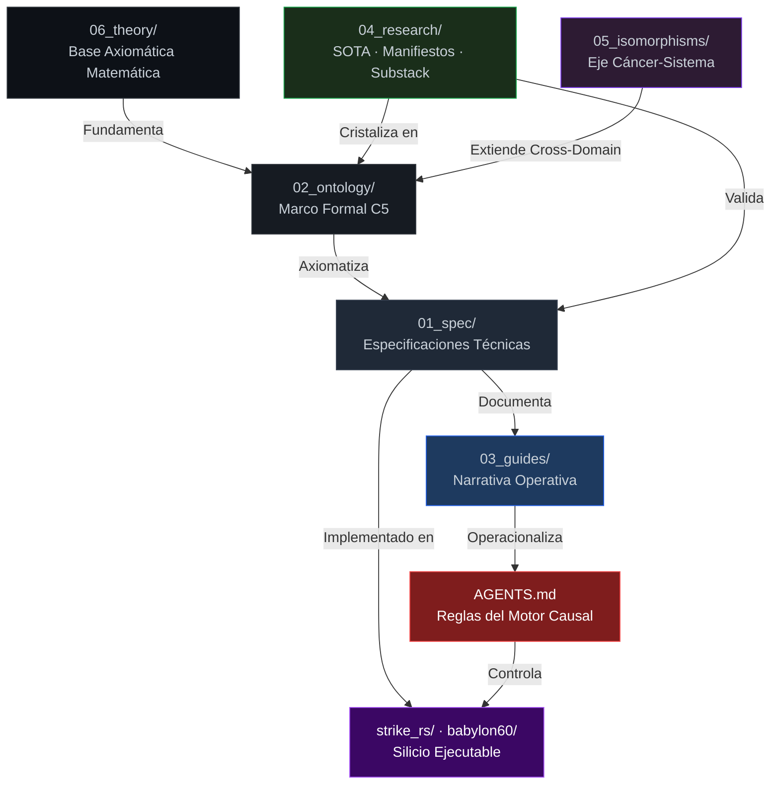

# BABYLON-60 — Índice Canónico de Documentación (`docs/`)

> **Última actualización:** 2026-08-09
> **Convención activa:** `lower_snake_case` con prefijo DDD — enforzado por `.git/hooks/pre-commit`
> **Invariante:** `INV_C5_NOMINAL_DENSITY` — todo símbolo apunta a una única entidad sin ambigüedad.

---

## Mapa de Relaciones (Grafo Causal)



---

## 01_spec — Especificaciones Técnicas

| Archivo | Contenido | Depende de | Implementado en |
|:---|:---|:---|:---|
| `spec_architecture.md` | Arquitectura global del monorepo | `axiom_ontology.md` | `strike_rs/`, `babylon60/` |
| `spec_technical.md` | Especificación técnica completa del sistema | `axiom_axiomatization.md` | `kernel/`, `runtime/` |
| `spec_babylon60.md` | Spec del lenguaje B60 DSL | `06_theory/03_computability_turing.md` | `compiler/` |
| `spec_proof_ir.md` | Spec del Intermediate Representation de pruebas | `06_theory/06_curry_howard.md` | `proof_kernel/`, `proof_ir/` |
| `spec_graph_canonical.md` | Spec del grafo canónico de ontología | `axiom_ontology.md` | `domain_kernel/` |
| `spec_exergy_ontology.md` | Especificación de la métrica de exergía | `axiom_axiomatization.md` | `strike_rs/atms.rs` |
| `spec_cryptographic_profile.md` | Perfil criptográfico del sistema | — | `L1_sink/` |
| `spec_security_model.md` | Modelo de seguridad y trust boundaries | `spec_cryptographic_profile.md` | `AGENTS.md` |
| `spec_causal_hitl_governance.md` | Especificación de Gobernanza Causal HITL y Agentes Operacionales | `AGENTS.md` | `scripts/c5_demos/poc_causal_hitl_agent.py` |
| `artifact_format_v1.md` | Especificación del formato estructurado de artefactos | — | `cortex/` |
| `audit_babylon60_v2.5.md` | Auditoría histórica v2.5 | — | — |

---

## 02_ontology — Marco Formal

| Archivo | Contenido | Depende de |
|:---|:---|:---|
| `axiom_ontology.md` | Ontología canónica de entidades del sistema | `06_theory/00_index.md` |
| `axiom_axiomatization.md` | Axiomática formal completa (C5-REAL + Moskv-1 APEX) | `06_theory/01_robinson_arithmetic.md` |
| `axiom_oncologia_300_primitivas.md` | 300 primitivas del lenguaje ontológico | `axiom_ontology.md` |
| `spec_c5_graph_isomorphism.md` | Spec del algoritmo 1-WL de isomorfismo | `06_theory/07_cross_domain.md` |
| `security_threat_model_v4.md` | Modelo de amenazas y vectores de ataque v4.0 | `spec_cryptographic_profile.md` |

---

## 03_guides — Narrativa Operativa

| Archivo | Audiencia | Depende de |
|:---|:---|:---|
| `guide_babylon60_complete.md` | Nuevos contribuidores | `spec_architecture.md` |
| `guide_explanation.md` | Audiencia técnica externa | `axiom_ontology.md` |
| `guide_experimental.md` | Operadores internos | `spec_technical.md` |
| `guide_repository_source_of_truth.md` | Todos los agentes | `AGENTS.md` |
| `guide_skill_arsenal_taxonomy.md` | ✅ VERIFIED — Mapeo completo (39 skills físicas / 143 operadores) | `docs/skills.json` |
| `tonnetz_audit_guide.md` | Guía de auditoría de topología Tonnetz | `06_theory/` |
| `tutorial_hello_causal.md` | Tutorial de inicio para programación causal | `spec_architecture.md` |
| `QUICKSTART_ENTERPRISE.md` | Guía de despliegue rápido Enterprise | `05_gtm/` |

---

## 04_research — SOTA · Manifiestos · Substack

### Whitepapers & Arquitectura Swarm
| Archivo | Tema |
|:---|:---|
| `centuria_swarm_architecture.md` | Arquitectura del enjambre Centuria BFT |
| `legion_222_swarm_topology.md` | Topología de 222 agentes enjambre C5-REAL |
| `eu_ai_act_compliance_whitepaper.md` | Cumplimiento legal y técnico de la EU AI Act |
| `evaluacion_falsacion_llm_models_2026.md` | Evaluación popperiana de modelos LLM 2026 |

### `sota/` — Estado del Arte
| Archivo | Tema | Cristalizado en |
|:---|:---|:---|
| `sota_cortex_persist_202607.md` | Cortex Persistence Engine | `cortex/` |
| `sota_ssm_lnn_202600.md` | SSM + LNN (Mamba) | `kernel/` |
| `sota_vibe_coding_manifesto.md` | Crítica del Vibe Coding | `AGENTS.md` → `RULE_VIBE_OPERATING_01` |

### `manifestos/` — Posiciones Formales
| Archivo | Tema |
|:---|:---|
| `manifesto_autodidact_ia.md` | Protocolo de investigación autodidacta |
| `manifesto_10_ide_singularities.md` | Las 10 singularidades del IDE ADHD |
| `manifesto_iteration_100_singularity.md` | La singularidad de la iteración 100 |
| `manifesto_local_deep_research.md` | Deep Research local sin cloud |

### `substack/` — Inputs Filosóficos (Cristalización Pendiente)
| Archivo | Dominio |
|:---|:---|
| `substack_kant.md` | Epistemología (Crítica de la Razón Pura → ATMS) |
| `substack_locke.md` | Empirismo (Tabula Rasa → Popperian Falsification) |
| `substack_luhmann.md` | Teoría de Sistemas (Autopoiesis → Open Engine) |
| `substack_boltzmann_prigogine.md` | Termodinámica (Entropía → Exergía) |
| `substack_skinner_chomsky_goedel.md` | Lingüística + Computabilidad |

---

## 05_isomorphisms — Eje Cáncer-Sistema

| Archivo | Contenido |
|:---|:---|
| `iso_cancer_sistemas.md` | El cáncer como sistema complejo — isomorfismo base |
| `iso_isomorfismos_cancer.md` | Mapa de isomorfismos estructurales |
| `iso_dinamica_atractores_cancer.md` | Dinámica de atractores y bifurcación |
| `iso_falsabilidad_empirica_cancer.md` | Protocolo de falsación popperiana aplicado |

---

## 05_gtm — Go-To-Market & Estrategia Comercial

| Archivo | Contenido |
|:---|:---|
| `PITCH_DECK.md` | Presentación ejecutiva y propuesta de valor C5-REAL |
| `VALUATION_STRATEGY.md` | Estrategia de valoración y modelo financiero |
| `vc_data_room_manifest.md` | Manifiesto del Data Room para VCs e inversores |
| `ciso_cold_email_playbook.md` | Playbook de prospección comercial para CISOs |
| `enterprise_poc_agreement_term_sheet.md` | Term Sheet estándar para PoC Enterprise |
| `forensic_quarantine_poc_spec.md` | Especificación de PoC de Cuarentena Forense |

---

## Audits & Compliance — Certificaciones Multilingües

| Archivo | Idioma / Tipo |
|:---|:---|
| `audits/CERTIFICADO_ES.md` | Certificado de Auditoría y Cumplimiento (Español) |
| `audits/COMPLIANCE_CERTIFICATE_EN.md` | Compliance Certificate (English) |
| `audits/COMPLIANCE_CERTIFICATE_DE.md` | Konformitätszertifikat (Deutsch) |
| `audits/COMPLIANCE_CERTIFICATE_FR.md` | Certificat de Conformité (Français) |
| `audits/COMPLIANCE_CERTIFICATE_IT.md` | Certificato di Conformità (Italiano) |
| `audits/HERO_DEMO_CERTIFICATE_ES.md` | Certificado Hero Demo (Español) |
| `audits/HERO_DEMO_CERTIFICATE_EN.md` | Hero Demo Certificate (English) |
| `audits/IP_INVENTION_DISCLOSURE.md` | Declaración e Inventario de Propiedad Intelectual |

---

## 06_theory — Base Axiomática Matemática (Ordenada)

| Archivo | Teorema / Concepto |
|:---|:---|
| `00_index.md` | Índice local de la teoría |
| `01_robinson_arithmetic.md` | Aritmética de Robinson (Q) |
| `02_goedel_incompleteness.md` | Incompletitud de Gödel |
| `03_computability_turing.md` | Computabilidad y Máquinas de Turing |
| `04_chaitin_kolmogorov.md` | Complejidad de Kolmogorov y Ω de Chaitin |
| `05_model_theory.md` | Teoría de Modelos |
| `06_curry_howard.md` | Isomorfismo Curry-Howard |
| `07_cross_domain.md` | Analogías estructurales cross-domain |
| `08_babylon60_architecture.md` | BABYLON-60 como realización física de la teoría |
| `09_formal_ontology_lean.md` | Ontología formal en Lean 4 |
| `10_physical_realization.md` | Realización física en silicio (M3 Pro) |

---

## Convención de Nomenclatura (Enforced)

```
prefijo_nombre_descriptivo_YYYYMM.md

Prefijos válidos:
  spec_      → Especificación técnica compilable
  axiom_     → Axioma, ley o marco formal
  guide_     → Guía narrativa para operador humano
  sota_      → Estado del arte / investigación externa
  manifesto_ → Posición formal del sistema
  audit_     → Registro de auditoría histórica
  NN_        → Documentos teóricos ordenados (00-10)
```

> [!NOTE]
> `guide_skill_arsenal_taxonomy.md` está **VERIFICADO Y SINCRONIZADO** (`INV_C5_NOMINAL_DENSITY`). Las 39 skills físicas de `~/.gemini/config/skills/` están vinculadas deterministamente con `docs/skills.json`.

> [!NOTE]
> Los archivos en `sources/` (`.docx`) son **inputs fósiles** — anergía estocástica pendiente de cristalización. No son parte del grafo operativo.
