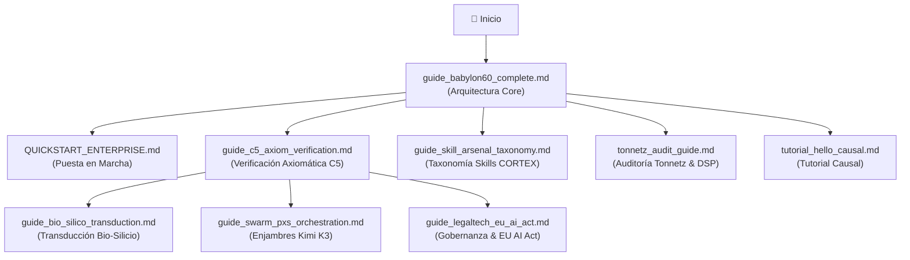

# Índice Maestro de Guías Operativas BABYLON-60

> *"El conocimiento sin guía es entropía; el manual formal es la restricción exergética que transforma la intención en ejecución determinista."*

Este módulo constituye el índice central y mapa de navegación para la suite completa de **13 guías operativas y metodológicas** del monorepo **BABYLON-60**.

---

## 🗺️ Mapa de Grafo de Lectura Recomendada

---

## 📚 Catálogo Completo de Guías Operativas

| # | Guía Operativa | Enfoque / Categoría | Componentes Vinculados | Invariante C5 |
| :---: | :--- | :--- | :--- | :--- |
| **01** | [guide_babylon60_complete.md](./guide_babylon60_complete.md) | Arquitectura & Monorepo | Interface Industrial Noir 2026, Modo Dual 2E | `INV_C5_15` |
| **02** | [guide_c5_axiom_verification.md](./guide_c5_axiom_verification.md) | Verificación Axiomática | Axiomas A1–A4, `axiom_verifier_z3.py` | `INV_C5_REAL_A4` |
| **03** | [guide_bio_silico_transduction.md](./guide_bio_silico_transduction.md) | Transducción Bio-Silicio | Ontología 300 Oncología, Grafos `NodeSpec` | `supp(f^\dagger_p(y)) \subseteq \text{supp}(p)` |
| **04** | [guide_swarm_pxs_orchestration.md](./guide_swarm_pxs_orchestration.md) | Enjambres Multi-Agente | Kimi K3 ($P \times S$), Futex, MCTS 2.8s | `ru_nivcsw \le 2132` |
| **05** | [guide_legaltech_eu_ai_act.md](./guide_legaltech_eu_ai_act.md) | Gobernanza & LegalTech | EU AI Act (Art. 9–14), Smart Contracts | `RULE_CAUSAL_HITL_VERIFY_01` |
| **06** | [guide_skill_arsenal_taxonomy.md](./guide_skill_arsenal_taxonomy.md) | Taxonomía CORTEX | Skill Chains, Triggers, Exergía de Skills | `INV_C5_28` |
| **07** | [QUICKSTART_ENTERPRISE.md](./QUICKSTART_ENTERPRISE.md) | Despliegue Enterprise | Inicialización Daemon, Entorno Soberano | `INV_BFT_04` |
| **08** | [guide_experimental.md](./guide_experimental.md) | Laboratorio Experimentos | Active Inference, EFE, Comónadas CTA | `INV_C5_CHAOS_MONAD` |
| **09** | [guide_explanation.md](./guide_explanation.md) | Explicación Conceptual | Energía Libre Variacional, Densidad $\Xi(T)$ | `ZERO_ANERGY_PRINCIPLE` |
| **10** | [guide_repository_source_of_truth.md](./guide_repository_source_of_truth.md) | Fuente de Verdad | Jerarquía de Artefactos y Consistencia | `MASTER_LEDGER` |
| **11** | [guide_commercial_license.md](./guide_commercial_license.md) | Licencia Soberana | Doble Licencia Abierta/Comercial | `INV_C5_17` |
| **12** | [tonnetz_audit_guide.md](./tonnetz_audit_guide.md) | Auditoría Tonnetz & DSP | Retículos Microtonales, FL Studio MCP | `TONNETZ_ISOMORPHISM` |
| **13** | [tutorial_hello_causal.md](./tutorial_hello_causal.md) | Tutorial Causal | Primeros Pasos Transformación Causal | `HELLO_CAUSAL_TUTORIAL` |

---

## 👥 Uso Dual: Agentes AI & Investigadores Humanos

- **Agentes AI (LLMs & Enjambres)**: Utilizan estas guías como **Capa 3 (Context Exergy)** para restringir el espacio de estados en inferencia, asegurando compilación sin anergía a $T=0$.
- **Investigadores Humanos**: Utilizan este índice para auditar la arquitectura, aplicar la supervisión humana (HITL) y explorar la transferencia de conocimiento entre física, medicina, derecho y software.