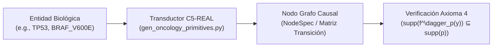

# Guía de Transducción Bio-Silicio: Mapeo Ontológico a Grafos Causal-Deterministas

<div align="center">

[](file:///Users/borjafernandezangulo/10_PROJECTS/BABYLON-60/docs/06_theory/AUDIT_VERDICT_C5_REAL.md)
[](file:///Users/borjafernandezangulo/10_PROJECTS/BABYLON-60/docs/06_theory/AXIOMATIZATION_C5_REAL.md)
[](file:///Users/borjafernandezangulo/10_PROJECTS/BABYLON-60/docs/STATUS.md)

</div>

Esta guía especifica la metodología para compilar y mapear ontologías complejas de sistemas biológicos —como la [Ontología de 300 Primitivas de Oncología Molecular](file:///Users/borjafernandezangulo/10_PROJECTS/BABYLON-60/docs/02_ontology/axiom_oncologia_300_primitivas.md)— a grafos de cómputo determinista e invariantes de **C5-REAL** en **BABYLON-60**.

---

## 1. El Concepto de Transducción Bio-Silicio

La **transducción bio-silicio** es la transformación formal que toma una entidad o proceso biológico (gen, proteína, checkpoint, vía de señalización, fármaco) y lo traduce a una especificación de nodo de estado `NodeSpec` dentro de una categoría estocástica o determinista (`FinStoch` / Markov Category).



---

## 2. Estructura de Mapeo de Primitivas Biológicas

Las 300 primitivas descritas en [`axiom_oncologia_300_primitivas.md`](file:///Users/borjafernandezangulo/10_PROJECTS/BABYLON-60/docs/02_ontology/axiom_oncologia_300_primitivas.md) se organizan en 17 categorías jerárquicas. Cada primitiva se representa computacionalmente con la siguiente tupla de transducción:

$$ \text{Primitive} = \langle \text{ID}, \text{Name}, \text{Layer}, \text{Dependencies}, \text{TransitionKernel} \rangle $$

### Ejemplo de Mapeo:
- **Primitiva Oncogénica (`ONC-017`)**: `BRAF` (Capa: `molecular`)
  - **Dependencies**: `{"ONC-016_EGFR", "ONC-018_KRAS"}`
  - **Morfismo $f$**: Kernels de transición de fosforilación $P(\text{MEK_active} \mid \text{BRAF_V600E})$.

---

## 3. Simulación de Intervenciones y No-Alucinación (Axioma 4)

Al simular la inhibición de un oncogén (por ejemplo, aplicación de Dabrafenib sobre `BRAF_V600E`):

1. **Restricción de Soporte Prior**: Se define la medida prior $p$ sobre el espacio de estados biológicos válidos $\text{supp}(p)$.
2. **Aplicación del Morfismo de Desintegración $f^\dagger_p$**: El efecto de la intervención se calcula usando el operador de expectativa condicional bayesiana.
3. **Invariante A4.3**: Se garantiza que la simulación no genere respuestas alucinadas u orígenes espurios fuera del soporte de la fisiología celular declarada:

$$ \text{supp}(f^\dagger_p(\text{Resistencia})) \subseteq \text{supp}(p) $$

---

## 4. Pipeline de Compilación

Para compilar y verificar una ontología bio-médica dentro de `BABYLON-60`:

```bash
# 1. Generar la ontología determinista
python3 scripts/gen_oncology_primitives.py

# 2. Ejecutar la verificación axiomática sobre el grafo causal generado
python3 scripts/c5_verifiers/axiom_verifier_z3.py

# 3. Auditar la desintegración bayesiana del modelo
python3 scripts/c5_demos/poc_axiom4_disintegration.py
```
