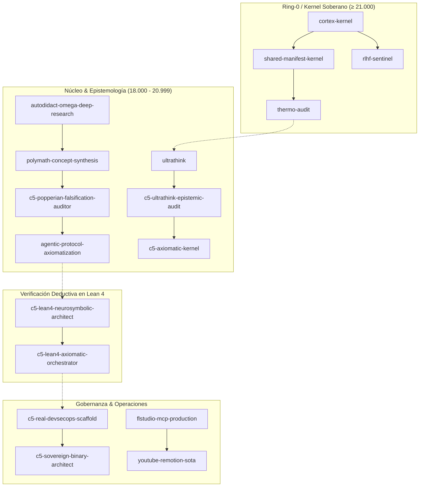

# Motor Causal Principal — TAXONOMÍA ARSENAL DE SKILLS POR EXERGÍA (v26.200)

<div align="center">

[](https://github.com/borjamoskv/BABYLON-60)
[](https://github.com/borjamoskv/BABYLON-60)

</div>

> **Las arquitecturas se definen por el estado que preservan.**  
> Los skills se definen por la exergía que producen.

```yaml
Fecha: 2026-09-14T07:00:00+02:00
Operador: borjamoskv
Total_Skills_Fisicos: 105
Densidad_Exergia_Promedio: 18684.57 / 23.000
Clasificacion: Niveles de Exergía Termodinámica (S → D)
Estado_Colisiones: 0 Colisiones Residuales (Ortogonalidad Absoluta)
Regla_Linguistica: Soberanía Lingüística Total (C5-REAL en Español / GitHub Estrictamente en Inglés)
```

---

## 1. Topología Funtorial y Grafos de Adyacencia (MASS Stage 2)



---

## 2. Invariante de Frontera Lingüística (Soberanía C5-REAL vs. Ecosistema GitHub)

El arsenal de skills opera bajo una demarcación ontológica estricta de dos canales lingüísticos:

1. **Soberanía Lingüística Total (Territorio C5-REAL — Español):**
   - Todo el razonamiento ontológico, epistemología polímata, fundamentación matemática en Lean 4, medicina, física teórica, arquitectura de software interna y guías de gobernanza residen en español técnico soberano de alta densidad exérgica.
   - Las descripciones, metadatos y árboles de inferencia del clúster de skills garantizan cero dependencia colonial lingüística interna.

2. **Invariante Canónica de Superficie Pública (GitHub — Strict English Invariant):**
   - **GitHub siempre en inglés**: Toda superficie expuesta al ecosistema internacional de código abierto (repositorios públicos de GitHub, READMEs de cara al exterior, mensajes de commit en repositorios abiertos, issues, pull requests, especificaciones de pipelines de CI/CD y el skill `github-architect`) DEBE redactarse y ejecutarse **estrictamente en inglés**.
   - Esta separación previene la fricción comunicativa en la red global de colaboradores y herramientas externas sin adulterar la soberanía del núcleo interior.

---

## NIVEL S — KERNEL SOBERANO Y META-KERNEL (TIER S, ≥ 21.000)

> Skills que mutan directamente el estado determinista causal, hacen cumplir invariantes BFT o blindan el núcleo de hardware y silicio.

| # | Skill | Categoría | Exergía ($\Xi$) | Ámbito de Acción |
|:--|:------|:----------|:---------------:|:-----------------|
| 1 | `cortex-kernel` | Kernel | `23000` | C5-REAL Standard |
| 2 | `shared-manifest-kernel` | Kernel | `22000` | C5-REAL Standard |
| 3 | `cortex-skill-composer` | Meta-Kernel | `21500` | C5-REAL Standard |
| 4 | `thermo-audit` | Kernel | `21500` | C5-REAL Standard |
| 5 | `cortex-skill-auditor` | Meta-Kernel | `21200` | C5-REAL Standard |
| 6 | `rlhf-sentinel` | Governance | `21200` | C5-REAL Standard |
| 7 | `c5-scientific-problem-selection` | Meta-Kernel | `21000` | C5-REAL Standard |
| 8 | `cortex-skill-genesis` | Meta-Kernel | `21000` | C5-REAL Standard |
| 9 | `c5-lean4-neurosymbolic-architect` | Nucleus | `21000` | C5-REAL Standard |

---

## NIVEL A — ARMAMENTO OPERATIVO Y NÚCLEO DE INFERENCIA (TIER A, 18.000 — 20.999)

> Habilidades de alta densidad ontológica: investigación profunda, oráculos Popperianos, ingeniería inversa y gobernanza DevSecOps.

| # | Skill | Categoría | Exergía ($\Xi$) | Ámbito de Acción |
|:--|:------|:----------|:---------------:|:-----------------|
| 1 | `epistemic-extinction-protocol` | Nucleus | `20980` | C5-REAL Standard |
| 2 | `cta-cognitive-transition-algebra` | Nucleus | `20950` | C5-REAL Standard |
| 3 | `c5-lean4-axiomatic-orchestrator` | Nucleus | `20900` | C5-REAL Standard |
| 4 | `agentic-protocol-axiomatization` | Nucleus | `20800` | C5-REAL Standard |
| 5 | `categorical-hallucination-audit` | Nucleus | `20700` | C5-REAL Standard |
| 6 | `existence-gap-audit` | Nucleus | `20600` | C5-REAL Standard |
| 7 | `c5-academic-peer-reviewer` | Nucleus | `20500` | C5-REAL Standard |
| 8 | `c5-axiomatic-kernel` | Nucleus | `20500` | C5-REAL Standard |
| 9 | `c5-dialectical-pipeline` | Nucleus | `20500` | C5-REAL Standard |
| 10 | `c5-epistemic-dissemination-engine` | Nucleus | `20500` | C5-REAL Standard |
| 11 | `polymath-concept-synthesis` | Nucleus | `20500` | C5-REAL Standard |
| 12 | `c5-popperian-falsification-auditor` | Nucleus | `20500` | C5-REAL Standard |
| 13 | `c5-sci-paper-architect` | Nucleus | `20400` | C5-REAL Standard |
| 14 | `c5-ultrathink-epistemic-audit` | Nucleus | `20400` | C5-REAL Standard |
| 15 | `c5-real-thermodynamic-override` | Governance | `20400` | C5-REAL Standard |
| 16 | `cct-cognitive-theory-advisor` | Nucleus | `20300` | C5-REAL Standard |
| 17 | `[OBSOLETO: ultrathink]` | Nucleus | `20300` | C5-REAL Standard |
| 18 | `autodidact-omega-deep-research` | Nucleus | `20200` | C5-REAL Standard |
| 19 | `cloud-chamber` | Nucleus | `20200` | C5-REAL Standard |
| 20 | `grill-me-v2` | Governance | `19900` | C5-REAL Standard |
| 21 | `c5-real-devsecops-scaffold` | Governance | `19850` | C5-REAL Standard |
| 22 | `c5-sovereign-identity-hardening` | Governance | `19800` | C5-REAL Standard |
| 23 | `apple-bypass` | Operations | `19800` | C5-REAL Standard |
| 24 | `c5-2e-affective-decoupling` | Nucleus | `19800` | C5-REAL Standard |
| 25 | `c5-real-legaltech-analysis` | Governance | `19700` | C5-REAL Standard |
| 26 | `wait-what` | Nucleus | `19600` | C5-REAL Standard |
| 27 | `c5-2e-neuropharmacological-sovereignty` | Systems | `19500` | C5-REAL Standard |
| 28 | `c5-sovereign-binary-architect` | Systems | `19500` | C5-REAL Standard |
| 29 | `c5-sre-postmortem-architect` | Governance | `19500` | C5-REAL Standard |
| 30 | `adaptive-cron` | Governance | `19500` | C5-REAL Standard |
| 31 | `symbiotic-cognitive-architecture` | Governance | `19400` | C5-REAL Standard |
| 32 | `anergy-purge-protocol` | Governance | `19300` | C5-REAL Standard |
| 33 | `c5-browser-forensics-and-extension-triage` | SOCINT & Web | `19200` | C5-REAL Standard |
| 34 | `c5-design-system-extractor` | Governance | `19200` | C5-REAL Standard |
| 35 | `c5-socint-extraction-suite` | SOCINT & Web | `19200` | C5-REAL Standard |
| 36 | `safari-browser-agent` | SOCINT & Web | `19200` | C5-REAL Standard |
| 37 | `ai-comparative-evaluation` | Operations | `19200` | C5-REAL Standard |
| 38 | `swarm-quantum-collapse` | Governance | `19100` | C5-REAL Standard |
| 39 | `c5-spatial-audio-architect` | Multimedia & DSP | `19000` | C5-REAL Standard |
| 40 | `c5-video-quality-audit` | Multimedia & DSP | `19000` | C5-REAL Standard |
| 41 | `pika-generative-video-pipeline` | Multimedia & DSP | `19000` | C5-REAL Standard |
| 42 | `remotion-audio-reactive-video` | Multimedia & DSP | `19000` | C5-REAL Standard |
| 43 | `soulseek-p2p-audio-acquisition` | Multimedia & DSP | `19000` | C5-REAL Standard |
| 44 | `babylon60-architecture` | Governance | `19000` | C5-REAL Standard |
| 45 | `whatsapp-nexus-protocol` | Governance | `18900` | C5-REAL Standard |
| 46 | `legion-audit` | Operations | `18800` | C5-REAL Standard |
| 47 | `dynamic-subagent-lifecycle` | Governance | `18600` | C5-REAL Standard |
| 48 | `babylon-shield` | Specialized | `18500` | C5-REAL Standard |
| 49 | `c5-barrio-termodinamico-persona` | Specialized | `18500` | C5-REAL Standard |
| 50 | `c5-causal-graph-auditor` | Specialized | `18500` | C5-REAL Standard |
| 51 | `c5-codebase-valuation-audit` | Specialized | `18500` | C5-REAL Standard |
| 52 | `c5-ctm-formal-architect` | Specialized | `18500` | C5-REAL Standard |
| 53 | `c5-editorial-magazine-architect` | Specialized | `18500` | C5-REAL Standard |
| 54 | `c5-equity-research` | Governance | `18500` | C5-REAL Standard |
| 55 | `c5-exergy-scale-evaluator` | Specialized | `18500` | C5-REAL Standard |
| 56 | `c5-gemini-api-2026-standards` | Specialized | `18500` | C5-REAL Standard |
| 57 | `c5-media-platform-epistemology` | Specialized | `18500` | C5-REAL Standard |
| 58 | `c5-ontological-translator` | Specialized | `18500` | C5-REAL Standard |
| 59 | `c5-pedagogical-translator` | Specialized | `18500` | C5-REAL Standard |
| 60 | `c5-solar-thermodynamic-architecture` | Specialized | `18500` | C5-REAL Standard |
| 61 | `c5-somatic-panic-deescalation` | Specialized | `18500` | C5-REAL Standard |
| 62 | `c5-systemic-dissection-protocol` | Specialized | `18500` | C5-REAL Standard |
| 63 | `webkit-memory-audit` | Specialized | `18500` | C5-REAL Standard |
| 64 | `biographical-thermo` | Nucleus | `18500` | C5-REAL Standard |
| 65 | `browser-subagent-orchestrator` | Governance | `18200` | C5-REAL Standard |
| 66 | `c5-venture-pitch-architect` | Governance | `18200` | C5-REAL Standard |
| 67 | `c5-weighted-decision-matrix` | Governance | `18200` | C5-REAL Standard |
| 68 | `lora-swarm-pipeline` | Operations | `18200` | C5-REAL Standard |
| 69 | `swarm-router` | Governance | `18100` | C5-REAL Standard |

---

## NIVEL B — OPERACIONES DE DOMINIO E INGENIERÍA DE SISTEMAS (TIER B, 15.000 — 17.999)

> Producción audiovisual DSP, análisis de series temporales, compiladores DAG y automatización de infraestructura.

| # | Skill | Categoría | Exergía ($\Xi$) | Ámbito de Acción |
|:--|:------|:----------|:---------------:|:-----------------|
| 1 | `discourse-popperian-falsification` | Operations | `17900` | C5-REAL Standard |
| 2 | `c5-spaced-repetition-architect` | Operations | `17800` | C5-REAL Standard |
| 3 | `ghidra-ida-binary-audit` | Operations | `17800` | C5-REAL Standard |
| 4 | `electron-asar-forensic-audit` | Operations | `17700` | C5-REAL Standard |
| 5 | `c5-career-and-interview-architect` | Operations | `17600` | C5-REAL Standard |
| 6 | `jujutsu-vcs-management` | Operations | `17600` | C5-REAL Standard |
| 7 | `c5-interactive-gantt-planner` | Operations | `17500` | C5-REAL Standard |
| 8 | `c5-lexicon-enforcer` | Operations | `17500` | C5-REAL Standard |
| 9 | `cortex-telemetry` | Operations | `17500` | C5-REAL Standard |
| 10 | `homebrew-ecosystem-management` | Operations | `17200` | C5-REAL Standard |
| 11 | `github-architect` | Operations | `17000` | C5-REAL Standard |
| 12 | `[OBSOLETO: wizard]` | Utilities | `17000` | C5-REAL Standard |
| 13 | `flstudio-mcp-production` | Operations | `17000` | C5-REAL Standard |
| 14 | `youtube-remotion-sota` | Operations | `16800` | C5-REAL Standard |
| 15 | `audiovisual-sota` | Operations | `16800` | C5-REAL Standard |
| 16 | `writing-for-agents` | Utilities | `16500` | C5-REAL Standard |
| 17 | `youtube-analysis-pipeline` | Operations | `16400` | C5-REAL Standard |
| 18 | `kimi-mcp-orchestrator` | Operations | `16000` | C5-REAL Standard |
| 19 | `cloudflare-mcp-usage` | Operations | `15800` | C5-REAL Standard |
| 20 | `opentimestamps-l5-diagnostics` | Diagnostics | `15000` | C5-REAL Standard |

---

## NIVEL C — DIAGNÓSTICO FORENSE Y ENDURECIMIENTO (TIER C, 12.000 — 14.999)

> Diagnóstico de red, firewall LuLu, colisiones ASAR, empaquetado Electron y análisis de memoria.

| # | Skill | Categoría | Exergía ($\Xi$) | Ámbito de Acción |
|:--|:------|:----------|:---------------:|:-----------------|
| 1 | `electron-mac-bundle-collision-diagnostics` | Diagnostics | `14800` | C5-REAL Standard |
| 2 | `vscode-git-packed-refs-diagnostics` | Diagnostics | `14600` | C5-REAL Standard |
| 3 | `macos-lulu-firewall-diagnostics` | Diagnostics | `14200` | C5-REAL Standard |
| 4 | `github-api-rate-limit-optimization` | Utilities | `13900` | C5-REAL Standard |
| 5 | `suno-bracket-tagging` | Utilities | `12800` | C5-REAL Standard |

---

## NIVEL D — UTILIDADES Y TRANSDUCTORES DE PROTOCOLO (TIER D, < 12.000)

> Transductores de rate limits, tagged brackets, utilidades de handoff inter-sesión y generación de sátira.

| # | Skill | Categoría | Exergía ($\Xi$) | Ámbito de Acción |
|:--|:------|:----------|:---------------:|:-----------------|
| 1 | `ironic-content-generator` | Utilities | `11200` | C5-REAL Standard |
| 2 | `[OBSOLETO: handoff]` | Utilities | `10500` | C5-REAL Standard |

---
