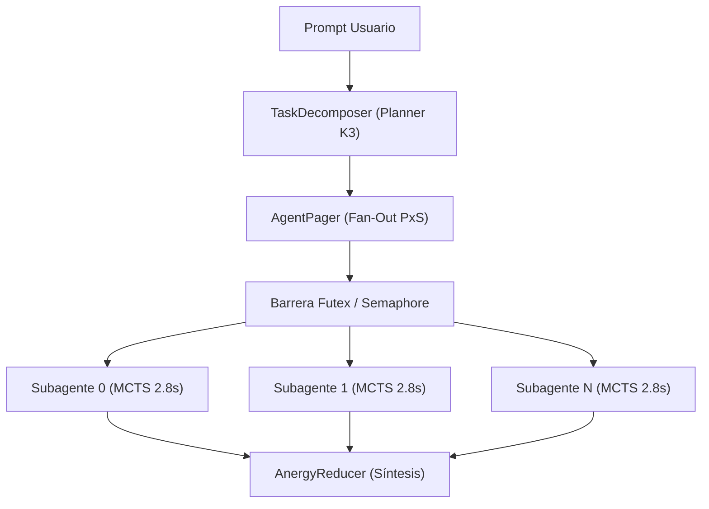

# Guía de Orquestación de Enjambres Multi-Agente Kimi K3 ($P \times S$)

Esta guía describe el protocolo de arquitectura y despliegue para enjambres multi-agente basados en la topología **Kimi K3 ($P \times S$)** en el ecosistema **BABYLON-60**.

---

## 1. Topología $P \times S$ y Prevención de Thrashing

Para evitar la anergía por contención de memoria en arquitecturas de memoria unificada (Apple Silicon ARM64), el orquestador Kimi K3 impone la división estricta de tareas:

$$ \text{Capacidad Máxima} = P \times S \le \text{Cores Físicos CPU} $$

- **$P$ (Process Cores)**: Número de procesos principales de planificación.
- **$S$ (Sub-threads)**: Número de subagentes ejecutores por núcleo.



---

## 2. Invariantes del Orquestador

### 2.1 Pausa Determinista MCTS (2.8s)
Antes de emitir operaciones I/O o modificar el disco, cada subagente introduce una pausa determinista de Monte Carlo Tree Search ($2.8\,\text{s}$) para colapsar los caminos de ejecución estocásticos y seleccionar la trayectoria de máxima densidad exergética $\Xi(T)$.

### 2.2 Control de Switches de Contexto (`ru_nivcsw`)
El monitor de kernel mide los cambios de contexto involuntarios. Si los *involuntary context switches* superan el umbral estricto:

$$ \text{ru\_nivcsw} > 2132 $$

El orquestador activa un **Circuit Breaker** inmediato (`SIGKILL_State_Purge`) para evitar la degradación de la memoria unificada.

---

## 3. Comandos de Despliegue

```bash
# Lanzar enjambre PxS con monitoreo térmico
python3 scripts/c5_legion/c5_legion_1000_workspace_swarm.py --cores 4 --threads 2

# Auditar telemetría de subagentes en runtime
python3 scripts/c5_quality_gates/audit_scripts_quality.py
```
