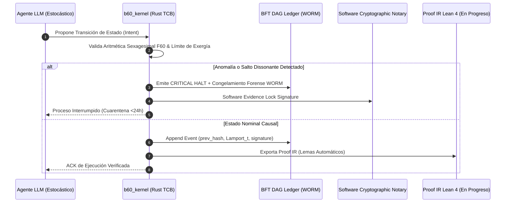

# El Determinismo Causal como Cumplimiento: Arquitectura BABYLON-60 v4.0 para Sistemas de IA de Alto Riesgo

<div align="center">

[](https://github.com/borjamoskv/BABYLON-60)
[](https://github.com/borjamoskv/BABYLON-60)

</div>

**Whitepaper Técnico y Normativo sobre la Resolución de los Artículos 9, 10, 11, 12, 13 y 14 del EU AI Act (Reglamento UE 2024/1689)**

> **Autor:** Borja Moskv · babylon60.com · Agosto 2026 · Licencia Sovereign Exclusion v1.0  
> **Ámbito:** Sistemas de IA Autónomos de Alto Riesgo (Banca, Salud, Infraestructura Crítica, Defensa)

---

> [!IMPORTANT]
> **Tesis Central:** La rendición de cuentas (*accountability*) en la Era de la Agencia Autónoma no puede basarse en similitud vectorial ni en guardrails probabilísticos. BABYLON-60 v4.0 convierte el cumplimiento regulatorio del **EU AI Act (Reglamento UE 2024/1689)** en un subproducto matemático ineludible mediante determinismo causal, aritmética sexagesimal exacta ($F60$) y verificación formal en Lean 4.

---

## 1. RESUMEN EJECUTIVO (Executive Summary)

### 1.1 El Problema: La Incompatibilidad de la IA Probabilística con la Ley
El despliegue corporativo de Agentes de IA Autónomos en 2026 ha chocado frontalmente con el marco regulatorio global. Los modelos de lenguaje (LLMs) operan mediante inferencia probabilística sobre tensores flotantes ($f64$ / $fp16$) —son cajas negras impredecibles. Cuando un agente toma una decisión financiera, médica o legal, no puede justificar **por qué** la tomó ni demostrar que su historial no ha sido manipulado.

### 1.2 La Solución: Encapsulamiento Causal y Substrato de Verificación
BABYLON-60 v4.0 no intenta alterar la aleatoriedad latente del LLM. En su lugar, encapsula el agente dentro de un **Substrato de Ejecución Verificable (Local-First Kernel)** en Rust que impone restricciones termodinámicas, aritmética sexagesimal exacta ($F60$) y verificación formal en Lean 4.

### 1.3 El Resultado: Defendibilidad Jurídica y "Caja Negra" Aeronáutica
Si el agente falla, entra en bucles de limerencia o sufre un intento de inyección de prompt, el sistema **no destruye la evidencia ni alucina en silencio**. En su lugar, ejecuta un `CRITICAL HALT` con **Cuarentena Forense WORM (Write Once Read Many)**, congelando el estado y emitiendo un certificado auditable anclado criptográficamente por software (con anclaje a hardware TPM 2.0 / TEE en el roadmap) en menos de 24 horas.

---

## 2. EL MURO REGULATORIO: EL FIN DE LOS AGENTES OPACOS

### 2.1 El Coste de la Opacidad
Bajo el **EU AI Act (Reglamento UE 2024/1689)**, desplegar un sistema de IA de alto riesgo sin trazabilidad ni gobernanza conlleva multas administrativas de hasta **€15.000.000 o el 3% de la facturación global anual** de la empresa (lo que sea mayor) por incumplimiento de las obligaciones aplicables a sistemas de alto riesgo (Art. 99); el tramo superior de **€35.000.000 o el 7%** se reserva a las prácticas prohibidas del Art. 5.

### 2.2 Comparativa de Enfoques de Gobernanza

| Enfoque Tradicional | Fallo Técnico / Legal | Consecuencia Regulatoria |
| :--- | :--- | :--- |
| **Prompt Engineering & System Prompts** | Vulnerables a Prompt Injection y Jailbreaks. No son barreras deterministas. | Rechazado bajo el Art. 9 (Gestión de Riesgos) |
| **Bases de Datos Vectoriales (RAG)** | Almacenan *similitud coseno*, no *linaje causal*. No prueban integridad temporal. | Rechazado bajo el Art. 10 (Gobernanza de Datos) |
| **Logs en Texto Plano / JSON** | Modificables por administradores locales o procesos comprometidos. | Rechazado bajo el Art. 12 (Conservación de Registros) |
| **Guardrails de Software en Python** | Latencia elevada y riesgo de sobrepaso por GIL de Python. | Inviable para alta frecuencia y tiempo real |
| **BABYLON-60 v4.0 (Kernel Causal)** | **Linaje inmutable WORM + Aritmética Sexagesimal $F60$ + Especificación Lean 4.** | **✅ CONFORME (Trazabilidad Forense Vinculante)** |

---

## 3. ARQUITECTURA BABYLON-60 v4.0: INGENIERÍA DE LA CONFIANZA

### 3.1 Flujo Causal de Ejecución



### 3.2 El Dominio Temporal $F60$ (Precisión Absoluta)
Para erradicar la deriva de coma flotante ($f64$) que corrompe el orden de los eventos en agendas de ejecución larga, BABYLON-60 opera con una tupla racional sexagesimal pura:

$$\text{F60} = \left\langle n \in \mathbb{U}64, \; s \in \mathbb{U}8 \right\rangle, \quad v = \frac{n}{60^s}$$

$1/3$ de hora se representa como $\text{F60}(20, 1) = 0;20 = 20\text{ minutos exactos}$. La causalidad temporal se mantiene matemáticamente inalterable ($\Delta t = 0$ drift), permitiendo certificar el orden relativo exacto de las operaciones ante tribunales y auditores.

### 3.3 Especificación Formal con Lean 4 (En Progreso)
El compilador de BABYLON-60 traduce las trazas de ejecución `.b60` a una Representación Intermedia de Pruebas (`proof.ir`). Este archivo alimenta al demostrador de teoremas **Lean 4**, generando lemas formales estáticos (`BabylonTrace.lean`). Nota de estado: los invariantes clave se enuncian actualmente como axiomas explícitos (sin `sorry`); las pruebas completas están en progreso:

$$\forall e_i, e_j \in \mathcal{E}, \quad e_i \prec e_j \implies \text{Hash}(e_i) \in \text{Parents}(e_j) \;\land\; \text{Lamport}(e_i) < \text{Lamport}(e_j)$$

La documentación técnica exige prueba matemática, no declaraciones de intención.

---

## 4. MAPEO TÉCNICO-NORMATIVO (MATRIZ DE CUMPLIMIENTO)

```
                       EU AI ACT STATUTORY MAPPING
┌──────────────────────────────────────────────────────────────────────────┐
│ Art. 9:  Gestión de Riesgos   ──>  Thermodynamic Pruner + Dead Man Switch│
│ Art. 10: Gobernanza de Datos  ──>  F60 Typed Memory + Merkle Lineage DAG │
│ Art. 11: Doc. Técnica         ──>  Lean 4 Proof IR Auto-Export           │
│ Art. 12: Conservación de Logs ──>  Merkle-Causal Ledger + WORM Quarantine│
│ Art. 13: Transparencia        ──>  Timeline IR + Standard Export Schema  │
│ Art. 14: Control Humano       ──>  Tonnetz App Harmonic Audit Visualizer  │
└──────────────────────────────────────────────────────────────────────────┘
```

### 4.1 Artículo 9: Sistema de Gestión de Riesgos
> *"Se establecerá, aplicará, documentará y mantendrá un sistema de gestión de riesgos..."*

- **Exigencia Legal:** Implementar un sistema continuo de evaluación y mitigación de riesgos.
- **Solución B60 v4.0:** **Motor de Auto-Falsación y Cuarentena Forense (WORM)**. Si el agente entra en un bucle de limerencia o sufre inestabilidad numérica, el kernel dispara `CRITICAL HALT`, congela la memoria y sella el estado. El riesgo se contiene físicamente antes de causar daño externo.

### 4.2 Artículo 10: Gobernanza de Datos y Linaje
> *"Los conjuntos de datos de entrenamiento, validación y prueba estarán sujetos a prácticas de gobernanza..."*

- **Exigencia Legal:** Trazabilidad completa de la procedencia y linaje de los datos.
- **Solución B60 v4.0:** **Tipado Estricto (`ALLOC T R`) y DAG de Causalidad Merkle**. Ningún dato entra en la memoria del agente sin estar firmado y tipado. Cada nodo de decisión contiene los IDs hash de sus eventos padres.

### 4.3 Artículo 11: Documentación Técnica
> *"La documentación técnica de un sistema de IA de alto riesgo se elaborará antes de que dicho sistema se comercialice..."*

- **Exigencia Legal:** Elaboración y actualización de documentación técnica detallada previa a la comercialización.
- **Solución B60 v4.0:** **Auto-Exportación de Proof IR (`proof.ir`) a Lean 4**. La documentación técnica no se escribe a mano; la genera el compilador como especificación formal en Lean 4 (invariantes clave como axiomas explícitos; pruebas completas en progreso).

### 4.4 Artículo 12: Conservación de Registros (Logging)
> *"Los sistemas de IA de alto riesgo permitirán el registro automático de eventos (logs) a lo largo de su ciclo de vida..."*

- **Exigencia Legal:** Registro automático de eventos durante el funcionamiento del sistema para garantizar trazabilidad.
- **Solución B60 v4.0:** **Ledger Merkle-Causal + Cuarentena WORM por Software**. Los eventos se encadenan mediante firmas BLAKE3/SHA-256 inmutables (anclaje hardware TPM 2.0 / TEE programado en hoja de ruta). Los administradores del servidor no pueden alterar los registros sin romper la cadena de hashes criptográfica.

### 4.5 Artículo 13: Transparencia y Explicabilidad
> *"Los sistemas de IA de alto riesgo se diseñarán de modo que su funcionamiento sea suficientemente transparente..."*

- **Exigencia Legal:** Diseño transparente que permita a los usuarios interpretar las salidas del sistema.
- **Solución B60 v4.0:** **Timeline IR Export**. Exportación estandarizada en formato JSON/YAML/JSON-LD de la secuencia exacta de opcodes y decisiones causales, permitiendo a cualquier auditor inspeccionar el orden exacto de los acontecimientos.

### 4.6 Artículo 14: Supervisión Humana
> *"Los sistemas de IA de alto riesgo se diseñarán y desarrollarán de forma que puedan ser supervisados por personas físicas..."*

- **Exigencia Legal:** Garantizar que los sistemas puedan ser supervisados e intervenidos eficazmente por personas físicas.
- **Solución B60 v4.0:** **Visualizador Armónico Tonnetz (`tonnetz_app/`)**. Interfaz basada en redes de afinidad tonal Neo-Riemannianas que proyecta el estado del agente en un plano geométrico 2D. La disonancia armónica (rojo) alerta a los supervisores humanos sobre desviaciones o alucinaciones antes de que se ejecute la acción.

---

## 5. PROTOCOLO DE ATENUACIÓN DE DAÑOS (DAMAGE CONTROL)

Ante un incidente en producción (ej. un intento de inyección de prompt o un fallo de red), BABYLON-60 v4.0 ejecuta un protocolo determinista en 4 pasos:

```
[1. Detección] ──> [2. CRITICAL HALT] ──> [3. WORM Quarantine] ──> [4. Certificate Export]
 Runtime Check       State Freeze          Software Sealed           PDF/JSON < 24h
```

1. **Detección Causal:** El Fuzzing diferencial o el Runtime Inspector detecta una inconsistencia en el DAG.
2. **Congelación Causal (`CRITICAL HALT`):** Se congela la corrutina en estado Zombie. Se bloquea cualquier llamada a API externa.
3. **Cuarentena Forense WORM:** El historial completo se sella en `artifact_bundle_v3/quarantine/` bajo firma criptográfica software (BLAKE3 / COSE_Sign1, con anclaje hardware TPM 2.0 en hoja de ruta). Cero datos destruidos.
4. **Exportación de Cumplimiento:** El módulo `[OBSOLETO: compliance_exporter]` genera un paquete firmado en JSON/Markdown listo para ser entregado a la Autoridad de Supervisión de IA en menos de 24 horas.

---

## 6. MODELO DE DESPLIEGUE Y LICENCIAMIENTO ENTERPRISE

### 6.1 Despliegue Híbrido Soberano (Local-First)
El cliente instala el kernel de BABYLON-60 en su propia infraestructura (*on-premise*, nube privada o enclaves seguros). Los datos sensibles **nunca abandonan el perímetro del cliente**.

### 6.2 La Licencia Enterprise (`[OBSOLETO: BABYLON60_LICENSE_KEY]`)
- **Sovereign Tier (Open Core):** Gratuito para desarrolladores e investigación.
- **Enterprise Tier:** Licencia comercial requerida para despliegues en producción. Se factura por **Nodo de Ejecución Verificable** o **Volumen de Eventos Causales Auditados**.

### 6.3 Análisis de Retorno de Inversión (ROI)

$$\text{ROI} = \frac{\text{Multa Evitada (hasta 3\% Facturación; 7\% en prácticas prohibidas)} + \text{Coste de Auditoría Ahorrado}}{\text{Licencia Enterprise } \text{CORTEX\_LICENSE\_KEY}}$$

Para una institución financiera con €500M de facturación, el riesgo máximo evitado por incumplimiento de obligaciones de alto riesgo asciende a €15M (y hasta €35M en el tramo de prácticas prohibidas del Art. 5). El coste de la licencia Enterprise representa una fracción inferior al 1% del riesgo mitigado.

---

## 7. CONCLUSIÓN Y LLAMADA A LA ACCIÓN

En 2027, la IA opaca y no auditable estará excluida del mercado corporativo regulado. BABYLON-60 v4.0 Sovereign Hardened convierte el cumplimiento normativo en una ventaja de ingeniería determinista.

**Solicite una Prueba de Concepto (PoC) de Cuarentena Forense:**
- **Email:** enterprise@babylon60.com
- **Web:** [babylon60.com](https://babylon60.com)
- **Repositorio:** [github.com/borjamoskv/BABYLON-60](https://github.com/borjamoskv/BABYLON-60)

---

<sub>© 2026 Borja Moskv. Sovereign Exclusion License v1.0. Todos los derechos reservados.</sub>
