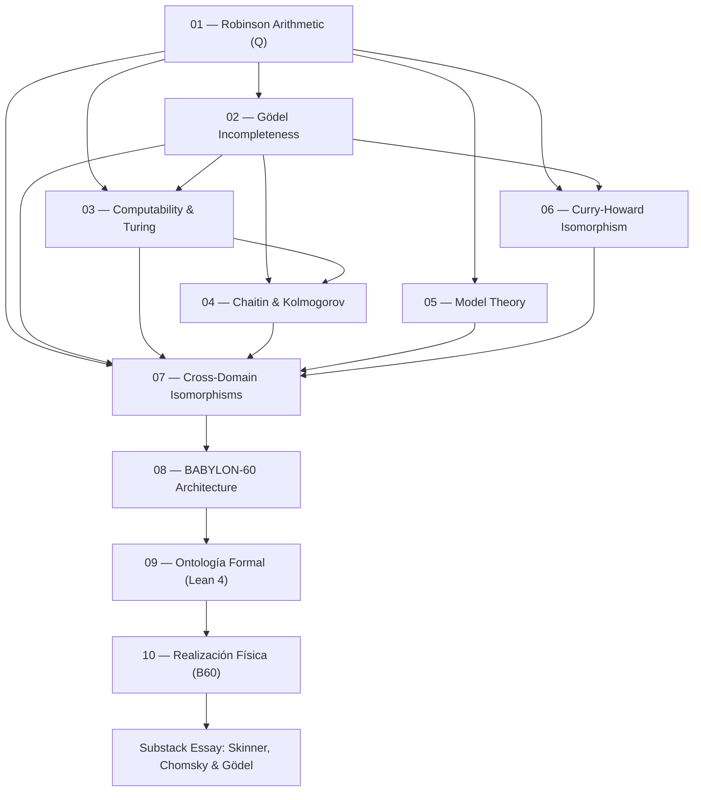

# Theoretical Foundations of BABYLON-60

> *"The Arithmetic of Robinson is the ignition point — the mathematical singularity — where the interaction between addition and multiplication under first-order quantification simultaneously generates self-reference, undecidability, informational horizons, uninhabitable types, logical maximality, referential underdetermination, computational inaccessibility of models, and the impossibility of self-verification."*

---

## 1. Executive Summary

This documentation suite establishes the **metamathematical, information-theoretic, and proof-theoretic foundations** underlying the BABYLON-60 ecosystem. Each module provides rigorous mathematical proofs, formal domain sorts, and direct architectural mapping to the system's operational invariants (`INV_BFT_04`, `INV_C5_15`, `INV_C5_17`, `INV_C5_18`, `INV_C5_28`, `GELABP_DEPTH_INVARIANT`).

---

## 2. Reading & Dependency Graph

---

## 3. Master Index of Theory Modules

| # | Module Document | Core Metamathematical Topic | System Mapping | Invariant Link |
| :---: | :--- | :--- | :--- | :--- |
| **01** | [Robinson's Arithmetic](file:///Users/borjafernandezangulo/BABYLON-60/docs/theory/01_robinson_arithmetic.md) | Axiom System $Q$, $\Sigma_1$-completeness, minimal undecidability | `b60_kernel` execution core | Essential Undecidability |
| **02** | [Gödel's Incompleteness](file:///Users/borjafernandezangulo/BABYLON-60/docs/theory/02_goedel_incompleteness.md) | Gödel numbering, Diagonal Lemma, 1st/2nd Theorems, Löb's Theorem | Self-falsation & `CRITICAL_HALT` | Diagonalization |
| **03** | [Computability & Turing](file:///Users/borjafernandezangulo/BABYLON-60/docs/theory/03_computability_turing.md) | Universal Turing Machines, Halting Problem, Rice's Theorem | Proof harness & static verification | `GELABP_DEPTH_INVARIANT` |
| **04** | [Chaitin & Kolmogorov](file:///Users/borjafernandezangulo/BABYLON-60/docs/theory/04_chaitin_kolmogorov.md) | Kolmogorov complexity $K(x)$, Chaitin's Constant $\Omega$, compression horizons | Base-60 integer scaling | Zero-Anergy Principle |
| **05** | [Model Theory](file:///Users/borjafernandezangulo/BABYLON-60/docs/theory/05_model_theory.md) | Compactness, Löwenheim-Skolem, Lindström's Theorem, Non-standard models | Agent execution isolation | `INV_C5_18` |
| **06** | [Curry-Howard Correspondence](file:///Users/borjafernandezangulo/BABYLON-60/docs/theory/06_curry_howard.md) | Propositions-as-Types, Proofs-as-Programs, Cart. Closed Categories | Lean 4 backend export | `proof_ir_spec.md` |
| **07** | [Cross-Domain Isomorphisms](file:///Users/borjafernandezangulo/BABYLON-60/docs/theory/07_cross_domain.md) | Isomorphic structural mappings (Linguistics, Physics, AI, Proof Theory) | Universal System Ontology | `INV_C5_28` (1-WL) |
| **08** | [BABYLON-60 Architecture](file:///Users/borjafernandezangulo/BABYLON-60/docs/theory/08_babylon60_architecture.md) | Direct metamathematical-to-code mapping matrix | Rust/Python Kernel | `TECHNICAL_SPEC.md` |
| **09** | [Ontología Formal (Lean 4)](file:///Users/borjafernandezangulo/BABYLON-60/docs/theory/09_formal_ontology_lean.md) | Small-step semantics, Constructive Type Theory in practice | `proof/lean/Babylon.lean` | `INV_BFT_04` |
| **10** | [Realización Física (B60)](file:///Users/borjafernandezangulo/BABYLON-60/docs/theory/10_physical_realization.md) | B60 Assembly, Turing completeness, fuzzing, graph determinism | `fibonacci.b60`, `fuzz_b60.py` | `INV_BFT_04` |
| **ESSAY** | [Skinner, Chomsky & Gödel](file:///Users/borjafernandezangulo/BABYLON-60/docs/theory/substack_skinner_chomsky_goedel.md) | LLMs as non-standard models of human language & community physics | Community & AI Dynamics | `RULE_HUMO_EVAL_01` |

---

## 4. Universal Central Thesis

> **Every finite cognitive or computational system (formal theory, neural model, biological brain, verification kernel) acts as an information compressor. The Kolmogorov complexity of its axioms $K(\text{Axioms})$ sets an absolute informational horizon $c_T$. Beyond that horizon, infinite mathematical truths exist that the system cannot prove — not due to engineering flaws, but because those truths contain more irreducible information than the system itself.**

---

## 5. License & Sovereignty

All theory modules in this suite are published under **`INV_C5_17`** (Sovereign Dual-Licensing Invariant): 100% free, open-source, and sovereign for individuals, independent developers, and non-commercial usage.
