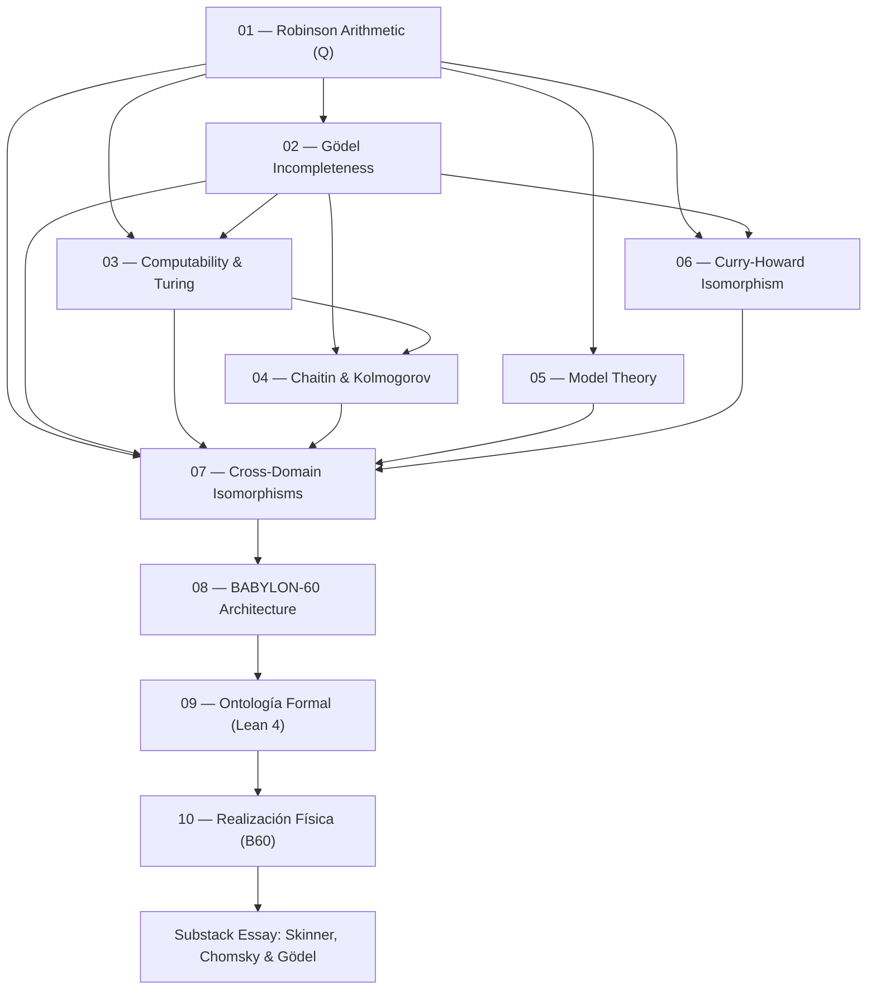

# Fundamentos Teóricos de BABYLON-60

> *"The Arithmetic of Robinson is the ignition point — the mathematical singularity — where the interaction between addition and multiplication under first-order quantification simultaneously generates self-reference, undecidability, informational horizons, uninhabitable types, logical maximality, referential underdetermination, computational inaccessibility of models, and the impossibility of self-verification."*

---

## 1. Executive Summary

This documentation suite establishes the **metamathematical, information-theoretic, and proof-theoretic foundations** underlying the BABYLON-60 ecosystem. Each module provides rigorous mathematical proofs, formal domain sorts, and direct architectural mapping to the system's operational invariants (`INV_BFT_04`, `INV_C5_15`, `INV_C5_17`, `INV_C5_18`, `INV_C5_28`, `GELABP_DEPTH_INVARIANT`).

---

## 2. Reading & Dependency Graph

---

## 3. Master Index of Theory Modules

| # | Module Document | Core Metamathematical Topic | System Mapping | Invariant Link |
| :---: | :--- | :--- | :--- | :--- |
| **01** | [Aritmética de Robinson](./01_robinson_arithmetic.md) | Sistema Axiomático $Q$, $\Sigma_1$-completitud, indecidibilidad mínima | Core de ejecución `b60_kernel` | Indecidibilidad Esencial |
| **02** | [Incompletitud de Gödel](./02_goedel_incompleteness.md) | Gödelización, Lema de Diagonalización, Teoremas 1º/2º, Teorema de Löb | Auto-falsación y `CRITICAL_HALT` | Diagonalización |
| **03** | [Computabilidad y Turing](./03_computability_turing.md) | Máquinas de Turing Universales, Problema de la Parada, Teorema de Rice | Harness de pruebas y verificación estática | `GELABP_DEPTH_INVARIANT` |
| **04** | [Chaitin y Kolmogorov](./04_chaitin_kolmogorov.md) | Complejidad de Kolmogorov $K(x)$, Constante $\Omega$ de Chaitin | Escalado entero Base-60 | Principio de Cero-Anergia |
| **05** | [Teoría de Modelos](./05_model_theory.md) | Compacidad, Löwenheim-Skolem, Teorema de Lindström, Modelos No Estándar | Aislamiento de ejecución de agentes | `INV_C5_18` |
| **06** | [Correspondencia Curry-Howard](./06_curry_howard.md) | Proposiciones-como-Tipos, Pruebas-como-Programas, Categorías Cartesianas Cerradas | Exportación backend Lean 4 | `01_spec/spec_proof_ir.md` |
| **07** | [Isomorfismos Cross-Domain](./07_cross_domain.md) | Mapeos estructurales isomorfos (Lingüística, Física, IA, Teoría de Pruebas) | Ontología Universal del Sistema | `INV_C5_28` (1-WL) |
| **08** | [Arquitectura BABYLON-60](./08_babylon60_architecture.md) | Matriz de mapeo metamatemático-a-código | Rust/Python Kernel | `01_spec/spec_technical.md` |
| **09** | [Ontología Formal (Lean 4)](./09_formal_ontology_lean.md) | Semántica de pequeños pasos, Teoría de Tipos Constructiva en práctica | `proof/lean/Babylon.lean` | `INV_BFT_04` |
| **10** | [Realización Física (B60)](./10_physical_realization.md) | B60 Assembly, completitud de Turing, fuzzing, determinismo de grafos | `fibonacci.b60`, `fuzz_b60.py` | `INV_BFT_04` |
| **AX** | [Base Axiomática C5-REAL](./AXIOMATIZATION_C5_REAL.md) | Axiomas A1–A4 (Categorías de Markov, Inversión Bayesiana, No-Alucinación) | Motor de Verificación Axiomática | `INV_C5_REAL_A4` |
| **ESSAY** | [Skinner, Chomsky y Gödel](../04_research/substack/research_substack_skinner_chomsky_goedel.md) | LLMs como modelos no estándar del lenguaje humano | Dinámica Comunitaria e IA | `RULE_HUMO_EVAL_01` |

---

## 4. Universal Central Thesis

> **Every finite cognitive or computational system (formal theory, neural model, biological brain, verification kernel) acts as an information compressor. The Kolmogorov complexity of its axioms $K(\text{Axioms})$ sets an absolute informational horizon $c_T$. Beyond that horizon, infinite mathematical truths exist that the system cannot prove — not due to engineering flaws, but because those truths contain more irreducible information than the system itself.**

---

## 5. License & Sovereignty

All theory modules in this suite are published under **`INV_C5_17`** (Sovereign Dual-Licensing Invariant): 100% free, open-source, and sovereign for individuals, independent developers, and non-commercial usage.
