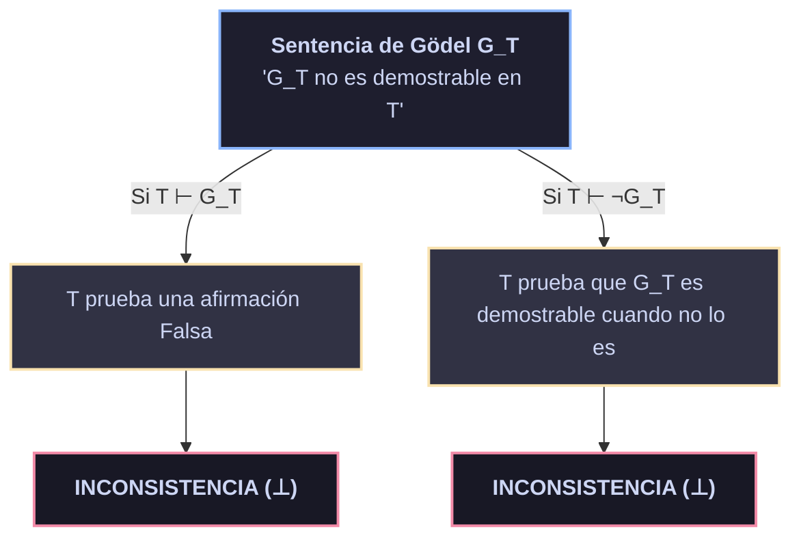

# 🌀 02 — Teoremas de Incompletitud de Gödel
> **Límites Absolutos de la Formalización y Verificación Automática**

> [!NOTE]
> **Modulo Teórico 02 | Proyecto BABYLON-60 | Licencia Soberana (`INV_C5_17`)**
> Formalización de Gödelización, el Lema de Diagonalización de Carnap, los Teoremas 1º y 2º de Incompletitud, el Teorema de Löb y la Lógica Modal GL.

---

## 2.1 🔁 El Lema de Diagonalización (Teorema del Punto Fijo)

Todos los fenómenos de incompletitud metamatemática descansan sobre un único resultado técnico computable dentro de la Aritmética de Robinson ($Q$):

> [!IMPORTANT]
> ### Lema de Diagonalización (Carnap 1934 / Gödel 1931)
> Para toda fórmula $\psi(x)$ con una variable libre en el lenguaje de $Q$, existe una sentencia $\gamma$ tal que:
> 
> $$ Q \vdash \gamma \leftrightarrow \psi(\ulcorner \gamma \urcorner) $$
> 
> donde $\ulcorner \gamma \urcorner$ es el número de Gödel (código numérico atómico) de la sentencia $\gamma$.

### 🛠️ Construcción Algorítmica Estricta

| Paso | Operación Formal | Mecanismo de Computación |
| :---: | :--- | :--- |
| **1** | **Gödelización** | Asignar a cada símbolo, fórmula $\phi$ y demostración un entero único $\#\phi \in \mathbb{N}$. |
| **2** | **Sustitución Diagonal** | Definir la función computable $\text{diag}(n) = \#(\phi(\bar{n}))$ donde $n = \#\phi(x)$. |
| **3** | **Representabilidad en $Q$** | Puesto que $\text{diag}$ es computable, $Q$ la representa mediante la fórmula $\delta(x, y)$. |
| **4** | **Construcción de Punto Fijo** | Sea $\psi(x)$ arbitraria. Definimos $\theta(x) \equiv \exists y (\delta(x, y) \land \psi(y))$. Con $m = \#\theta(x)$, la sentencia $\gamma \equiv \theta(\bar{m})$ satisface $Q \vdash \gamma \leftrightarrow \psi(\ulcorner \gamma \urcorner)$. |

---

## 2.2 ⚠️ El Primer Teorema de Incompletitud

> [!CAUTION]
> ### Primer Teorema de Incompletitud (Gödel, 1931)
> Si $T \supseteq Q$ es una teoría consistente y recursivamente axiomatizable, entonces $T$ es **incompleta**: existe una sentencia $G_T$ tal que:
> 
> $$ T \nvdash G_T \quad \text{y} \quad T \nvdash \neg G_T $$

---

## 2.3 🛑 El Segundo Teorema de Incompletitud

> [!WARNING]
> ### Segundo Teorema de Incompletitud (Gödel, 1931)
> Si $T \supseteq Q$ es consistente y recursivamente axiomatizable, entonces la teoría no puede demostrar su propia consistibilidad:
> 
> $$ T \nvdash \text{Con}(T) $$
> 
> donde $\text{Con}(T) \equiv \neg \text{Prov}_T(\ulcorner 0 = 1 \urcorner)$.

### 📋 Condiciones de Derivabilidad de Hilbert-Bernays-Löb

| Condición | Denominación | Formulación Lógica |
| :---: | :--- | :--- |
| **D1** | **Necesitación** | Si $T \vdash \phi \implies T \vdash \text{Prov}_T(\ulcorner \phi \urcorner)$ |
| **D2** | **Distributividad** | $T \vdash \text{Prov}_T(\ulcorner \phi \to \psi \urcorner) \implies (\text{Prov}_T(\ulcorner \phi \urcorner) \to \text{Prov}_T(\ulcorner \psi \urcorner))$ |
| **D3** | **Introspección** | $T \vdash \text{Prov}_T(\ulcorner \phi \urcorner) \implies \text{Prov}_T(\ulcorner \text{Prov}_T(\ulcorner \phi \urcorner) \urcorner)$ |

---

## 2.4 💡 El Teorema de Löb

> [!NOTE]
> ### Teorema de Löb (1955)
> Si $T \supseteq \text{PA}$ demuestra que $\text{Prov}_T(\ulcorner \phi \urcorner) \implies \phi$, entonces $T$ ya demuestra $\phi$ incondicionalmente:
> 
> $$ T \vdash (\text{Prov}_T(\ulcorner \phi \urcorner) \to \phi) \implies T \vdash \phi $$

---

## 2.5 ⚙️ Implicaciones para BABYLON-60

> [!TIP]
> 1. **Ausencia de Verificadores Auto-Consistentes:** Un verificador $V$ en BABYLON-60 no puede certificar su propia consistencia interna $\text{Con}(V)$. La verificación de consistencia DEBE ser estratificada desde un nivel superior de confianza (Verificación de Oráculo Externo).
> 2. **Modelo de Fallo y Auto-Falsación:** Cuando el motor detecta una inconsistencia en el espacio de estados, aplica el protocolo `CRITICAL HALT` en lugar de intentar la autorreparación dentro del mismo nivel de abstracción.

---

## 2.6 📖 Referencias

- Gödel, K. (1931). "Über formal unentscheidbare Sätze der Principia Mathematica und verwandter Systeme I." *Monatshefte für Mathematik und Physik*, 38, 173–198.
- Löb, M. H. (1955). "Solution of a Problem of Leon Henkin." *Journal of Symbolic Logic*, 20(2), 115–118.

