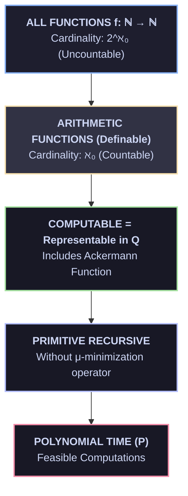

# 💻 03 — Computabilidad y Turing
> **Tesis de Church-Turing, Problema de la Parada y Teorema de Rice**

<div align="center">

[](file:///Users/borjafernandezangulo/10_PROJECTS/BABYLON-60/docs/06_theory/AUDIT_VERDICT_C5_REAL.md)
[](file:///Users/borjafernandezangulo/10_PROJECTS/BABYLON-60/docs/06_theory/AXIOMATIZATION_C5_REAL.md)
[](file:///Users/borjafernandezangulo/10_PROJECTS/BABYLON-60/docs/06_theory/STATUS.md)

</div>

> [!NOTE]
> **Modulo Teórico 03 | Proyecto BABYLON-60 | Licencia Soberana (`INV_C5_17`)**
> Estudio metamatemático de la computabilidad efectiva, la jerarquía aritmética, la indecidibilidad del Halting Problem y los límites impuestos por el Teorema de Rice.

---

## 3.1 🌐 The Church-Turing Thesis

The question *"What is a computable function?"* received four independent, convergent answers in the 1930s:

| Formalism | Author | Year | Model Mechanism | Equivalence Guarantee |
| :--- | :--- | :---: | :--- | :--- |
| **$\lambda$-calculus** | Alonzo Church | 1936 | Functional abstraction | Turing-Complete |
| **Turing machines** | Alan Turing | 1936 | Automaton with infinite tape | Turing-Complete |
| **$\mu$-recursive functions** | Stephen Kleene | 1936 | Recursion + minimization operator | Turing-Complete |
| **Representability in $Q$** | Raphael Robinson | 1950 | Provable formulas in 7 axioms | Turing-Complete |

All four define exactly the **same class** of functions. The **Church-Turing Thesis** postulates that this class captures the intuitive notion of "effective calculability."

---

## 3.2 🛑 The Halting Problem

> [!CAUTION]
> ### Theorem (Turing, 1936)
> There is no algorithm that, given an arbitrary program $p$ and input $n$, determines whether $p$ halts on $n$.

### 🔬 Formal Proof via Diagonalization

1. Suppose such an algorithm $H(p, n)$ exists, returning $1$ if $p$ halts on $n$, and $0$ otherwise.
2. Construct the diagonalizing program $D$:
   ```python
   def D(p):
       if H(p, p) == 1:
           while True: pass # Loop forever
       else:
           return           # Halt immediately
   ```
3. Evaluate $D(D)$:
   - If $D(D)$ halts $\implies H(D, D) = 1 \implies D(D)$ loops forever. **(Contradiction)**
   - If $D(D)$ loops $\implies H(D, D) = 0 \implies D(D)$ halts immediately. **(Contradiction)**
4. $\therefore H$ cannot exist physically or logically. $\blacksquare$

### 🔗 Connection to Robinson's Arithmetic

The Halting Problem connects directly to $Q$ via $\Sigma_1$-completeness:
1. Given a Turing machine $M$ and input $n$, construct the $\Sigma_1$ sentence $\sigma_{M,n}$: *"There exists a finite computation trace where $M$ halts on $n$."*
2. By $\Sigma_1$-completeness: $M$ halts on $n \iff Q \vdash \sigma_{M,n}$.
3. If $Q$ were decidable, we could decide the Halting Problem. **(Contradiction)**

---

## 3.3 🪜 Turing Degrees & The Jump Operator

Undecidability is not a binary phenomenon. There exists an **infinite hierarchy** of degrees of unsolvability, organized by **Turing reducibility** ($\le_T$):

| Degree | Name | Example Problem | Description |
| :---: | :--- | :--- | :--- |
| $\mathbf{0}$ | Computable | *"Is $2+3=5$?"* | Algorithmically decidable in $Q$ |
| $\mathbf{0'}$ | Turing jump | *"Does $M$ halt on $n$?"* | $\Sigma_1$-complete (Halting Problem) |
| $\mathbf{0''}$ | Double jump | *"Is $\phi$ independent of $Q$?"* | $\Sigma_2$-complete |
| $\mathbf{0'''}$ | Triple jump | *"Is $T$ essentially undecidable?"* | $\Sigma_3$-complete |
| $\mathbf{0^{(n)}}$ | $n$-th jump | $\Sigma_n$-complete problems | Strictly harder than the previous level |

---

## 3.4 📊 The Arithmetic Hierarchy

| Level | Form | Epistemic Characteristic | $Q$'s Capability |
| :---: | :--- | :--- | :--- |
| $\Delta_0$ | Bounded quantifiers | Decidable (bounded search) | **Complete** |
| $\Sigma_1$ | $\exists x_1 \dots \exists x_n \; \phi_{\Delta_0}$ | Semi-decidable (r.e.) | **Complete** — verifies concrete computation |
| $\Pi_1$ | $\forall x_1 \dots \forall x_n \; \phi_{\Delta_0}$ | Co-semi-decidable (co-r.e.) | **Incomplete** — cannot prove $\forall x (0+x=x)$ |
| $\Sigma_n$ | $\exists \forall \exists \dots$ ($n$ alternations) | $\Sigma_n$-complete | Increasingly incomplete |

---

## 3.5 🛡️ Rice's Theorem

> [!WARNING]
> ### Theorem (Rice, 1953)
> Every non-trivial semantic property of the behavior of programs is undecidable.

### ⚙️ Consequence for BABYLON-60

> [!IMPORTANT]
> Rice's Theorem implies that **no automatic verifier can determine whether an arbitrary smart contract or agent satisfies a non-trivial behavioral specification**. All verification systems must operate on restricted subclasses (AST invariants) or use bounded heuristics.

---

## 3.6 📈 The Ackermann Function: At the Boundary

The **Ackermann function** $A(m, n)$ is the canonical example of a function that is **computable but not primitive recursive**:

$$ A(0, n) = n + 1 $$
$$ A(m+1, 0) = A(m, 1) $$
$$ A(m+1, n+1) = A(m, A(m+1, n)) $$

| $m \backslash n$ | 0 | 1 | 2 | 3 | 4 |
| :---: | :---: | :---: | :---: | :---: | :---: |
| **0** | 1 | 2 | 3 | 4 | 5 |
| **1** | 2 | 3 | 4 | 5 | 6 |
| **2** | 3 | 5 | 7 | 9 | 11 |
| **3** | 5 | 13 | 29 | 61 | 125 |
| **4** | 13 | 65533 | $2^{65536}-3$ | $2^{2^{65536}} - 3$ | ⫶ |

---

## 3.7 🏗️ The Function Hierarchy



---

## 3.8 📖 References

- Turing, A. M. (1936). "On Computable Numbers, with an Application to the Entscheidungsproblem." *Proceedings of the London Mathematical Society*, s2-42(1), 230–265.
- Church, A. (1936). "An Unsolvable Problem of Elementary Number Theory." *American Journal of Mathematics*, 58(2), 345–363.
- Rice, H. G. (1953). "Classes of Recursively Enumerable Sets and Their Decision Problems." *Transactions of the AMS*, 74, 358–366.

---

*Previous: [02 — Gödel's Incompleteness](./02_goedel_incompleteness.md) | Next: [04 — Chaitin & Kolmogorov](./04_chaitin_kolmogorov.md)*

