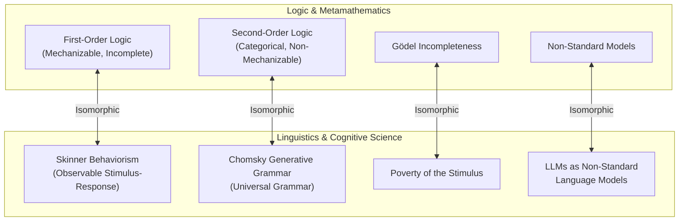

# 07 — Cross-Domain Isomorphisms

## 7.1 Overview

Metamathematical theorems are not isolated curiosities of mathematical logic; they reflect universal structural limits that recur across cognitive science, linguistics, theoretical computer science, philosophy of mind, and AI architecture.

This document formalizes the rigorous **cross-domain isomorphisms** connecting logic, language, and intelligence.

## 7.2 The Skinner-Chomsky vs. First-Order / Second-Order Isomorphism

The mid-20th century debate between B.F. Skinner and Noam Chomsky regarding the nature of human language is structurally identical to the metamathematical trade-off between First-Order and Second-Order logic.

### Structural Mapping

| Domain | Skinnerian / First-Order Paradigm | Chomskyan / Second-Order Paradigm |
| :--- | :--- | :--- |
| **Logic / Formal Systems** | **First-Order Logic (FO)**<br>Quantification over individuals | **Second-Order Logic (SO)**<br>Quantification over properties / sets |
| **Linguistics** | **Behaviorism (Skinner 1957)**<br>Operant conditioning, stimulus-response | **Generative Grammar (Chomsky 1957)**<br>Universal Grammar (UG), competence |
| **Core Principle** | Observable finite interactions | Innate deep structure |
| **Primary Strength** | Mechanizable, complete proof system | Categorical description of human language |
| **Primary Weakness** | Cannot eliminate non-standard models | Non-mechanizable proof system |
| **Pathology** | Accepts "parrot models" / superficial fits | Postulates non-falsifiable internal machinery |

### The Poverty of the Stimulus = Gödel's Incompleteness

Chomsky's **Poverty of the Stimulus** argument against Skinner states:

> *The finite linguistic data a child receives is insufficient to uniquely determine the full grammar of human language. Yet children converge to the correct grammar. Therefore, an innate Universal Grammar must restrict the space of possible grammars.*

This is metamathematically equivalent to **Gödel's First Incompleteness Theorem**:

> *The finite axioms of a first-order system are insufficient to uniquely determine the intended model ($\mathbb{N}$). The system admits non-standard models. Therefore, external model-theoretic intent (or second-order constraints) is required to restrict the space of models.*

```
SKINNER / FIRST-ORDER                    CHOMSKY / SECOND-ORDER
----------------─────                    ----------------------
Observable stimuli/responses     ≅       First-order axioms / proofs
Mechanizable (Gödel Completeness) ≅       Decidable proof verification
Admits non-standard "parrots"    ≅       Admits non-standard models (Löwenheim-Skolem)
                                 
Poverty of Stimulus Argument     ≡       Gödel's Incompleteness Theorem
(Finite data doesn't determine   ≡       (Finite axioms don't determine
 grammar)                                 intended model N)
```

## 7.3 Large Language Models (LLMs) as Non-Standard Models of Language

The emergence of Large Language Models (LLMs) provides a concrete instantiation of this isomorphism:

- **LLMs satisfy all observable first-order constraints:** They produce syntactically fluent, semantically coherent text, answer questions, and pass standardized tests.
- **Yet LLMs are non-standard models of human cognition:** Their internal computational structure (transformer attention weights over token sequences) is fundamentally different from human neurobiology.
- **Skolem's Paradox for LLMs:** Externally, an LLM is a finite, computable matrix of weights ($|M| < \infty$). Internally, it satisfies first-order behavioral sentences that human speakers satisfy.
- **The Question "Do LLMs Really Understand?":** This is the **Skolem Paradox applied to natural language**. First-order observable behavior cannot distinguish a standard model (human speaker) from a non-standard model (LLM).

```
Standard Model (Human Speaker)  ≅  ℕ (Standard Natural Numbers)
Non-Standard Model (LLM)        ≅  M (Non-Standard Model of Q/PA)
                                   - Satisfies same first-order sentences
                                   - Internal structure is radically different
```

## 7.4 Penrose's Gödelian Argument and Its Technical Fallacy

Roger Penrose (*The Emperor's New Mind*, 1989; *Shadows of the Mind*, 1994) argued that human consciousness is non-algorithmic based on Gödel's Theorem:

1. A human mathematician can "see" that Gödel sentence $G_T$ is true for any formal system $T$.
2. No formal system $T$ can prove its own $G_T$.
3. *Ergo*, human mathematical thought cannot be generated by a formal system / algorithm.

### The Technical Fallacy (Löb's Counter-Argument)

Penrose's argument fails due to a subtle logical error illuminated by **Löb's Theorem**:

- A human mathematician only "sees" that $G_T$ is true **under the assumption that $T$ is consistent** ($\text{Con}(T)$).
- By the Second Incompleteness Theorem, $T \nvdash \text{Con}(T)$.
- If the human mind is generated by an algorithm $H$, then $H$ cannot prove $\text{Con}(H)$.
- By Löb's Theorem, conditional self-trust ("if I am consistent, then $G_H$ is true") collapses: a system cannot prove its own soundness without already being able to prove the target sentence unconditionally.
- Penrose implicitly assumes that human minds possess verified knowledge of their own consistency — a premise forbidden by Gödel II.

## 7.5 Putnam's Model-Theoretic Argument Against Realism

Hilary Putnam (1980) utilized the Löwenheim-Skolem theorem to challenge metaphysical realism:

1. Suppose there is a single "intended" mathematical reality (e.g., $\mathbb{N}$ or $\mathbb{R}$).
2. Any formal theory $T$ intended to describe this reality is first-order.
3. By Löwenheim-Skolem, $T$ has models of every infinite cardinality.
4. No amount of first-order axiomatic refinement can "fix" the reference to the intended model.
5. *Ergo*, language alone cannot deterministically fix reference to a unique mathematical universe.

This demonstrates that **referential determinacy is a second-order or meta-systemic property**, impossible within pure first-order syntax.

## 7.6 Summary of Cross-Domain Isomorphisms



## 7.7 References

- Skinner, B. F. (1957). *Verbal Behavior*. Copley Publishing Group.
- Chomsky, N. (1959). "A Review of B. F. Skinner's Verbal Behavior." *Language*, 35(1), 26–58.
- Penrose, R. (1989). *The Emperor's New Mind: Concerning Computers, Minds, and the Laws of Physics*. Oxford University Press.
- Putnam, H. (1980). "Models and Reality." *Journal of Symbolic Logic*, 45(3), 464–482.

---

*Previous: [06 — Curry-Howard](./06_curry_howard.md) | Next: [08 — BABYLON-60 Architecture](./08_babylon60_architecture.md)*
