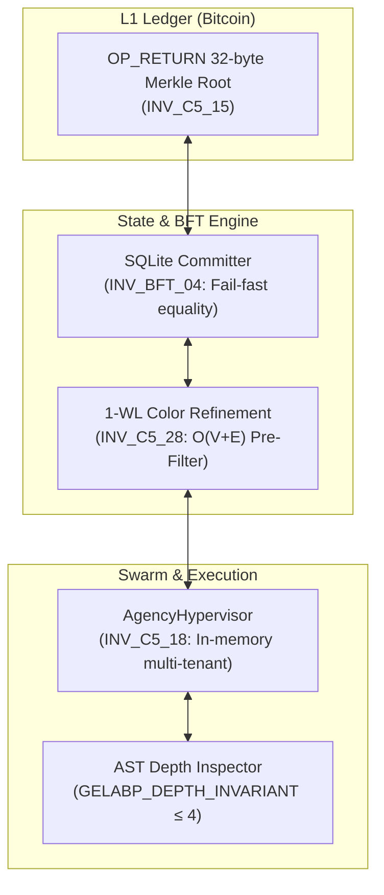

# 08 — BABYLON-60 Architecture & System Invariants

## 8.1 Metamathematical Mapping to BABYLON-60

The theoretical foundations detailed in documents [01](./01_robinson_arithmetic.md)–[07](./07_cross_domain.md) are not abstract exercises; they directly dictate the architectural invariants, verification limits, and engineering primitives of the BABYLON-60 platform.

This document explicitly maps each metamathematical limit to its corresponding operational invariant in the codebase.

## 8.2 Architectural Mapping Matrix

| Metamathematical Principle | Limiting Factor | System Response in BABYLON-60 | Enforcing Invariant / Rule |
| :--- | :--- | :--- | :--- |
| **$\Sigma_1$-Completeness of $Q$** | Verification of concrete computation traces is always decidable ($O(N)$) | Execution traces and state transitions are verified as explicit $\Sigma_1$ witness checks | **INV_BFT_04** (Fail-fast payload equality) |
| **Chaitin's Horizon / Raw Commitments** | Commitment payloads must preserve 100% of information density without truncation | L1 commitments store raw 32-byte Merkle root hashes on-chain | **INV_C5_15** (Raw 32-Byte `OP_RETURN`) |
| **Weisfeiler-Lehman Graph Isomorphism** | Combinatorial graph matching is $O(N!)$; pre-filtering must be $O(V+E)$ | AST and network ontology comparisons execute 1-WL hashing before exact VF2 bijection | **INV_C5_28** (1-WL Pre-Filter) |
| **Zero-Worktree Swarm Scaling** | Physical disk storage exhausts under $N \ge 10$ agents (ENOSPC) | Swarm scaling uses in-memory AgencyHypervisor multi-tenant handles | **INV_C5_18** (Zero-Worktree Scaling) |
| **AST Nesting Depth Ceiling** | High AST control flow complexity ($\ge 5$) impedes static proof extraction | Python code within `babylon60/` enforces nesting depth $\le 4$ per function | **GELABP_DEPTH_INVARIANT** |
| **Sovereign Dual-Licensing** | Monopolistic licensing restricts sovereign user execution | 100% free, open-source, sovereign component access | **INV_C5_17** (Sovereign Dual-Licensing) |

## 8.3 Operational Invariants Breakdown

### 8.3.1 Non-Silent Collision Fail-Fast (INV_BFT_04)

> **INV_BFT_04:** SQLite committer functions and persistence layers must never perform silent `INSERT OR IGNORE` on primary key / `mutation_hash` collisions without validating payload equality. If `payload_hash` differs on collision, the engine MUST immediately raise `ValueError("Fail-fast: INV_BFT_04 Collision...")` and abort the transaction.

**Theoretical Rationale:** By the $\Sigma_1$-completeness of $Q$, concrete computational steps must be deterministically verifiable. A silent collision ignore would introduce non-determinism into the state transition graph, breaking the property that state transitions form a valid $\Sigma_1$ proof trace.

### 8.3.2 Raw 32-Byte OP_RETURN Payload Encoding (INV_C5_15)

> **INV_C5_15:** `L1_sink` Bitcoin `OP_RETURN` script payloads must store the raw 32-byte Merkle root hash (`bytes.fromhex(merkle_root).hex()`) rather than double-ASCII hex strings or truncated 160-bit strings, preserving 100% of the 256-bit commitment in 32 bytes on-chain.

**Theoretical Rationale:** By Chaitin's information-theoretic limits, truncating or double-encoding a cryptographic commitment alters its Kolmogorov complexity and destroys the uncompressed entropy of the 256-bit hash. Preserving raw 32 bytes ensures maximal information density per byte on-chain.

### 8.3.3 Graph Isomorphism Weisfeiler-Lehman 1-WL Pre-Filter (INV_C5_28)

> **INV_C5_28:** Any structural graph comparison (AST isomorphism or network ontology mapping) MUST execute 1-dimensional Weisfeiler-Lehman (1-WL) color refinement hashing ($O(V+E)$) before attempting exact bijection (VF2/NAUTY). If WL hashes differ, the engine MUST collapse instantly in $O(1)$ without wasting ATP on $O(N!)$ combinatorial search.

**Theoretical Rationale:** Exact graph isomorphism is in NP (and quasi-polynomial time via Babai). 1-WL color refinement computes a $\Delta_0$-bounded polynomial-time invariant. If the $\Delta_0$ invariants differ, the system avoids launching an NP search tree, obeying optimal computational stratification.

### 8.3.4 AST Control Flow Nesting Depth Ceiling (GELABP_DEPTH_INVARIANT)

> **GELABP_DEPTH_INVARIANT:** All Python source code within `babylon60/` and `scripts/` MUST maintain a maximum control flow nesting depth $\le 4$ per top-level function across all AST control structures (`ClassDef`, `FunctionDef`, `If`, `For`, `While`, `Try`, `With`).

**Theoretical Rationale:** Deep control flow nesting rapidly increases the number of execution paths ($O(2^d)$ for depth $d$), expanding the complexity of formal proof extraction. Capping depth $\le 4$ maintains bounded path verification.

## 8.4 Verification System Architecture

## 8.5 Conclusion: The Metamathematical Sovereignty of BABYLON-60

BABYLON-60 is engineered under explicit recognition of Gödelian and Chaitinian limits:

1. **No system self-verifies universally:** Verification is decoupled from proof synthesis.
2. **Commitments preserve maximal entropy:** No arbitrary truncation of cryptographic proofs.
3. **Decidable pre-filtering precedes hard searches:** Polynomial $\Delta_0$ bounds protect against exponential collapse.
4. **Sovereignty is absolute:** The system is 100% open-source under **INV_C5_17**, ensuring no centralized entity controls the verification boundary.

---

*Previous: [07 — Cross-Domain Isomorphisms](./07_cross_domain.md) | Index: [00 — Index](./00_index.md)*
