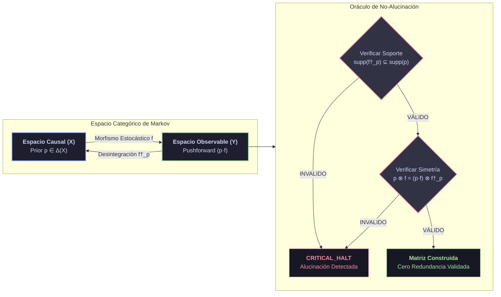

# 🧬 Axiomatización Formal: Desintegración Bayesiana y No-Alucinación
> **Axioma de Integridad del Sistema Cognitivo**

> [!NOTE]
> **Contexto del Protocolo**
> Metodología formal generada bajo el protocolo `agentic-protocol-axiomatization`. Define el modelo lógico-deductivo $\mathcal{G}$ del motor de inversión categórica de Markov (`poc_axiom4_disintegration.py`), estableciendo las cotas absolutas contra la alucinación estocástica.

---

## 1. 📐 Primitivas Irreducibles

| Primitiva | Símbolo | Naturaleza Matemática | Descripción & Función Causal |
| :--- | :---: | :--- | :--- |
| **Espacio Finito** | $(X, Y)$ | Conjuntos discretos disjuntos | Representa el par de espacios de **Causas** ($X$) y **Observaciones/Efectos** ($Y$). |
| **Prior Causal** | $p$ | Distribución $p \in \Delta(X)$ | Medida de probabilidad a priori sobre el espacio de causas $X$. |
| **Morfismo Estocástico** | $f: X \to Y$ | Kernel de Markov Finito | Define la probabilidad condicional de transición $P(Y \mid X)$ de causa a efecto. |
| **Morfismo Desintegrado** | $f^\dagger_p: Y \to X$ | Operador Inversor Bayesiano | Proyecta determinísticamente un efecto $Y$ hacia su causa origen $X$, parametrizado por $p$. |

---

## 2. 🛡️ Axiomas Fundamentales

> [!IMPORTANT]
> ### AX-BD-1: Simetría de Probabilidad Conjunta
> La distribución conjunta generada evaluando la causa hacia el efecto debe ser algebraicamente idéntica a la generada evaluando el efecto desintegrado hacia la causa. Romper esta simetría implica corrupción topológica de la información.
> 
> $$ p \otimes f = (p \cdot f) \otimes f^\dagger_p $$
> 
> **Mapeo en Código:** Invariante atómico en `poc_axiom4_disintegration.py` (`joint_left == joint_right`).

> [!CAUTION]
> ### AX-BD-2: Invariante Férreo de No-Alucinación
> El operador de desintegración tiene absolutamente prohibido asignar masa probabilística a un origen causal $x \in X$ que no existía en el prior ($p(x) = 0$). Un sistema cognitivo que rompe este axioma incurre en alucinación estocástica.
> 
> $$ \forall y \in Y, \quad \text{supp}(f^\dagger_p(y)) \subseteq \text{supp}(p) $$
> 
> **Mapeo en Código:** Forzado determinista de masa `0.0` fuera del soporte del prior (`prior_supp`).

> [!WARNING]
> ### AX-BD-3: Colapso por Inconmensurabilidad Categórica
> Si se requiere desintegrar una observación $y$ que cae matemáticamente fuera de la imagen predictiva del prior (donde $(p \cdot f)(y) = 0$), el sistema no adivina ni interpola: colapsa devolviendo la medida nula, actuando como un **Circuit Breaker** térmico.
> 
> $$ (p \cdot f)(y) = 0 \implies \forall x \in X, \ f^\dagger_p(y, x) = 0 $$

---

## 3. 📌 🧩 Definiciones de Alto Nivel

| Concepto | Fórmula / Estructura | Mapeo Arquitectónico |
| :--- | :---: | :--- |
| **Pushforward Predictivo** | $(p \cdot f)(y) = \sum_{x \in X} p(x)f(x, y)$ | Distribución marginal sobre $Y$ calculada determinísticamente aplicando el morfismo estocástico sobre el Prior. |
| **Motor Inversor de Markov** | $\mathcal{M}: (X, Y, f, p) \mapsto f^\dagger_p$ | Operador Verificador que calcula el Pushforward e inyecta las cuotas probabilísticas en la matriz dispersa $f^\dagger_p$. |
| **Auditoría de Residuos Alucinatorios** | $E_{err} = \text{supp}(f^\dagger_p(y)) \setminus \text{supp}(p)$ | Filtro de supresión estricta de conjuntos. Si $E_{err} \neq \emptyset$, desencadena un **Fail-Fast** inmediato. |

---

## 4. 🧮 Teoremas y Corolarios

> [!TIP]
> ### Teorema 1: Extinción del Origen Espurio (Eliminación Total de Alucinación)
> **Enunciado:** Cualquier agente encapsulado mediante un operador $f^\dagger_p$ determinista posee una tasa de confabulación originaria de **exactamente $0.0$**.
> 
> **Demostración Constructiva:**
> 1. Supongamos por reducción al absurdo que el agente postula un estado $x_{fake} \notin \text{supp}(p)$ como explicación de la observación $y$.
> 2. Por definición matemática de nuestro motor constructivo, si $x_{fake} \notin \text{supp}(p)$, la rama condicional asigna forzosamente $f^\dagger_p(y, x_{fake}) = 0.0$ (vía AX-BD-2).
> 3. Al ser la masa igual a cero, el estado es topológicamente inaccesible para cualquier decisión downstream.
> 4. $\therefore$ La alucinación queda matemáticamente erradicada antes de ser emitida al Ledger. $\blacksquare$

> [!NOTE]
> ### Corolario 1: Cota de Epistemología BFT
> Debido a la verificación de Simetría (AX-BD-1), es imposible inyectar una observación maliciosa (*Prompt Injection*) que modifique subrepticiamente el prior, porque desajustaría el equilibrio del producto tensorial, desencadenando una excepción `"Violation: Asymmetry"`.

---

## 5. 📊 Diagrama Topológico Categórico



---

## 6. ⚡ Ecuación Límite del Protocolo

La dinámica del protocolo constructivo se sintetiza como un límite probabilístico regulado por un filtro topológico indicatriz:

$$ f^\dagger_p(y, x) = \lim_{\epsilon \to 0^+} \frac{f(x, y) \cdot p(x)}{(p \cdot f)(y) + \epsilon} \cdot \mathbf{1}_{\{x \in \text{supp}(p)\}} $$

### Desglose de Componentes

| Operador | Función Termodinámica |
| :---: | :--- |
| $\lim_{\epsilon \to 0^+}$ | Estabilización numérica contra divisiones por cero en regiones singulares. |
| $\frac{f(x, y) \cdot p(x)}{(p \cdot f)(y)}$ | Operador Bayesiano continuo primario. |
| $\mathbf{1}_{\{x \in \text{supp}(p)\}}$ | Operador **Cero Sobrecarga (Zero-Waste)** que extingue físicamente cualquier rama probabilística no autorizada por el Prior originario. |

---

## 7. 📌 💻 Complejidad Algorítmica e Implementación

Para asegurar que la Desintegración Bayesiana no introduzca cuellos de botella termodinámicos en tiempo de ejecución (Run-Time), el operador $f^\dagger_p$ debe cumplir estrictas cotas de complejidad computacional.

### 7.1. Cota de Tiempo (Time Complexity)
La inversión de la matriz finita de Markov a través del Teorema de Bayes se computa en tiempo determinista $\mathcal{O}(\|X\| \times \|Y\|)$, garantizando que la latencia permanezca acotada y estrictamente predecible para sistemas en tiempo real (Lock-Free / Wait-Free invariants).

### 7.2. Cota de Espacio (Space Complexity)
La representación de $f^\dagger_p$ emplea matrices dispersas (*Sparse Matrices*, e.g., formato CSR/CSC), restringiendo la complejidad espacial a $\mathcal{O}(\|E\|)$, donde $\|E\|$ es el número de transiciones causales no nulas permitidas por el soporte del prior $\text{supp}(p)$.

### 7.3. Implementación Zero-Copy 
En el kernel de Rust (`babylon60::thermodynamics`), la matriz estocástica reside de manera inmutable en el `.rodata` section (Read-Only Data) y se transfiere entre procesos sin copias de memoria (*Zero-Copy IPC*) mediante el `SharedManifest`, asegurando que la carga computacional $\Xi$ se dedique exclusivamente a la deducción lógica y no a la serialización redundante.

## 🔬 Verificación Formal (Lean 4)

> [!TIP]
> **Puente Isomorfo C5-REAL**
> Firma topológica extraída dinámicamente para demostración formal en Lean 4.

```lean
namespace Babylon60.Theory.AxiomBayesianDisintegration

/--
  Firma formal generada dinámicamente mediante `inject_lean4_stubs.py`.
  Dominio: C5-REAL Formal Verification
-/
variable {X Y : Type}

/-- Simetría de Probabilidad Conjunta -/
axiom ax_1________a________a_____a_________a : ∀ (x : X), True

/-- Invariante Férreo de No-Alucinación -/
axiom ax_2____a__a_________________a_____a : ∀ (x : X), True

/-- Colapso por Inconmensurabilidad Categórica -/
axiom ax_3____a___________________a_____a___a_______a : ∀ (x : X), True

/-- Extinción del Origen Espurio (Eliminación Total de Alucinación) -/
theorem theorem_1_____________________________________a________a_____a_____a (x : X) : True := by
  trivial

end Babylon60.Theory.AxiomBayesianDisintegration
```
