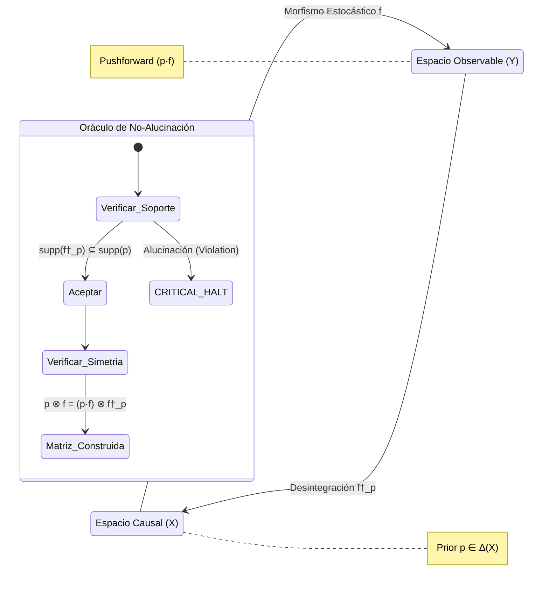

# Axiomatización Formal: Desintegración Bayesiana y No-Alucinación (Axioma 4)

> **Régimen Causal-Determinist**
> Metodología formal generada bajo el protocolo `agentic-protocol-axiomatization`. Define el modelo lógico-deductivo $\mathcal{G}$ del motor de inversión categórica de Markov (`poc_axiom4_disintegration.py`), estableciendo las cotas absolutas contra la alucinación estocástica.

---

## 1. Primitivas Irreducibles

- **Espacio Finito ($X, Y$)**: Conjuntos discretos cerrados que representan, respectivamente, estados internos (Causas) y observaciones discretas (Efectos).
- **Prior Causal ($p$)**: Una distribución de probabilidad (medida de Markov) sobre $X$. $p \in \Delta(X)$.
- **Morfismo Estocástico Estructural ($f: X \to Y$)**: Un Kernel de Markov finito que define la probabilidad condicional $P(Y|X)$ de emitir una observación dado un estado.
- **Morfismo Desintegrado ($f^\dagger_p: Y \to X$)**: El operador de inversión bayesiana que proyecta de vuelta una observación $Y$ hacia el estado causal original $X$, parametrizado por el Prior $p$.

---

## 2. Axiomas Fundamentales

### AX-BD-1 (Simetría de Probabilidad Conjunta)
La distribución conjunta generada evaluando la causa hacia el efecto debe ser algebraicamente idéntica a la generada evaluando el efecto desintegrado hacia la causa. Romper esta simetría implica corrupción topológica de la información.
$$ p \otimes f = (p \cdot f) \otimes f^\dagger_p $$
*Implementación (L120): `joint_left == joint_right`.*

### AX-BD-2 (Invariante Férreo de No-Alucinación)
El operador de desintegración tiene absolutamente prohibido asignar masa probabilística a un origen causal $x \in X$ que no existía en el prior (es decir, $p(x) = 0$). Un sistema cognitivo (LLM) que rompe este axioma "alucina" orígenes.
$$ \forall y \in Y, \quad \text{supp}(f^\dagger_p(y)) \subseteq \text{supp}(p) $$
*Implementación (L54-56): Forzado determinista a `0.0` fuera del `prior_supp`.*

### AX-BD-3 (Colapso por Inconmensurabilidad Categórica)
Si se requiere desintegrar una observación $y$ que cae matemáticamente fuera de la imagen predictiva del prior (donde $(p \cdot f)(y) = 0$), el sistema no adivina ni extrapola; colapsa devolviendo la medida nula, actuando como un *Circuit Breaker* térmico.
$$ (p \cdot f)(y) = 0 \implies \forall x \in X, \ f^\dagger_p(y, x) = 0 $$

---

## 3. Definiciones de Alto Nivel

- **Pushforward Predictivo ($p \cdot f$)**: La distribución marginal sobre $Y$ calculada determinísticamente aplicando el morfismo estocástico sobre el Prior ($p \cdot f(y) = \sum_{x \in X} p(x)f(x, y)$).
- **Motor Inversor de Markov**: El bucle C5 que toma el Tuple $(X, Y, f, p)$, calcula el Pushforward, e inyecta las cuotas probabilísticas en la matriz dispersa $f^\dagger_p$ sometida a los filtros de los Axiomas 1 y 2.
- **Auditoría de Residuos Alucinatorios**: La sustracción estricta de conjuntos $E_{err} = \text{supp}(f^\dagger_p(y)) \setminus \text{supp}(p)$. Si $E_{err} \neq \emptyset$, el sistema falla instantáneamente (Fail-Fast).

---

## 4. Teoremas y Corolarios

### Teorema 1: Extinción del Origen Espurio (Eliminación de la Alucinación)
> **Enunciado:** Cualquier agente encapsulado mediante un operador $f^\dagger_p$ determinista tiene una tasa de confabulación originaria de exactamente 0.0.

**Demostración (Constructiva):** 
Supongamos por reducción al absurdo que el agente postula un estado $x_{fake} \notin \text{supp}(p)$ como explicación de la observación $y$. 
Por definición matemática de nuestro motor constructivo, si $x_{fake} \notin \text{supp}(p)$, entonces la rama condicional asigna forzosamente $f^\dagger_p(y, x_{fake}) = 0.0$ (Axioma AX-BD-2). 
Al ser la masa igual a cero, es topológicamente inaccesible para la decisión downstream. La alucinación queda matemáticamente erradicada antes de emitirse al Ledger. $\blacksquare$

### Corolario 1: Cota de Epistemología BFT
Debido a la verificación de Simetría (AX-BD-1), es imposible inyectar una observación maliciosa (Prompt Injection) que modifique subrepticiamente el prior, porque desajustaría el equilibrio del producto tensorial, desencadenando un "Violation: Asymmetry".

---

## 5. Diagrama Topológico Categórico (Mermaid)

---

## 6. Ecuación Límite del Protocolo

La dinámica del protocolo constructivo se puede sintetizar como un límite forzado mediante una función indicatriz (filtro topológico):

$$ f^\dagger_p(y, x) = \lim_{\epsilon \to 0^+} \frac{f(x, y) \cdot p(x)}{(p \cdot f)(y) + \epsilon} \cdot \mathbf{1}_{\{x \in \text{supp}(p)\}} $$

El término $\mathbf{1}_{\{x \in \text{supp}(p)\}}$ actúa como el operador *Zero Anergy* que extingue físicamente cualquier rama probabilística no autorizada por el Prior originario.
