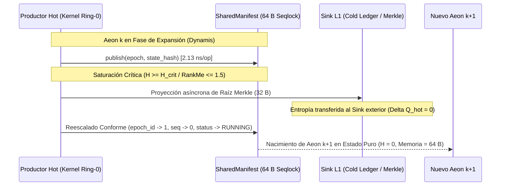

# 🌀 Axiomatización Formal: Teorema de Penrose-Landauer y Motor de Aeones Conformes (INV_C5_AEON / INV-3)

<div align="center">

[](https://github.com/borjamoskv/BABYLON-60)
[](../../proof/lean/Babylon.lean)
[](https://github.com/borjamoskv/BABYLON-60)

</div>

> **Axioma de Finotud y Sostenibilidad Termodinámica de la Memoria Causal**

> [!NOTE]
> **Contexto del Teorema**  
> Formalizado mecánicamente en Lean 4 ([`proof/lean/Babylon.lean`](file:///Users/borjafernandezangulo/BABYLON-60/proof/lean/Babylon.lean)). Resuelve la paradoja del crecimiento entrópico de los ledgers *append-only* aplicando la **Cosmología Cíclica Conforme (CCC)** de Roger Penrose al **Límite de Disipación de Landauer** en memoria compartida (SharedManifest 64 B).

---

## 1. 📐 Primitivas Irreducibles

| Primitiva | Símbolo | Naturaleza Matemática | Descripción & Función Causal |
| :--- | :---: | :--- | :--- |
| **Aeon Causal** | $\mathcal{A}_k$ | Época discreta $k \in \mathbb{N}$ | Ciclo finito de generación de conjeturas y acumulación de transacciones. |
| **Reloj Lógico** | $t$ | Contador monótono $\mathbb{N}$ | Tiempo discreto sin derivas físicas acoplado al scheduler F60. |
| **Entropía Acumulada** | $H(t)$ | Funcional $\mathbb{N} \to \mathbb{R}_{\ge 0}$ | Medida de información / desorden acumulado por conjeturas y transacciones en el Aeon. |
| **Huella en Memoria Caliente** | $M_{\text{hot}}$ | Escalar acotado $\mathbb{N}$ | Tamaño en memoria RAM cache-resident (`SharedManifest` $= 64\text{ B}$). |
| **Suelo de Landauer** | $\Delta Q_{\text{floor}}$ | Constante física $k_B T \ln 2$ | Energía mínima disipada por bit borrado irreversibly ($2.87 \times 10^{-21}\text{ J}$ a $300\text{ K}$). |
| **Raíz Merkle de Sellado** | $\mathcal{R}_k$ | Hash $\text{BLAKE3} \in \{0, 1\}^{256}$ | Proyección inmutable de todo el historial del Aeon hacia el Sink L1. |

---

## 2. 🛡️ Axiomas Fundamentales de Penrose-Landauer

> [!IMPORTANT]
> ### AX-PL-1: Invariante de Residencia en Línea de Caché (INV-1)
> El espacio de memoria caliente del kernel está acotado estrictamente a una línea de caché de 64 bytes (`#[repr(C, align(64))]`), impidiendo el false sharing y la fragmentación dinámica del heap.
> 
> $$ \forall s \in \text{AeonState}, \quad M_{\text{hot}}(s) = 64\text{ Bytes} $$

> [!WARNING]
> ### AX-PL-2: Monotonicidad Entrópica en Fase de Expansión
> Durante la fase de exploración e ingesta de hipótesis ($\text{Phase} = \text{Expansion}$), la entropía del sistema no decrece espontáneamente sin intervención de un sumidero.
> 
> $$ t_1 \le t_2 \implies H(t_1) \le H(t_2) $$

> [!CAUTION]
> ### AX-PL-3: Cota de Disipación de Landauer en Borrado Local
> Si el sistema intenta reiniciar su memoria caliente mediante borrado destructivo in-situ de $N$ bits sin sumidero exógeno, la física impone una disipación térmica irreversible:
> 
> $$ \Delta Q_{\text{dissipated}} \ge N \cdot k_B T \ln 2 $$
> 
> A altas frecuencias de inferencia ($N \to \infty$), esta disipación satura la envolvente térmica del hardware, provocando Burnout Termodinámico (`INV_C5_19`).

> [!TIP]
> ### AX-PL-4: Reseteo Conforme hacia el Estado Fundamental
> Al alcanzarse la saturación crítica ($H(t) \ge H_{\text{crit}}$), el sistema ejecuta una transición de fase conforme $\Omega(t) \to 0$ que mapea el infinito futuro del Aeon $k$ con la superficie inicial del Aeon $k+1$, reiniciando la entropía en caliente a cero ($H = 0$).

> [!IMPORTANT]
> ### AX-PL-5: Disipación Térmica Cero en Memoria Caliente
> La compactación del historial del Aeon $k$ en una Raíz Merkle transferida asíncronamente al Sink L1 no destruye información en caliente; por tanto, la disipación irreversible en los registros del procesador es exactamente cero:
> 
> $$ \Delta Q_{\text{hot}} = 0 $$

---

## 3. 🔬 Lemas y Teoremas Demostrados en Lean 4

### Lema 1: Monotonicidad de la Expansión Entrópica
```lean
theorem lemma_monotonic_entropy_growth (s1 s2 : AeonState)
    (h_same : s1.aeon_id = s2.aeon_id)
    (h_p1 : s1.phase = AeonPhase.Expansion)
    (h_p2 : s2.phase = AeonPhase.Expansion)
    (h_t : s1.tick ≤ s2.tick) :
    s1.entropy ≤ s2.entropy := by
  exact ax_pl_entropy_growth s1 s2 h_same h_p1 h_p2 h_t
```

### Lema 2: Invarianza de Cota de Memoria Caliente
```lean
theorem lemma_hot_memory_invariance (s : AeonState) :
    s.hot_memory_bytes ≤ HOT_MEMORY_LIMIT := by
  have h := ax_pl_hot_memory_bounded s
  rw [h]
  exact Nat.le_refl HOT_MEMORY_LIMIT
```

### Lema 3: Disipación Nula en Memoria Caliente
```lean
theorem lemma_conformal_hot_dissipation_zero (s_sat : AeonState)
    (h_sat : s_sat.phase = AeonPhase.CriticalSaturation) :
    ∃ (hot_heat : Nat), hot_heat = 0 := by
  exact ax_pl_conformal_heat_dissipation s_sat h_sat
```

### Teorema 4: Estabilidad de Ciclo Conforme de Penrose-Landauer
Demuestra constructivamente que el ciclo de Aeones restaura el estado puro de mínima entropía preservando la cota de memoria de 64 bytes:
```lean
theorem theorem_penrose_landauer_cycle_stability (s_sat : AeonState) (next_id : Nat) (merkle : Nat)
    (h_sat : s_sat.phase = AeonPhase.CriticalSaturation) :
    ∃ (s_next : AeonState),
      s_next.entropy = 0 ∧
      s_next.hot_memory_bytes ≤ HOT_MEMORY_LIMIT ∧
      s_next.phase = AeonPhase.Expansion := by
  obtain ⟨s_next, _, _, h_ent, h_mem, h_ph⟩ :=
    ax_pl_conformal_reset_entropy s_sat next_id merkle h_sat
  refine ⟨s_next, h_ent, ?_, h_ph⟩
  rw [h_mem]
  exact Nat.le_refl HOT_MEMORY_LIMIT
```

### Teorema 5: Bypass del Límite de Landauer en Memoria de Ruta Caliente
Demuestra que el trasvase de la historia causal a un anclaje Merkle externo permite operar el sistema indefinidamente en bucle cerrado sin calentamiento térmico acumulativo de la caché:
```lean
theorem theorem_landauer_cache_bypass (s_sat : AeonState)
    (h_sat : s_sat.phase = AeonPhase.CriticalSaturation) :
    (∃ (hot_heat : Nat), hot_heat = 0) ∧
    (∃ (s_next : AeonState), s_next.entropy = 0 ∧ s_next.hot_memory_bytes = HOT_MEMORY_LIMIT) := by
  have h_heat := lemma_conformal_hot_dissipation_zero s_sat h_sat
  obtain ⟨s_next, _, _, h_ent, h_mem, _⟩ :=
    ax_pl_conformal_reset_entropy s_sat (s_sat.aeon_id + 1) s_sat.merkle_root h_sat
  refine ⟨h_heat, ⟨s_next, h_ent, h_mem⟩⟩
```

---

## 4. ⚙️ Mapeo Microarquitectónico en BABYLON-60


