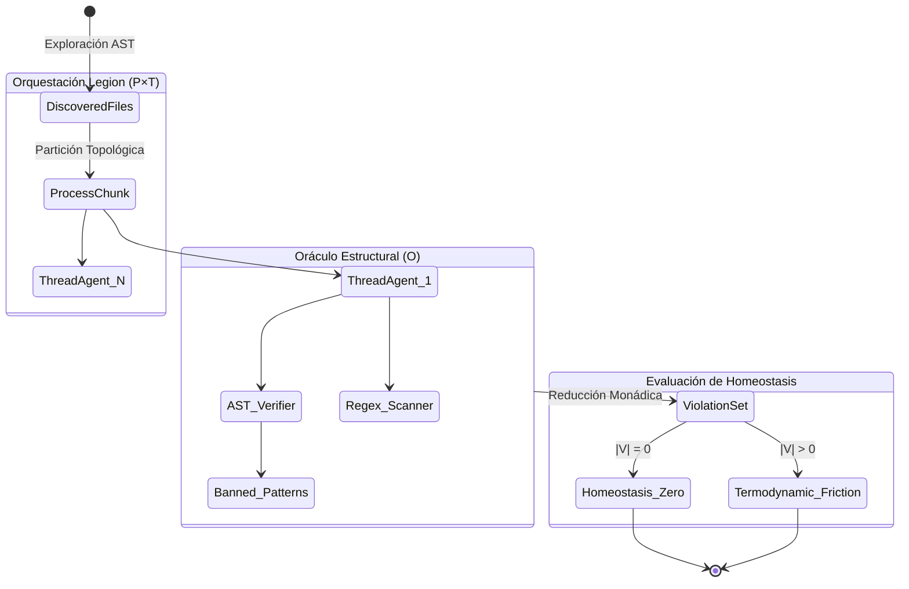

# Axiomatización Formal: Legion Parallel Workspace Swarm

> **Régimen Causal-Determinist**
> Metodología formal generada bajo el protocolo `agentic-protocol-axiomatization`. Define el modelo lógico-deductivo $\mathcal{G}$ subyacente al motor de auditoría de 1,000 agentes paralelos.

---

## 1. Primitivas Irreducibles

- **Espacio de Trabajo ($\mathcal{W}$)**: Un hipergrafo inmutable compuesto por un conjunto discreto de Nodos Documentales $D = \{d_1, d_2, \dots, d_n\}$.
- **Agente Lógico ($\alpha$)**: Un autómata determinista de estado cero, definido como una función pura $\alpha : D \to \mathcal{V}$, donde $\mathcal{V}$ es el Espacio de Violaciones.
- **Oráculo Estructural ($\mathcal{O}$)**: Conjunto de predicados booleanos (AST, Patrones Banned, Shebang) que un documento debe satisfacer.
- **Legión ($\Lambda$)**: El orquestador de concurrencia física (Process/Thread Pool) que inyecta instancias de $\alpha$ sobre particiones de $\mathcal{W}$.

---

## 2. Axiomas Fundamentales

### AX-LS-1 (Acotamiento de Concurrencia Férrea)
El paralelismo físico en cualquier instante $t$ está estrictamente acotado por un límite termodinámico superior, evitando la saturación del OS:
$$ \forall t \in \text{Ejecución}, \quad |\text{Active}(\Lambda_t)| \le \mathcal{C}_{\text{proc}} \times \mathcal{C}_{\text{thr}} $$

### AX-LS-2 (Mutabilidad Cero / Aislamiento Causal)
La legión es un observador epistemológico puro. Ningún nodo altera $\mathcal{W}$ durante la ejecución. El gradiente de entropía local del sistema de archivos es estrictamente cero:
$$ \Delta\text{Entropía}(\mathcal{W}) = 0 $$

### AX-LS-3 (Fail-Fast de Grano Fino)
Una excepción en $\alpha_i$ evaluando $d_i$ (e.g., error de lectura o corrupción binaria no UTF-8) no interrumpe el bucle de la Legión, sino que colapsa determinísticamente en un elemento de $\mathcal{V}$ sin propagarse topológicamente:
$$ \text{Crash}(\alpha_i) \implies \alpha_i(d_i) = \{ v_{\text{crash}} \} \land \text{Alive}(\alpha_{j \neq i}) $$

---

## 3. Definiciones de Alto Nivel

- **Partición Topológica (Chunking):** El espacio $\mathcal{W}$ se divide ortogonalmente en $K$ subconjuntos disjuntos $\mathcal{W}_1, \dots, \mathcal{W}_K$ tal que $\bigcup \mathcal{W}_k = \mathcal{W}$ y $\bigcap \mathcal{W}_k = \emptyset$. Cada chunk es procesado atómicamente por un Process Worker.
- **Bucle Deductivo de Auditoría:** La aplicación recursiva de $\mathcal{O}$ a cada nodo $d_i \in \mathcal{W}$ hasta que $\Lambda$ se vacía.
- **Matriz de Saneamiento:** El conjunto final $\mathbf{V} = \bigcup_{i=1}^{|\mathcal{W}|} \alpha(d_i)$. Si $\mathbf{V} = \emptyset$, el repositorio alcanza la **Homeostasis Estructural**.

---

## 4. Teoremas y Corolarios

### Teorema 1: Invarianza Causal del Scheduler
> **Enunciado:** Dado un espacio $\mathcal{W}$ inmutable, el estado final de la Matriz de Saneamiento $\mathbf{V}$ es matemáticamente idéntico independientemente de la latencia del sistema operativo o el orden asíncrono de los hilos de ejecución.

**Demostración (Boceto):** Por AX-LS-2, ninguna función $\alpha$ muta el estado global. Como cada $\alpha_i$ procesa un $d_i$ independiente de la Partición Topológica disjunta, las evaluaciones son homomorfismos aislados. La unión de conjuntos conmutativos $A \cup B = B \cup A$ garantiza que el orden de retorno de los `Future`s en el `as_completed` no alterará el vector final $\mathbf{V}$. $\blacksquare$

### Corolario 1: Cota de Sobrecarga Termodinámica
El sistema nunca puede entrar en "Green Theater" (bloqueo mutuo asintótico o livelock). Debido a AX-LS-3 y la finitud de $\mathcal{W}$, el proceso siempre termína en un número acotado de operaciones atómicas de SO.

---

## 5. Topología del Bucle Deductivo (Mermaid)

---

## 6. Ecuación Límite del Protocolo

El protocolo colapsa el esfuerzo termodinámico del agente humano en tiempo constante amortizado. La ecuación límite para el tiempo de procesamiento total (Wall Time) $t_{\text{wall}}$ en estado de saturación total ($N \to |\mathcal{W}|$) se define por:

$$ \lim_{N \to \infty} t_{\text{wall}} = O\left( \frac{|\mathcal{W}|}{\min(N, \mathcal{C}_{\text{proc}} \times \mathcal{C}_{\text{thr}})} \cdot \tau_{\text{io}} \right) + c_{\text{overhead}} $$

Donde $\tau_{\text{io}}$ es la fricción térmica irreducible del disco duro, y $c_{\text{overhead}}$ el coste exergético de serializar/deserializar en los pipes IPC.
