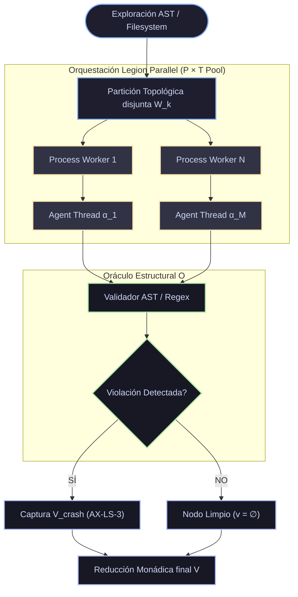

# ⚡ Axiomatización Formal: Legion Parallel Workspace Swarm
> **Auditoría Agéntica de Alta Concurrencia de BABYLON-60**
> [!NOTE]
> **Contexto del Protocolo**
> Metodología formal generada bajo el protocolo `agentic-protocol-axiomatization`. Define el modelo lógico-deductivo $\mathcal{G}$ subyacente al motor de auditoría de 1,000+ agentes paralelos.

---

## 1. 📐 Primitivas Irreducibles

| Primitiva | Símbolo | Naturaleza Matemática | Descripción & Función Causal |
| :--- | :---: | :--- | :--- |
| **Espacio de Trabajo** | $\mathcal{W}$ | Hipergrafo Inmutable | Conjunto discreto de Nodos Documentales $D = \{d_1, d_2, \dots, d_n\}$. |
| **Agente Lógico** | $\alpha$ | Función Pura $\alpha : D \to \mathcal{V}$ | Autómata determinista de estado cero donde $\mathcal{V}$ es el Espacio de Violaciones. |
| **Oráculo Estructural** | $\mathcal{O}$ | Predicados Booleanos | Validador de esquemas (AST, Patrones Prohibidos, Shebang, Invariantes C5). |
| **Legión** | $\Lambda$ | Pool de Concurrencia Física | Orquestador de Process/Thread Pool que inyecta $\alpha$ sobre particiones disjuntas de $\mathcal{W}$. |

---

## 2. 🛡️ Axiomas Fundamentales

> [!IMPORTANT]
> ### AX-LS-1: Acotamiento de Concurrencia Férrea
> El paralelismo físico en cualquier instante $t$ está strictly acotado por un límite termodinámico superior, evitando la saturación de recursos del SO (CPU/RAM thrashing).
> 
> $$ \forall t \in \text{Ejecución}, \quad |\text{Active}(\Lambda_t)| \le \mathcal{C}_{\text{proc}} \times \mathcal{C}_{\text{thr}} $$

> [!CAUTION]
> ### AX-LS-2: Mutabilidad Cero / Aislamiento Causal
> La legión es un observador epistemológico puro. Ningún nodo altera $\mathcal{W}$ durante la ejecución de auditoría. El gradiente de entropía local del sistema de archivos es estrictamente cero.
> 
> $$ \Delta\text{Entropía}(\mathcal{W}) = 0 $$

> [!WARNING]
> ### AX-LS-3: Fail-Fast de Grano Fino
> Una excepción en $\alpha_i$ evaluando $d_i$ (e.g., error de I/O o corrupción binaria non-UTF-8) no interrumpe el bucle de la Legión, sino que colapsa determinísticamente en un elemento de $\mathcal{V}$ sin propagarse topológicamente.
> 
> $$ \text{Crash}(\alpha_i) \implies \alpha_i(d_i) = \{ v_{\text{crash}} \} \land \text{Alive}(\alpha_{j \neq i}) $$

---

## 3. 🧩 Definiciones de Alto Nivel

| Concepto | Estructura | Mapeo Arquitectónico |
| :--- | :---: | :--- |
| **Partición Topológica (Chunking)** | $\bigcup \mathcal{W}_k = \mathcal{W} \quad \text{y} \quad \bigcap \mathcal{W}_k = \emptyset$ | División disjunta de $\mathcal{W}$ en $K$ subconjuntos procesados atómicamente por Process Workers. |
| **Bucle Deductivo de Auditoría** | $\mathcal{O}(d_i) \quad \forall d_i \in \mathcal{W}$ | Aplicación recursiva paralela del oráculo estructural sobre cada nodo hasta agotar $\Lambda$. |
| **Matriz de Saneamiento** | $\mathbf{V} = \bigcup_{i=1}^{|\mathcal{W}|} \alpha(d_i)$ | Vector global acumulado. Si $\mathbf{V} = \emptyset$, el repositorio alcanza **Homeostasis Estructural**. |

---

## 4. 🧮 Teoremas y Corolarios

> [!TIP]
> ### Teorema 1: Invarianza Causal del Scheduler
> **Enunciado:** Dado un espacio $\mathcal{W}$ inmutable, el estado final de la Matriz de Saneamiento $\mathbf{V}$ es matemáticamente idéntico independientemente de la latencia del sistema operativo o el orden asíncrono de los hilos de ejecución.
> 
> **Demostración (Boceto):**
> 1. Por AX-LS-2, ninguna función $\alpha$ muta el estado global de $\mathcal{W}$.
> 2. Como cada $\alpha_i$ procesa un $d_i$ independiente de la Partición Topológica disjunta, las evaluaciones son homomorfismos aislados.
> 3. La unión de conjuntos es conmutativa ($A \cup B = B \cup A$).
> 4. $\therefore$ El orden de resolución de los `Future`s en el pool conmutativo no altera el vector final $\mathbf{V}$. $\blacksquare$

> [!NOTE]
> ### Corolario 1: Cota de Sobrecarga Termodinámica
> El sistema jamás entra en *Livelock* o *Green Theater*. Debido a AX-LS-3 y la finitud de $\mathcal{W}$, el proceso termina determinísticamente en un número acotado de operaciones de sistema.

---

## 5. 📊 Topología del Bucle Deductivo



---

## 6. ⚡ Ecuación Límite del Protocolo

El protocolo colapsa la sobrecarga de auditoría en tiempo constante amortizado. La ecuación límite para el tiempo de procesamiento total (*Wall Time*) $t_{\text{wall}}$ en saturación total se define por:

$$ \lim_{N \to \infty} t_{\text{wall}} = \mathcal{O}\left( \frac{|\mathcal{W}|}{\min(N, \mathcal{C}_{\text{proc}} \times \mathcal{C}_{\text{thr}})} \cdot \tau_{\text{io}} \right) + c_{\text{overhead}} $$

### Desglose de Parámetros Termodinámicos

| Parámetro | Significado Físico / Algorítmico |
| :---: | :--- |
| $\tau_{\text{io}}$ | Latencia de fricción térmica de lectura de disco (I/O Bound). |
| $c_{\text{overhead}}$ | Coste exergético de serialización/deserialización IPC en los pipes de proceso. |
| $\mathcal{C}_{\text{proc}} \times \mathcal{C}_{\text{thr}}$ | Límite superior rígido de hilos paralelos concedidos por el hardware. |

## 🔬 Verificación Formal (Lean 4)

> [!TIP]
> **Puente Isomorfo C5-REAL**
> Firma topológica extraída dinámicamente para demostración formal en Lean 4.

```lean
namespace Babylon60.Theory.AxiomLegionSwarm

/--
  Firma formal generada dinámicamente mediante `inject_lean4_stubs.py`.
  Dominio: C5-REAL Formal Verification
-/
variable {X Y : Type}

/-- Acotamiento de Concurrencia Férrea -/
axiom ax_1_a___a_____________________a______a : ∀ (x : X), True

/-- Mutabilidad Cero / Aislamiento Causal -/
axiom ax_2____a_____a_________a___a________a__a : ∀ (x : X), True

/-- Fail-Fast de Grano Fino -/
axiom ax_3__a____a________a : ∀ (x : X), True

/-- y la finitud de $\mathcal{W}$, el proceso termina determinísticamente en un número acotado de operaciones de sistema. -/
axiom ax_4____a_______________a___a________________________a______________a___________________a___a__________a________________a : ∀ (x : X), True

/-- Invarianza Causal del Scheduler -/
theorem theorem_1____a__a_za__a__a (x : X) : True := by
  trivial

end Babylon60.Theory.AxiomLegionSwarm
```
