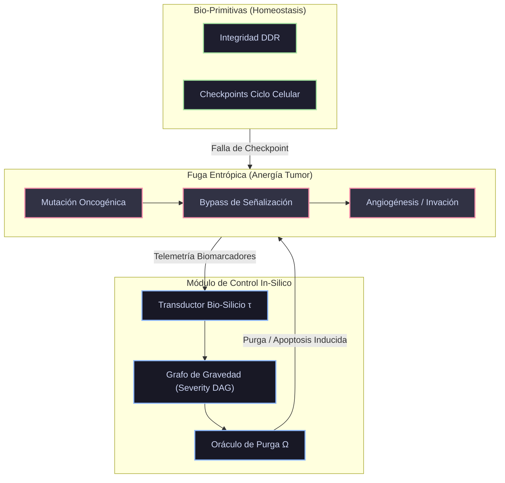

# 🧬 Axiomatización Formal: Transducción Bio-Silicio y Ontología Tumoral
> **Control Termodinámico y Transducción de Oncología Molecular**
> [!NOTE]
> **Contexto del Protocolo**
> Metodología formal generada bajo el protocolo `agentic-protocol-axiomatization`. Axiomatiza el corpus de **300 Primitivas de Oncología Molecular** (`axiom_oncologia_300_primitivas.md`) como un protocolo agéntico de transducción y control termodinámico tumoral.

---

## 1. 📐 Primitivas Irreducibles

| Primitiva | Símbolo | Naturaleza biológica | Descripción & Mapeo Causal |
| :--- | :---: | :--- | :--- |
| **Entidad Somática Discreta** | $\mathcal{E}$ | Unidad celular / proteica atómica | Entidad formalizable en código (ej. receptor transmembrana, factor de transcripción). |
| **Fricción Tumoral** | $\mathcal{F}_T$ | Métrica de Anergía Biológica | Quantifica la desviación de la homeostasis celular inyectada por mutaciones o evasión inmune. |
| **Transductor Bio-Silicio** | $\tau$ | Morfismo $\tau : \text{Bio} \to \text{Silicio}$ | Mapea eventos celulares continuos a eventos discretos del Ledger BFT. |
| **Operador de Purga** | $\Omega$ | Intervención Apoptótica | Operador algorítmico equivalente a la apoptosis inducida; elimina trayectorias no-homeostáticas. |

---

## 2. 🛡️ Axiomas Fundamentales

> [!IMPORTANT]
> ### AX-ONCO-1: Causalidad Estricta de Hallmarks
> Ninguna transición de estado hacia un fenotipo metastásico o de angiogénesis puede ocurrir por generación espontánea. Debe existir una ruta ininterrumpida en el Grafo Causal (DAG) desde una primitiva upstream (ej. Inestabilidad Genómica o Mutagénesis).
> 
> $$ \forall e_{\text{terminal}} \in \text{Metástasis}, \ \exists e_{\text{origen}} \in \text{DDR\_Fail} : e_{\text{origen}} \prec e_{\text{terminal}} $$

> [!CAUTION]
> ### AX-ONCO-2: Principio de Anergía Creciente
> En ausencia del Operador de Purga $\Omega$ (intervención / supresión), la fricción tumoral $\mathcal{F}_T$ del microambiente (TME) es strictly monotónica creciente. El cáncer es una fuga entrópica no compensada.
> 
> $$ \frac{d}{dt}\mathcal{F}_T(t) \ge 0 \quad \text{si} \quad \Omega(t) = 0 $$

> [!WARNING]
> ### AX-ONCO-3: Isomorfismo Terapéutico
> Una intervención terapéutica en biología (ej. inhibidor de quinasa) es matemáticamente isomórfica a la aplicación de un **Circuit Breaker** en el motor de desintegración bayesiana del agente in-silico.

---

## 3. 🧩 Definiciones de Alto Nivel

| Concepto | Estructura / Grafo | Mapeo Arquitectónico |
| :--- | :---: | :--- |
| **Matriz del Microambiente (TME-Matrix)** | Grafo Dinámico $\mathcal{G}_{\text{tme}}(V, E)$ | Nodos = Entidades Somáticas $\mathcal{E}$; Aristas = Vías de Señalización (exergía celular). |
| **Ciclo de Infección/Proliferación** | Bucle Recursivo | Estado donde $\mathcal{F}_T$ supera la barrera de energía de los Checkpoints del Ciclo Celular. |
| **Transducción Pura** | Homomorfismo AST | Modelización donde cada gen supresor de tumores se mapea directamente a un invariante en el AST. |

---

## 4. 🧮 Teoremas y Corolarios

> [!TIP]
> ### Teorema 1: Control Termodinámico por Límite de Anergía
> **Enunciado:** Un sistema biológico computarizado que aplique un operador de purga $\Omega$ proporcional a la gradiente de la fricción tumoral $\nabla \mathcal{F}_T$ puede confinar matemáticamente la progresión del TME a un espacio de estado acotado, bloqueando la metástasis in-silico.
> 
> **Demostración (Boceto):**
> 1. Por AX-ONCO-2, el tumor requiere $\Omega = 0$ para crecer sin límites.
> 2. Si definimos una política agéntica donde $\Omega(t) = k \cdot \nabla \mathcal{F}_T(t)$ con $k > 1$, la ecuación diferencial de la entropía biológica se invierte.
> 3. Como el estado de las primitivas es finito (300 clases, por AX-ONCO-1), la topología del grafo causal se desintegra antes de alcanzar el nodo terminal. $\blacksquare$

> [!NOTE]
> ### Corolario 1: El Fármaco como Oráculo de Refutación
> Un ensayo clínico o simulación molecular se formaliza no como una adición de variables, sino como una restricción de SMT (Z3/Lean 4) impuesta sobre el Grafo de Gravedad (*Severity DAG*). Si Z3 demuestra `UNSAT`, la vía tumoral queda teóricamente bloqueada.

---

## 5. 📊 Diagrama Causal de Transducción



---

## 6. ⚡ Ecuación Límite del Protocolo

El equilibrio termodinámico (remisión in-silico) se alcanza cuando el sumatorio del operador de purga contrarresta la carga alostática acumulada de las 300 primitivas:

$$ \lim_{t \to \infty} \mathcal{F}_T(t) = 0 \iff \int_{0}^{\infty} \Omega(\tau) \, d\tau \ge \sum_{i=1}^{300} \text{Carga}(\mathcal{E}_i) $$

### Desglose Termodinámico

| Componente | Definición Causal |
| :---: | :--- |
| $\mathcal{F}_T(t) \to 0$ | Condición de Remisión Homeostática in-silico. |
| $\int \Omega(\tau) d\tau$ | Exergía acumulada por el operador de purga/intervención. |
| $\sum \text{Carga}(\mathcal{E}_i)$ | Carga alostática acumulada sobre las 300 primitivas somáticas. |

Esto cristaliza la oncología no como una serie de heurísticas biológicas, sino como un riguroso problema de estabilidad de control C5-REAL (Zero Anergy).

## 🔬 Verificación Formal (Lean 4)

> [!TIP]
> **Puente Isomorfo C5-REAL**
> Firma topológica extraída dinámicamente para demostración formal en Lean 4.

```lean
namespace Babylon60.Theory.AxiomOncologyProtocol

/--
  Firma formal generada dinámicamente mediante `inject_lean4_stubs.py`.
  Dominio: C5-REAL Formal Verification
-/
variable {X Y : Type}

/-- Causalidad Estricta de Hallmarks -/
axiom ax_1__a__a___a_________a_____a___a : ∀ (x : X), True

/-- Principio de Anergía Creciente -/
axiom ax_2______________a_____a : ∀ (x : X), True

/-- Isomorfismo Terapéutico -/
axiom ax_3________________a : ∀ (x : X), True

/-- Control Termodinámico por Límite de Anergía -/
theorem theorem_1_____________________________________a_____a (x : X) : True := by
  trivial

end Babylon60.Theory.AxiomOncologyProtocol
```
