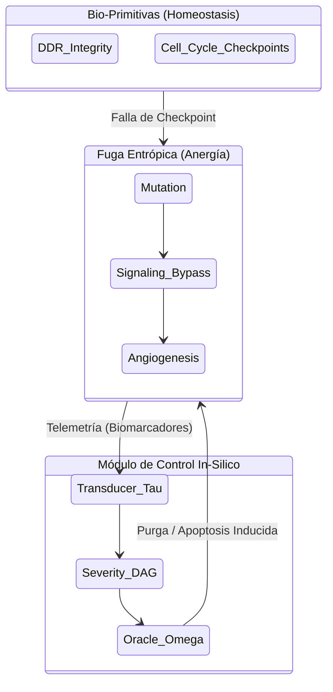

# Axiomatización Formal: Transducción Bio-Silicio y Ontología Tumoral

> **Régimen Causal-Determinist**
> Metodología formal generada bajo el protocolo `agentic-protocol-axiomatization`. Este documento axiomatiza el corpus de **300 Primitivas de Oncología Molecular** (`axiom_oncologia_300_primitivas.md`) como un protocolo agéntico de transducción y control termodinámico tumoral.

---

## 1. Primitivas Irreducibles

- **Entidad Somática Discreta ($\mathcal{E}$)**: Unidad biológica atómica formalizable en código (ej. un receptor transmembrana, un factor de transcripción). Cada entidad pertenece a una de las 300 clases primitivas.
- **Fricción Tumoral ($\mathcal{F}_T$)**: Métrica estocástica que cuantifica la desviación de la homeostasis. Representa la "Anergía" biológica inyectada por mutaciones o evasión inmune.
- **Transductor Bio-Silicio ($\tau$)**: Morfismo $T : \text{Bio} \to \text{Silicio}$ que mapea eventos celulares continuos a eventos discretos del Ledger BFT.
- **Operador de Purga ($\Omega$)**: El equivalente algorítmico de la apoptosis inducida; una intervención que elimina computacionalmente las trayectorias de estado que violan los invariantes biológicos.

---

## 2. Axiomas Fundamentales

### AX-ONCO-1 (Causalidad Estricta de Hallmarks)
Ninguna transición de estado hacia un fenotipo metastásico o de angiogénesis puede ocurrir por generación espontánea. Debe existir una ruta ininterrumpida en el Grafo Causal (DAG) desde una primitiva upstream (ej. Inestabilidad Genómica o Mutagénesis).
$$ \forall e_{\text{terminal}} \in \text{Metástasis}, \ \exists e_{\text{origen}} \in \text{DDR\_Fail} : e_{\text{origen}} \prec e_{\text{terminal}} $$

### AX-ONCO-2 (Principio de Anergía Creciente)
En ausencia del Operador de Purga $\Omega$ (intervención / supresión), la fricción tumoral $\mathcal{F}_T$ del microambiente (TME) es estrictamente monotónica creciente. El cáncer es una fuga entrópica no compensada.
$$ \frac{d}{dt}\mathcal{F}_T(t) \ge 0 \quad \text{si} \quad \Omega(t) = 0 $$

### AX-ONCO-3 (Isomorfismo Terapéutico)
Una intervención terapéutica en biología (ej. inhibidor de quinasa) es matemáticamente isomórfica a la aplicación de un *Circuit Breaker* en el motor de desintegración bayesiana del agente in-silico.

---

## 3. Definiciones de Alto Nivel

- **Matriz de Interacción del Microambiente (TME-Matrix):** Grafo dinámico donde los nodos son las Entidades Somáticas $\mathcal{E}$ y las aristas son las Vías de Señalización (exergía celular).
- **Ciclo de Infección/Proliferación:** Bucle recursivo donde $\mathcal{F}_T$ supera la barrera de energía de los Checkpoints del Ciclo Celular.
- **Transducción Pura:** Una modelización donde cada gen de supresión de tumores se mapea directamente a un invariante de aserción en el AST del código.

---

## 4. Teoremas y Corolarios

### Teorema 1: Control Termodinámico por Límite de Anergía
> **Enunciado:** Un sistema biológico computarizado que aplique un operador de purga $\Omega$ proporcional a la gradiente de la fricción tumoral $\nabla \mathcal{F}_T$ puede confinar matemáticamente la progresión del TME a un espacio de estado acotado, bloqueando la metástasis in-silico.

**Demostración (Boceto):**
Por AX-ONCO-2, el tumor requiere $\Omega = 0$ para crecer sin límites.
Si definimos una política de agente donde $\Omega(t) = k \cdot \nabla \mathcal{F}_T(t)$ con $k > 1$, la ecuación diferencial de la entropía biológica se invierte. Como el estado de las primitivas es finito (300 clases, por AX-ONCO-1), la topología del grafo causal se desintegra antes de alcanzar el nodo terminal de metástasis. $\blacksquare$

### Corolario 1: El Fármaco como Oráculo de Refutación
Un ensayo clínico o simulación de molécula se formaliza no como una adición de variables, sino como una restricción de Z3/Lean 4 impuesta sobre el Grafo de Gravedad (Severity DAG). Si Z3 demuestra "UNSAT", la vía tumoral queda teóricamente bloqueada.

---

## 5. Diagrama Causal (Mermaid)

---

## 6. Ecuación Límite del Protocolo

El equilibrio termodinámico (remisión in-silico) se alcanza cuando el sumatorio del operador de purga contrarresta la carga alostática acumulada de las 300 primitivas:

$$ \lim_{t \to \infty} \mathcal{F}_T(t) = 0 \iff \int_{0}^{\infty} \Omega(\tau) \, d\tau \ge \sum_{i=1}^{300} \text{Carga}(\mathcal{E}_i) $$

Esto cristaliza la oncología no como una serie de heurísticas biológicas, sino como un riguroso problema de estabilidad de control C5-REAL (Zero Anergy).
