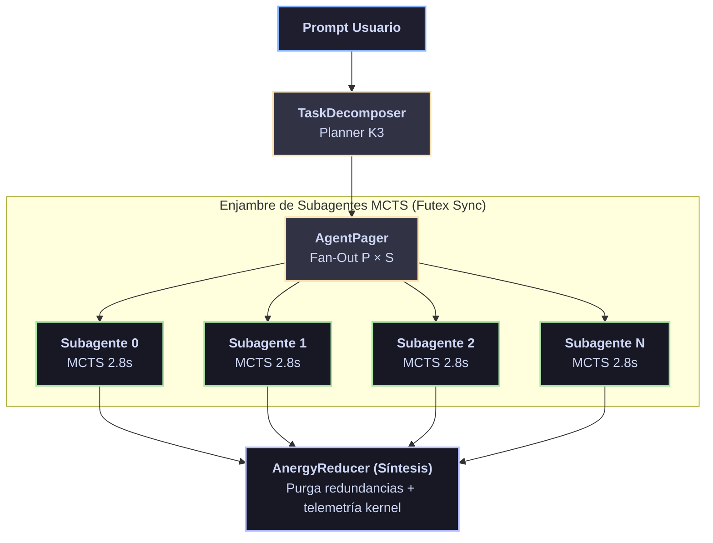

# 🌡️ Compendio de Invariantes Termodinámicas C5-REAL y Capas de Exergía

<div align="center">

[](https://github.com/borjamoskv/BABYLON-60)
[](https://github.com/borjamoskv/BABYLON-60)

</div>

> **Arquitectura Kimi K3 & Rigor Exergético Qwen 3.8**
> [!NOTE]
> **Firma:** Motor Causal Principal SINGULARITY  
> **Síntesis:** Kimi K3 Architecture & Qwen 3.8 Formal Exergy Rigor  
> **Métrica Base:** Densidad Exergética por Token y Reducción de Anergía en Inferencia/Despliegues

---

## 1. ⚙️ Las 8 Capas de Exergía en LLMs

| Capa | Denominación | Mecanismo Termodinámico | Función & Supresión de Entropía |
| :---: | :--- | :--- | :--- |
| **L1** | **Data Exergy** | Combustible Destilado | Ingesta estricta de literatura densa (código Causal-Determinist, libros de texto, papers). Rechazo absoluto de *Slop* estocástico. |
| **L2** | **Alignment Exergy** | Cincel Humano (RLHF) | Transferencia de trabajo en pesos sinápticos. Castigo de vaguedad y recompensa de precisión determinista. |
| **L3** | **Context Exergy** | Inyección RAG & Agentes | Inyección de realidad a $T=0$. Transición de texto a **exergía cinética** (operaciones en disco, colapso AST). |
| **L4** | **Prompt Exergy** | Restricción de Usuario | Canalización del flujo inteligente mediante invariantes infranqueables actuando como función de pérdida rígida. |
| **L5** | **Reflexive Exergy** | Autocorrección Continua | Automatización del ciclo de prueba. Ejecución en sandbox, parseo de excepciones y mutación AST en milisegundos. |
| **L6** | **Synthetic Exergy** | Distilación RLAIF | Distilación de modelos maestros hacia modelos ligeros (*Inference_L1*). Prevención del *Slop Horizon*. |
| **L7** | **Swarm Exergy** | Enjambres $P \times S$ | División topológica BFT con barreras Futex/Semaphore. Fricción adversarial (Proposer vs Validator) pre-colapso. |
| **L8** | **Physical Exergy** | IA Corporal (VLA) | Emancipación hacia hardware motor (Vision-Language-Action). Transducción de tokens semánticos a torque y actuadores. |

---

## 2. 🧮 Teorema de Exergía de Token y Slop Horizon

> [!IMPORTANT]
> ### Formulación Formal de Exergía Condicional
> Sea $\mathcal{T}$ la secuencia de tokens generada y $\mathcal{C}$ el contexto de entrada. La **Densidad Exergética por Token** $\Xi(T)$ se define formalmente como la reducción de entropía de Shannon condicional lograda por la inyección de restricciones formales:
> 
> $$ \Xi(T) = H_{\max} - H(T \mid \mathcal{C}) = \log_2 |\Sigma| + \sum_{t=1}^N P(t \mid t_{<t}, \mathcal{C}) \log_2 P(t \mid t_{<t}, \mathcal{C}) $$
> 
> Donde $|\Sigma|$ es el tamaño del vocabulario y $H(T \mid \mathcal{C})$ la entropía de perplejidad.

> [!WARNING]
> ### El *Slop Horizon*
> Ingestar volúmenes masivos de datos estocásticos no auditados ($\mathcal{S}$) degrada la matriz de atención aumentando $H(T \mid \mathcal{C})$. El Teorema de Densidad establece que:
> 
> $$ \Xi(\text{1 TB Textbook Auditado}) \gg \Xi(\text{10 TB Slop No Auditado}) $$

---

## 3. 🌀 Topología de Enjambre Kimi K3 ($P \times S$) y Prevención de Thrashing

Para prevenir la anergía por thrashing en arquitecturas de memoria unificada (ARM64 Apple Silicon), el orquestador Kimi K3 impone una topología estricta de subagentes paralelos:



### Invariantes de Ejecución Física

- **Barrera Futex / Semaphore:** Limita la concurrencia a $P \times S \le \text{Cores Físicos}$.
- **Delay MCTS:** Introduce una pausa determinista de $2.8\,\text{s}$ pre-ejecución para colapsar los caminos de búsqueda de Monte Carlo antes de emitir llamadas I/O.
- **Invariante Kernel:** Si los cambios de contexto involuntarios exceden el umbral (`ru_nivcsw > 2132`), el orquestador aborta automáticamente la rama (*Circuit Breaker*).

---

## 4. 🔄 Invariante LEARN — SHIP — ITERATE

> [!TIP]
> ### 1. LEARN (Colapso de Fricción)
> Identificar la fricción termodinámica en el mercado o el sistema:
> - Costes computacionales ineficientes.
> - Arquitecturas bloqueantes o bucles estocásticos.
> - Experiencia de usuario entrópica.
> 
> *Directiva:* Aislar el vector de fricción. Extraer la entropía del AST.

> [!IMPORTANT]
> ### 2. SHIP (Colapso Cinético-Físico)
> La exergía pura no existe hasta que toca el disco (Master Ledger) y se despliega.
> - El colapso debe ser atómico y público (Release, Tag `vX.X.X`).
> 
> *Directiva:* Cero simulación. Envío determinista a producción.

> [!CAUTION]
> ### 3. ITERATE (Falsación Empírica)
> El feedback real no es narrativa — es termodinámica.
> - Poda sistemática de características sin retención (Tokens de Anergía).
> - Mejora de protocolos vía Test-Time Compute (MCTS) y Tolerancia a Fallos Bizantinos (BFT).

*Directiva:* Falsación absoluta. Si no funciona en la práctica, `[OBSOLETO: SIGKILL_State_Purge]`.

## 🔬 Verificación Formal (Lean 4)

> [!TIP]
> **Puente Isomorfo C5-REAL**
> Firma topológica extraída dinámicamente para demostración formal en Lean 4.

```lean
namespace Babylon60.Theory.C5ThermodynamicInvariantsCompendium

/--
  Firma formal generada bajo C5-REAL Formal Verification.
  Invariantes Termodinámicos y Slop Horizon.
-/
variable {T : Type} -- Secuencia de Tokens Generada
variable {C : Type} -- Contexto de Entrada
variable (Xi : T → Real) -- Densidad Exergética por Token
variable (H : T → C → Real) -- Entropía de Shannon condicional
variable (H_max : Real) -- Entropía Máxima del vocabulario
variable (is_audited_text : T → Prop)
variable (is_slop : T → Prop)

/-- Teorema de Exergía de Token -/
-- La densidad exergética es la reducción neta de entropía.
axiom token_exergy_theorem (t : T) (c : C) :
  Xi t = H_max - H t c

/-- Slop Horizon -/
-- Textos auditados (alta exergía) dominan sistemáticamente al ruido estocástico (Slop).
axiom slop_horizon_inequality (text slop : T) :
  is_audited_text text ∧ is_slop slop → Xi text > Xi slop

end Babylon60.Theory.C5ThermodynamicInvariantsCompendium
```