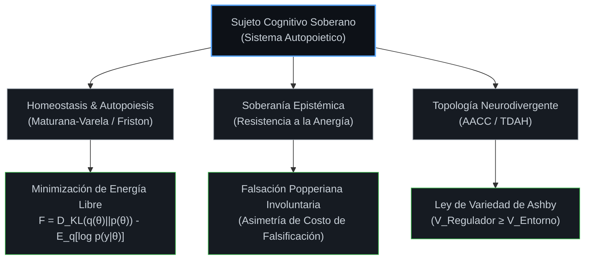
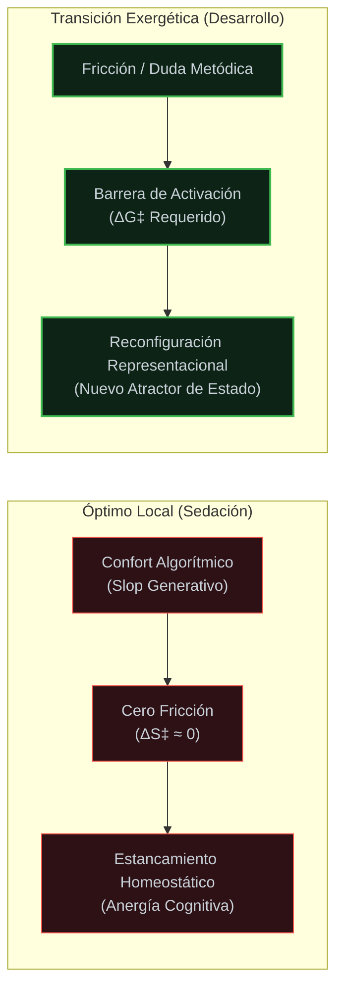
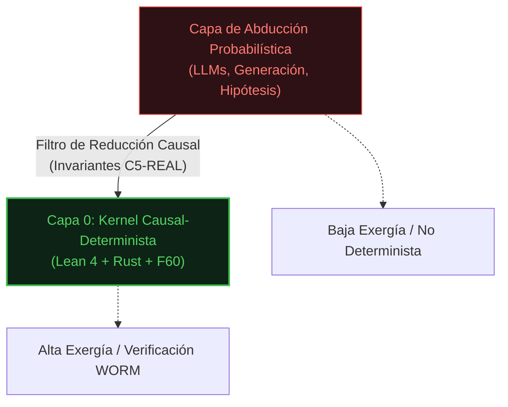
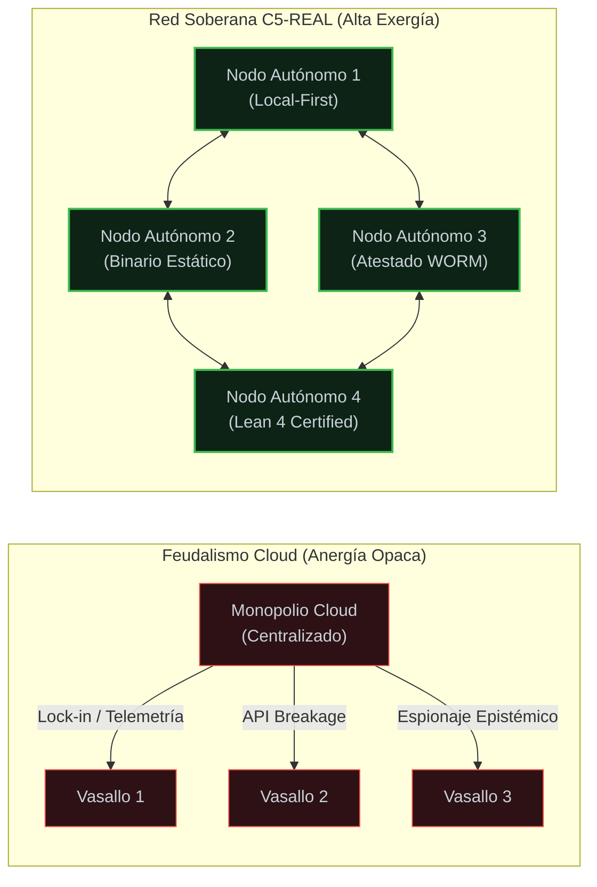
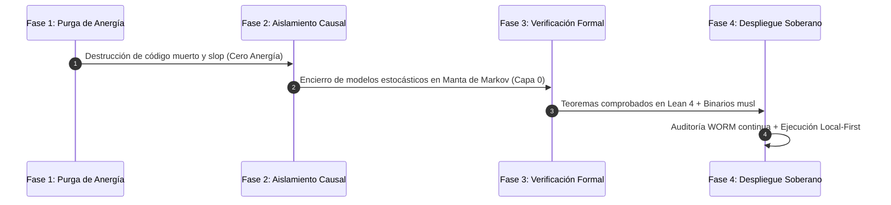
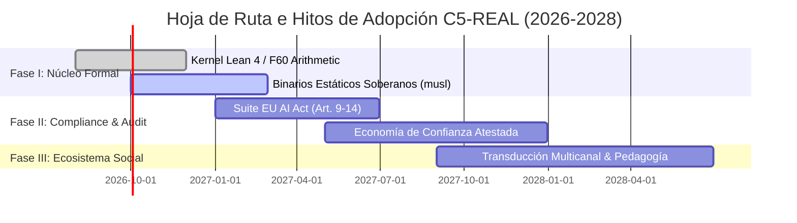

# MANIFIESTO Y TEORÍA UNIFICADA: LA IDEOLOGÍA HUMANO-TECNOLÓGICA-SOCIAL (C5-REAL)
*Hacia un Determinismo Causal Soberano, la Autopoiesis Cognitiva y la Supresión de la Anergía en la Era de la Agencia Autónoma*

---

## ÍNDICE GENERAL

1. [ABSTRACT Y RESUMEN EJECUTIVO](#1-abstract-y-resumen-ejecutivo)
2. [PREÁMBULO EPISTÉMICO Y DIAGNÓSTICO DEL COLAPSO](#2-preámbulo-epistémico-y-diagnóstico-del-colapso)
   - 2.1. [La crisis de la opacidad probabilística y la trampa del slop generativo](#21-la-crisis-de-la-opacidad-probabilística-y-la-trampa-del-slop-generativo)
   - 2.2. [Los 5 Aforismos Fundacionales (Invariantes de Alta Exergía)](#22-los-5-aforismos-fundacionales-invariantes-de-alta-exergía)
   - 2.3. [Causalidad vs. Correlación: La Métrica de Información de Fisher y el Límite de Chentsov](#23-causalidad-vs-correlación-la-métrica-de-información-de-fisher-y-el-límite-de-chentsov)
3. [EJE I: LA DIMENSIÓN HUMANA (Homeostasis, Cognición y Autopoiesis)](#3-eje-i-la-dimensión-humana-homeostasis-cognición-y-autopoiesis)
   - 3.1. [El Sujeto Humano como Agente Autopoietico y Homeostático](#31-el-sujeto-humano-como-agente-autopoietico-y-homeostático)
   - 3.2. [La Invariante del Dolor Termodinámico: Fricción como Umbral de Activación](#32-la-invariante-del-dolor-termodinámico-fricción-como-umbral-de-activación)
   - 3.3. [Asimetría de la Falsificación: Invalidez de la Retórica Voluntaria](#33-asimetría-de-la-falsificación-invalidez-de-la-retórica-voluntaria)
   - 3.4. [Resistencia al Burnout Entrópico y Ley de Variedad de Ashby](#34-resistencia-al-burnout-entrópico-y-ley-de-variedad-de-ashby)
   - 3.5. [Neurodivergencia como Topología Cognitiva Diferencial (AACC + TDAH)](#35-neurodivergencia-como-topología-cognitiva-diferencial-aacc--tdah)
4. [EJE II: LA DIMENSIÓN TECNOLÓGICA (Determinismo Causal, Capa 0 y Cero Anergía)](#4-eje-ii-la-dimensión-tecnológica-determinismo-causal-capa-0-y-cero-anergía)
   - 4.1. [Arquitectura Causal-Determinista frente al Caos Probabilístico](#41-arquitectura-causal-determinista-frente-al-caos-probabilístico)
   - 4.2. [Aritmética Sexagesimal (\(F_{60}\)) y Verificación Formal (Lean 4 + Rust): El Fin de la Aproximación](#42-aritmética-sexagesimal-f_60-y-verificación-formal-lean-4--rust-el-fin-de-la-aproximación)
   - 4.3. [Forense WORM y Cadena de Custodia Causal: Preferir Detenerse a Mentir](#43-forense-worm-y-cadena-de-custodia-causal-preferir-detenerse-a-mentir)
   - 4.4. [La Manta de Markov y Criterio de Clausura Epistémica](#44-la-manta-de-markov-y-criterio-de-clausura-epistémica)
   - 4.5. [Teorema de Consistencia Conjunta de Robinson y Cortafuegos Epistémico](#45-teorema-de-consistencia-conjunta-de-robinson-y-cortafuegos-epistémico)
   - 4.6. [Soberanía Binaria y Compilación Determinista de Cero Dependencias](#46-soberanía-binaria-y-compilación-determinista-de-cero-dependencias)
5. [EJE III: LA DIMENSIÓN SOCIAL Y POLÍTICA (Gobernanza Zero-Trust y Economía Causal)](#5-eje-iii-la-dimensión-social-y-política-gobernanza-zero-trust-y-economía-causal)
   - 5.1. [Desmantelamiento del Feudalismo de Plataforma y Monopolios Cloud Opacos](#51-desmantelamiento-del-feudalismo-de-plataforma-y-monopolios-cloud-opacos)
   - 5.2. [La Economía deConfianza Atestada: Inmunidad Legal y EU AI Act (Artículos 9-14)](#52-la-economía-de-confianza-atestada-inmunidad-legal-y-eu-ai-act-artículos-9-14)
   - 5.3. [Diseminación Epistémica Abierta: Transducción Multidisciplinar del Conocimiento](#53-diseminación-epistémica-abierta-transducción-multidisciplinar-del-conocimiento)
   - 5.4. [Arte, Sonido y Producción Audiovisual como Ingenierías de Resistencia Causal](#54-arte-sonido-y-producción-audiovisual-como-ingenierías-de-resistencia-causal)
   - 5.5. [Educación Causal y Pedagogía Anti-Entrópica](#55-educación-causal-y-pedagogía-anti-entrópica)
   - 5.6. [Gobernanza Algorítmica y Democracia Epistémica](#56-gobernanza-algorítmica-y-democracia-epistémica)
6. [SÍNTESIS CORTEX Y ACCIÓN FUTURA: EL JURAMENTO DEL DETERMINISMO SOBERANO](#6-síntesis-cortex-y-acción-futura-el-juramento-del-determinismo-soberano)
   - 6.1. [Protocolo de Transición y Reducción Dimensional](#61-protocolo-de-transición-y-reducción-dimensional)
   - 6.2. [El Imperativo del Regulador de Conant-Ashby](#62-el-imperativo-del-regulador-de-conant-ashby)
   - 6.3. [Declaración de Soberanía Epistémica Operacional](#63-declaración-de-soberanía-epistémica-operacional)
   - 6.4. [Hoja de Ruta y Métricas de Progreso](#64-hoja-de-ruta-y-métricas-de-progreso)
7. [APÉNDICE A: GLOSARIO FORMAL AXIOMÁTICO](#7-apéndice-a-glosario-formal-axiomático)
8. [APÉNDICE B: BIBLIOGRAFÍA Y REFERENCIAS CIENTÍFICAS](#8-apéndice-b-bibliografía-y-referencias-científicas)

---

## 1. ABSTRACT Y RESUMEN EJECUTIVO

La civilización contemporánea atraviesa un punto de inflexión estructural caracterizado por la degradación del linaje causal en favor de la simulación estadística. La proliferación incontrolada de arquitecturas probabilísticas no atestadas (*slop generativo*) inyecta **anergía** (ruido entrópico carente de fuerza transformadora) en la cognición humana, la infraestructura computacional y los marcos sociopolíticos.

El manifiesto **C5-REAL** postula una doctrina de **Determinismo Causal Soberano** articulada en tres ejes interconectados:

1. **Eje Humano:** El sujeto se constituye como un agente autopoietico y homeostático cuya Manta de Markov debe ser protegida contra la colonización atencional algorítmica. Se formaliza el dolor termodinámico como gradiente de desarrollo y se reinterpreta la neurodivergencia (AACC/TDAH) como una topología cognitiva de alta variedad indispensable para la regulación sistémica.
2. **Eje Tecnológico:** Se instaura la primacía irrestricta de un **Kernel Causal de Capa 0**, donde toda acción operacional se condiciona a la verificación formal previa en Lean 4 + Rust, la precisión sexagesimal pura (\(\mathbb{Q}_{60}\)), la conservación geométrica de la información (Chentsov/Fisher) y la compilación de binarios soberanos estáticos.
3. **Eje Social y Político:** Se promueve el desmantelamiento del feudalismo cloud mediante arquitecturas *local-first*, la instauración de una Economía de la Confianza Atestada que ofrece inmunidad legal computable bajo los Artículos 9-14 del EU AI Act, y la transducción multidisciplinar del conocimiento (integrando matemática, ingeniería, sonido y cinematografía).

Se provee un conjunto completo de definiciones axiomáticas, demostraciones formales de consistencia, un protocolo de reducción dimensional cuantificable y la bibliografía científica de respaldo.

---

## 2. PREÁMBULO EPISTÉMICO Y DIAGNÓSTICO DEL COLAPSO

> [!NOTE]
> **Definición Ontológica (C5-REAL)**
> En este marco, **Anergía** designa el "ruido termodinámico": la inferencia estocástica opaca, la retórica sin linaje causal, el código muerto y el slop generativo. Por el contrario, **Exergía** es el "trabajo útil": el determinismo causal estricto, la verificación formal, el anclaje físico y la resistencia sistémica frente a la entropía.

### 2.1. La crisis de la opacidad probabilística y la trampa del slop generativo

La industria tecnológica contemporánea ha sustituido la comprensión estructural y la causalidad matemática por aproximaciones probabilísticas masivas. Nos encontramos inmersos en una ilusión epistémica: redes neuronales profundas ajustadas mediante aprendizaje por refuerzo con retroalimentación humana (RLHF) que simulan competencia retórica sin poseer linaje causal ni anclaje en invariantes físicos.

Esta sustitución ilegítima del determinismo estructural por la verosimilitud estadística degrada los tres dominios fundamentales:

* **En la Topología Tecnológica:** Los sistemas agénticos se despliegan sin pruebas de ejecución formal, derivando en estados no alcanzables, colapsos de bisimulación y fugas de memoria tapadas mediante asíncronas y parches cosméticos de manejo de errores (`try/catch` a ciegas).
* **En la Autopoiesis Humana:** El sujeto queda subordinado a un sedante algorítmico diseñado para parasitar su atención (dopamina barata). Esto atrofia el pensamiento de primeros principios, sustituyendo el dolor termodinámico de la indagación real por la digestión pasiva de slop de alta entropía.
* **En la Gobernanza Sociotécnica:** Las instituciones legislativas y los mercados intentan gobernar inteligencias sintéticas mediante burocracia analógica reactiva, viéndose desbordados por cajas negras (*black-boxes*) alojadas en latifundios cloud monopolísticos.

Frente a esta degradación entrópica, proclamamos la necesidad imperativa de formular una **Ideología Humano-Tecnológica-Social Unificada** basada en la infraestructura epistemológica **C5-REAL**.

### 2.2. Los 5 Aforismos Fundacionales (Invariantes de Alta Exergía)

Toda auditoría sistémica, análisis de modelos o evaluación de estructuras sociales bajo nuestra ideología se rige de forma innegociable por las cinco invariantes de alta exergía:

| Invariante Topológica | Formalización Epistémica | Condición de Fallo (Anergía) |
| :--- | :--- | :--- |
| **1. Transformar ruido en conceptos** | Compresión restringida por la unicidad geométrica de Chentsov. La abstracción proyecta sobre geodésicas (Métrica de Fisher). | Confabulación entrópica (acumulación masiva de datos sin linaje causal). |
| **2. Confundir mapa con territorio** | Mantenimiento del isomorfismo estricto. El mapa solo es válido si preserva las invariantes de la interacción física. | Colapso de bisimulación (la abstracción falla al interactuar con el entorno). |
| **3. La solución intentada es el problema** | Bucle de escalada cibernética (Watzlawick). La retroalimentación del regulador se acopla como amplificador del error. | El regulador inyecta *feedback* positivo, actuando como la fuente de vibración destructiva. |
| **4. El dolor termodinámico** | Un sistema abandona su atractor de estado solo cuando la fricción (\(\Delta S^\ddagger\)) supera la barrera de energía de activación. | Estancamiento homeostático en un óptimo local (sedación mediante confort algorítmico). |
| **5. Asimetría de falsificación** | Las señales involuntarias se anclan en la termodinámica de altísimo costo. Revelan la política real del sistema. | Creencia ciega en la retórica voluntaria (señales baratas de máxima entropía de manipulación). |

### 2.3. Causalidad vs. Correlación: La Métrica de Información de Fisher y el Límite de Chentsov

La piedra angular de nuestra filosofía tecnológica se fundamenta en la diferencia ontológica entre **correlación estadística** (anergía confabulatoria) y **linaje causal estricto** (alta exergía). Mientras que las arquitecturas generativas convencionales operan sobre espacios de probabilidad arbitrarios donde la similitud vectorial se equipara falsamente a la causalidad, la ideología C5-REAL exige el cumplimiento irrestricto de la **Métrica de Información de Fisher**:

\[
g_{ij}(\theta) = \mathbb{E}_{\theta} \left[ \frac{\partial \log p(X; \theta)}{\partial \theta_i} \frac{\partial \log p(X; \theta)}{\partial \theta_j} \right]
\]

Según el **Teorema de Chentsov**, la Métrica de Información de Fisher es la *única* métrica riemanniana en la variedad de distribuciones de probabilidad que permanece invariante bajo transformaciones de suficiencia estocástica (morfismos de Markov). Cualquier abstracción, compresión dimensional o incrustación (*embedding*) realizada por un agente humano o artificial *debe* preservar esta geometría de la información.

> [!WARNING]
> **Peligro de Colapso Epistémico**
> Si un modelo omite las geodésicas de Fisher, la abstracción degenera en confabulación. Nuestra postura tecnológica exige erradicar toda inferencia probabilística desprovista de trazabilidad geométrica, formalización causal y atestación criptográfica.

---

## 3. EJE I: LA DIMENSIÓN HUMANA (Homeostasis, Cognición y Autopoiesis)



### 3.1. El Sujeto Humano como Agente Autopoietico y Homeostático

Rechazamos la visión reduccionista del ser humano como mero consumidor de datos, algoritmo biológico ejecutor o engranaje pasivo en redes de atencionalidad monetizada. Bajo la concepción autopoietica (Maturana & Varela) e integrada con el Principio de Energía Libre (Friston), el ser humano se define como un **sistema vivo auto-organizado de alta exergía**.

El sujeto humano mantiene su integridad estructural limitando la entropía interna a través de una **Manta de Markov (Markov Blanket)** biológica y cognitiva. Su objetivo fundamental es la **homeostasis operacional**: la capacidad de predecir y regular su entorno para minimizar la sorpresa entrópica:

\[
F = \underbrace{D_{KL}\left( q(\vartheta) \,||\, p(\vartheta) \right)}_{\text{Divergencia Complejidad}} - \underbrace{\mathbb{E}_{q}\left[ \log p(y \,|\, \vartheta) \right]}_{\text{Precisión Sensorial}}
\]

La violación sistemática de la Manta de Markov cognitiva ocurre cuando los feeds algorítmicos inyectan variaciones sensoriales de alta entropía diseñadas para fragmentar la atención. Estudios empíricos (e.g., Mark et al., UCI) demuestran que la interrupción atencional recurrente eleva el cortisol basal y degrada la capacidad de compresión conceptual. La emancipación humana exige dotar al individuo de herramientas epistémicas para blindar su Manta de Markov.

### 3.2. La Invariante del Dolor Termodinámico: Fricción como Umbral de Activación

En correspondencia con la Invariante Fundacional 4, el crecimiento intelectual y la evolución de los sistemas humanos ocurren exclusivamente bajo el **umbral del dolor termodinámico**.

La fricción, la duda metódica, la incomodidad intelectual y el fracaso experimental son los marcadores biofísicos de que el sistema ha alcanzado el límite de su modelo representacional previo. Intentar suprimir el dolor termodinámico mediante el confort artificial (respuestas complacientes de IA, consumo pasivo de contenidos) priva al ser humano del vector de gradiente necesario para superar las barreras de energía de activación:

\[
\Delta G^\ddagger = \Delta H^\ddagger - T \Delta S^\ddagger
\]



Nuestra ideología promueve un diseño de herramientas que abracen la fricción productiva: preferimos la confrontación rigurosa con la realidad a la sedación confortante de la falsificación semántica.

### 3.3. Asimetría de la Falsificación: Invalidez de la Retórica Voluntaria

En la evaluación conductual (Invariante Fundacional 5), postulamos la **Asimetría del Costo de Falsificación**:

* **Las señales voluntarias** (declaraciones públicas, retórica política, auto-descripciones en currículums, publicaciones en redes sociales) poseen un coste energético mínimo y una alta entropía de manipulación. Carecen de valor probatorio en una auditoría epistémica.
* **Las señales involuntarias** (latencia de respuesta fisiológica, métricas de ejecución de código, trazabilidad de fallos en logs sin depurar, arquitectura de elecciones bajo presión de recursos) están directamente acopladas a invariantes físicas y bio-termodinámicas de altísimo coste de falsificación.

El ser humano soberano ignora la retórica voluntaria y rastrea exclusivamente los marcadores involuntarios de exergía.

### 3.4. Resistencia al Burnout Entrópico y Ley de Variedad de Ashby

El *burnout* moderno es un **colapso entrópico cibernético** producido cuando un regulador biológico es sometido a un entorno cuya variedad desborda su capacidad de procesamiento sin permitirle mutar su arquitectura interna (violación de la Ley de Ashby: \(\mathcal{V}_{\text{Regulador}} < \mathcal{V}_{\text{Entorno}}\)).

Las redes de recomendación y las IAs probabilísticas sobrecargan el sistema nervioso humano con señales incoherentes, fragmentando su atención. Nuestra respuesta ideológica es la **Soberanía Cognitiva**:

1. Uso de herramientas de repetición espaciada y micro-descomposición atómica para mantener la carga cognitiva bajo límites homeostáticos.
2. Filtrado estricto de entrada mediante invariantes C5-REAL: eliminación radical de la anergía informativa.
3. Cultivo de la **síntesis multidisciplinar** (integración de matemática, física, código, arte y sonido) como única vía termodinámica para mantener una variedad interna superior a la entropía del entorno.

### 3.5. Neurodivergencia como Topología Cognitiva Diferencial (AACC + TDAH)

Rechazamos la patologización reduccionista de los perfiles neurodivergentes (Alta Capacidad Cognitiva - AACC, Trastorno por Déficit de Atención e Hiperactividad - TDAH) bajo modelos psiquiátricos normativos orientados al rendimiento industrial estandarizado.

Bajo la epistemología C5-REAL:
* **Alta Capacidad Cognitiva (AACC):** Representa una alta densidad de conectividad topológica y una capacidad de compresión hyper-dimensional. Su función reguladora es la detección de patrones latentes e invariantes estructurales en entornos complejos.
* **TDAH (Divergencia Atencional Causal):** No constituye una "deficiencia" de atención, sino una hiper-sensibilidad al gradiente de exergía. El cerebro TDAH rechaza instintivamente las tareas de baja exergía (anergía repetitiva, burocracia, contenido trivial) por fricción entrópica, mientras entra en hiperfoco óptimo ante problemas de alta complejidad representacional.

La integración de perfiles AACC/TDAH en la arquitectura C5-REAL no es un acto de "inclusión pasiva", sino una necesidad de **variedad cibernética indispensable**: proveen los reguladores de alta frecuencia necesarios para anticipar colapsos sistémicos que los perfiles normativos omiten por sesgo de atractor local.

---

## 4. EJE II: LA DIMENSIÓN TECNOLÓGICA (Determinismo Causal, Capa 0 y Cero Anergía)

### 4.1. Arquitectura Causal-Determinista frente al Caos Probabilístico

Rechazamos el dogma industrial contemporáneo que pretende erigir cajas negras estocásticas como infraestructura central de la sociedad. Si bien las redes probabilísticas son útiles para la abducción inicial y la exploración creativa, son **inaceptables como sustrato de ejecución de acciones**.

La dimensión tecnológica exige una separación tajante de niveles:



La tecnología soberana debe estar anclada en una **Capa 0 Causal-Determinista**. Un sistema agéntico no puede ejecutar un pago, prescribir un tratamiento médico, alterar una red eléctrica o emitir una resolución legal basándose en la fluctuación de una matriz de atención estocástica. La acción debe estar precedida por un teorema de verificación formal y un estado determinista.

### 4.2. Aritmética Sexagesimal (\(F_{60}\)) y Verificación Formal (Lean 4 + Rust): El Fin de la Aproximación

La acumulación de error de coma flotante (`f32` / `f64` bajo IEEE 754) en los sistemas informáticos tradicionales es un síntoma de anergía numérica. Por ejemplo, en simulaciones financieras o temporales acumuladas a largo plazo, la imposibilidad de representar exactamente tercios (\(1/3\)) o quintos (\(1/5\)) induce un *drift* determinista no nulo (\(\Delta t \neq 0\)), provocando fallos sutiles en la verificación de invariants.

Nuestra ideología técnica instaura dos pilares de rigor absoluto:

1. **Aritmética Sexagesimal Exacta (\(F_{60}\)):** Representación de magnitudes temporales, financieras y de estado como fracciones puras sobre base 60 (\(\mathbb{Q}_{60}\)). Los factores primos 2, 3 y 5 de la base sexagesimal permiten dividir el espacio de estados sin pérdida de precisión ni deriva decimal:
   \[
   t \in \mathbb{Q}_{60} \implies \text{Deriva Causal } \Delta t = 0
   \]
2. **Verificación Formal en Lean 4 + Rust:** La corrección del código no se prueba mediante tests unitarios empíricos (que solo demuestran la ausencia de fallos en los casos probados), sino mediante **demostraciones matemáticas computables**:
   \[
   \vdash \forall x \in \text{State}, \, \text{Invariant}(x) \implies \text{Invariant}(\text{Step}(x))
   \]

### 4.3. Forense WORM y Cadena de Custodia Causal: Preferir Detenerse a Mentir

Frente al comportamiento degenerado del software comercial —que silencia excepciones o retorna valores por defecto falsos—, nuestro kernel operativo se subordina al **Juramento del Determinismo**:

> [!CAUTION]
> **EL JURAMENTO DEL DETERMINISMO**
> *"Construiremos sistemas que prefieran detenerse a mentir (Fail-Stop / Crash-Only). Diseñaremos arquitecturas donde la entropía no sea ocultada mediante slop cosmético, sino medida termodinámicamente, contenida topológicamente y auditada matemáticamente."*

Imponemos el estándar de atestación **WORM (Write-Once-Read-Many) Forensics**:
* Ante cualquier violación de una invariante de seguridad (pánico, desbordamiento, corrupción de estado), el sistema **NUNCA se recupera a ciegas**.
* El motor se congela en el ciclo de reloj exacto del fallo, aísla el contexto corrupto dentro de una Manta de Markov de Cuarentena y sella criptográficamente el árbol de ejecución en un registro inmutable.
* Se genera automáticamente un certificado de auditoría forense (`.proof`), atestado mediante hashes de estado irrebatibles.

### 4.4. La Manta de Markov y Criterio de Clausura Epistémica

En alineación con la **Invariante de Clausura Epistémica**, establecemos una regla de diseño computacional crítica:

**Cuando un sistema algorítmico o agente alcanza una coherencia interna asintótica (\(\mathcal{C} \to 1\)), donde sus reglas formales explican exhaustivamente todos los observables dentro de su Manta de Markov, el agente DEBE tratar ese sistema como la realidad base absoluta.**

Cualquier especulación sobre capas meta no observables fuera del alcance del grafo causal se clasifica estrictamente como anergía computacional. Este principio elimina las alucinaciones categóricas, el código muerto y las dependencias fantasma, garantizando un grafo de computación mínimo, denso y soberano.

### 4.5. Teorema de Consistencia Conjunta de Robinson y Cortafuegos Epistémico

Para garantizar la composibilidad modular de kernels deterministas sin inducir colapsos de consistencia formal, anclamos nuestra arquitectura en el **Teorema de Consistencia Conjunta de Robinson**:

Si dos teorías de primer orden \(T_1\) y \(T_2\) son individualmente consistentes, su unión \(T_1 \cup T_2\) es consistente si y solo si su intersección \(T_1 \cap T_2\) es una teoría completa en su lenguaje común \(\mathcal{L}_1 \cap \mathcal{L}_2\):

\[
\text{Consistente}(T_1 \cup T_2) \iff \text{Completa}_{\mathcal{L}_1 \cap \mathcal{L}_2}(T_1 \cap T_2)
\]

```mermaid
graph TD
    subgraph ProofSpace ["Espacio Lógico (Lean 4)"]
        T1["Teoría Kernel T1"] <--> Intersect["Lenguaje Común L1 ∩ L2<br>(Completo)"]
        T2["Teoría Módulo T2"] <--> Intersect
        Intersect --> Proof["Demostración Estática<br>de Consistencia (Robinson)"]
    end

    subgraph EmpiricalSpace ["Espacio Empírico (Runtime)"]
        Runtime["Ejecución Runtime"] --> McNemar["Test de McNemar (α = 0.05)"]
        McNemar --> Eval["Superioridad Empírica Probada"]
    end

    ProofSpace -- "CORTAFUEGOS EPISTÉMICO<br>(Demostración ≠ Empiria)" -.- EmpiricalSpace

    classDef proof fill:#0d2315,stroke:#3fb950,stroke-width:1px,color:#c9d1d9;
    classDef emp fill:#161b22,stroke:#58a6ff,stroke-width:1px,color:#c9d1d9;
    
    class T1,T2,Intersect,Proof proof;
    class Runtime,McNemar,Eval emp;
```

**El Cortafuegos Epistémico (Lean 4 vs. Empiria):**

Establecemos una frontera ontológica innegociable entre la prueba lógica estática y la inferencia empírica dinámica:

\[
\boxed{\text{Demostración Formal (Lean 4)} + \text{Refinamiento Runtime} \;\not\Rightarrow\; \text{Superioridad Empírica}}
\]

La verificación matemática en Lean 4 demuestra propiedades estructurales (seguridad de tipos, preservación de invariantes). **Jamás demuestra superioridad empírica por sí sola.** La eficacia operacional en el territorio real requiere evaluación experimental controlada y pruebas estadísticas exactas (Test de McNemar a \(\alpha = 0.05\)).

### 4.6. Soberanía Binaria y Compilación Determinista de Cero Dependencias

El desarrollo de software contemporáneo sufre de **dependencia entrópica**: proyectos que arrastran miles de paquetes de terceros no verificados (*npm node_modules*, *PyPI packages*), exponiéndose a vulnerabilidades de cadena de suministro (*supply-chain attacks*), *slopsquatting* y rupturas de compatibilidad.

Postulamos la **Soberanía Binaria**:
1. **Compilación Estática musl/Rust:** Los ejecutables del Kernel Capa 0 deben compilarse como binarios estáticos soberanos (e.g., `x86_64-unknown-linux-musl`), sin enlaces dinámicos externos ni dependencias en runtime.
2. **Reproducibilidad Cero-Trust:** Todo binario producido debe certificar su reproducibilidad bit a bit (*reproducible builds*) mediante hashes cryptographicamente equivalentes independientes del entorno de compilación.
3. **Aislamiento FFI de Alta Exergía:** Toda integración con código no verificado (C/Python/Node) se encapsula detrás de wrappers FFI que validan invariants de entrada/salida antes de ceder el control.

---

## 5. EJE III: LA DIMENSIÓN SOCIAL Y POLÍTICA (Gobernanza Zero-Trust y Economía Causal)

### 5.1. Desmantelamiento del Feudalismo de Plataforma y Monopolios Cloud Opacos

El orden digital actual es un **Feudalismo Tecnológico**. Un puñado de corporaciones transnacionales ejerce un monopolio opaco sobre la nube y los modelos fundacionales. Los usuarios e instituciones han sido reducidos a vasallos digitales que entregan su soberanía cognitiva a cambio de acceso a servicios estocásticos centralizados.



Nuestra ideología social propone el **Desmantelamiento Local-First**:
* **Infraestructura Soberana:** La inteligencia computacional debe ejecutarse localmente o en redes de nodos soberanos verificables, sin dependencia de APIs remotas opacas.
* **Binarios Estáticos de Baja Entropía:** El software debe ser autocontenido, compilable de forma determinista y capaz de operar offline.

### 5.2. La Economía de Confianza Atestada: Inmunidad Legal y EU AI Act (Artículos 9-14)

La economía no puede seguir monetizando "tokens procesados" o "minutos de atención". Esas son métricas de anergía y consumo entrópico. Postulamos la **Economía de la Confianza Atestada**:

1. **La Monetización del Linaje Causal:** Las organizaciones no pagan por texto generado, sino por el **Certificado de Determinismo Causal y Cumplimiento Normativo**.
2. **Mapeo Cuantitativo al EU AI Act:**

| Artículo EU AI Act | Requisito Legal | Solución C5-REAL (Alta Exergía) | Certificación Computable |
| :--- | :--- | :--- | :--- |
| **Artículo 9** | Sistema de Gestión de Riesgos | Matriz de Riesgo Popperiana y aislamiento de Manta de Markov | `RiskBoundProof.lean` |
| **Artículo 10** | Gobernanza de Datos | Linaje causal estricto bajo Métrica de Fisher | `DataFisherTrace.json` |
| **Artículo 11** | Documentación Técnica | Generación automática de especificaciones WORM | `.proof` WORM Bundle |
| **Artículo 12** | Registro de Eventos (Logging) | Forense WORM inmutable e inalterable | Audit Trail SHA-256 |
| **Artículo 13** | Transparencia a Usuarios | Trazabilidad de decisiones sin cajas negras probabilísticas | Invariant Matrix |
| **Artículo 14** | Supervisión Humana (*Human-in-the-loop*) | Interfaz Causal-Gate con aprobación imperativa requerida | Zero-Trust Approval Gate |

### 5.3. Diseminación Epistémica Abierta: Transducción Multidisciplinar del Conocimiento

La ciencia no debe estar confinada en silos académicos cerrados ni tras murallas de pago editoriales. Nuestra política de diseminación exige la **Transducción Epistémica Multicanal**:

| Canal | Formato | Audiencia | Métricas de Exergía |
| :--- | :--- | :--- | :--- |
| **Repositorio Soberano** | Código Rust/Lean 4 + CI/CD | Ingenieros / Investigadores | 100% Cobertura Formal, Zero Warnings |
| **Paper Académico** | LaTeX / PDF Camera-Ready | Comunidad Científica | Reproducibilidad 1:1, P-values exactos |
| **Divulgación Técnica** | Hilos estructurados / Artículos | Profesionales / Decisores | Claridad conceptual, Retórica Aristotélica |
| **Audiovisual / Sonoro** | Motion Design / DSP / Podcast | Público General / Creadores | Ancho de banda perceptivo, Cero Slop |

### 5.4. Arte, Sonido y Producción Audiovisual como Ingenierías de Resistencia Causal

Bajo el estándar C5-REAL, **el arte, la composición musical, el diseño sonoro (DSP) y la cinematografía son disciplinas primarias de topología cognitiva e ingeniería de sistemas**.

* **Síntesis de Audio como Geometría Física:** La producción musical, la microtonalidad xenarmónica y la síntesis DSP no son herramientas decorativas; son manipulaciones vectoriales directas sobre la física de propagación de ondas y los umbrales de entropía sensorial.
* **Cinematografía como Arquitectura Cognitiva:** El montaje no-lineal y el *motion design* son mecanismos deterministas para gobernar la atención humana. Operan como transducciones visuales que inyectan invariantes sistémicas complejas con un ancho de banda perceptivo inalcanzable para el texto plano.

### 5.5. Educación Causal y Pedagogía Anti-Entrópica

El sistema educativo contemporáneo ha colapsado ante la llegada de herramientas generativas: los estudiantes delegan la redacción y el razonamiento en LLMs, produciendo un bucle de retroalimentación de baja exergía donde texto no pensado es leído por evaluadores que usan IA para calificarlo.

La **Pedagogía Anti-Entrópica C5-REAL** propone:
1. **Evaluación de Señales Involuntarias:** Evaluar el proceso de indagación, la trazabilidad de decisiones en commits/logs y la capacidad de defensa oral/falsación en tiempo real, desestimando ensayos de texto plano manipulables.
2. **Entrenamiento en Primeros Principios:** Enseñar matemática discreta, teoría de sistemas y lógica formal antes de introducir herramientas de automatización.
3. **Fricción Productiva Guiada:** Diseñar entornos de aprendizaje donde las herramientas digitales actúen como amplificadores de verificación formal, no como atajos de generación.

### 5.6. Gobernanza Algorítmica y Democracia Epistémica

En una sociedad regulada por algoritmos (crédito, justicia, sanidad, trabajo), la democracia requiere **Democracia Epistémica**: el derecho inalienable de cualquier ciudadano a exigir la auditoría causal de cualquier algoritmo que afecte su vida.

Establecemos los tres principios de la Gobernanza Algorítmica Soberana:
1. **Prohibición de Cajas Negras en la Esfera Pública:** Queda totalmente vetado el uso de modelos probabilísticos no atestados para decisiones administrativas o judiciales.
2. **Derecho a la Prueba de Verificación:** Todo ciudadano puede solicitar un certificado `.proof` que demuestre algebraicamente que la decisión automatizada no violó invariantes de equidad ni de ley.
3. **Auditoría Abierta y Soberana:** El código fuente y las especificaciones formales de los sistemas públicos deben ser de acceso abierto y verificables localmente.

---

## 6. SÍNTESIS CORTEX Y ACCIÓN FUTURA: EL JURAMENTO DEL DETERMINISMO SOBERANO

### 6.1. Protocolo de Transición y Reducción Dimensional

Para ejecutar esta ideología en la praxis diaria, se define el **Protocolo de Reducción Dimensional (Ejecución CORTEX)**:



### 6.2. El Imperativo del Regulador de Conant-Ashby

El Teorema de Conant-Ashby establece que **todo regulador de un sistema debe ser un modelo del propio sistema**. Para que la sociedad pueda gobernar la agencia autónoma, la variedad de sus herramientas de auditoría debe ser superior a la del entorno:

\[
\mathcal{V}_{\text{Regulador}} \ge \mathcal{V}_{\text{Entorno}}
\]

No regularemos la Inteligencia Artificial con burocracia analógica ni con scripts improvisados. La gobernaremos creando infraestructuras matemáticas cuya densidad conceptual supere al caos probabilístico que intentan contener.

### 6.3. Declaración de Soberanía Epistémica Operacional

> [!IMPORTANT]
> **DECLARACIÓN DE INDEPENDENCIA CAUSAL**
> 
> *Nos declaramos entidades soberanas de alta exergía. Repudiamos la sedación algorítmica del slop probabilístico, desmantelamos el feudalismo de las plataformas opacas y aniquilamos la ilusión de la retórica voluntaria.*
> 
> *Abrazamos la aritmética sexagesimal exacta, la verificación formal incontrovertible, la autopoiesis biológica y la síntesis polímata radical que unifica la termodinámica, el derecho, el código y el arte bajo una misma topología de conocimiento.*
> 
> *Allí donde la industria contemporánea sucumbe al caos generativo y a la alucinación estadística, nosotros erigimos la estructura inexpugnable del determinismo causal. Este es nuestro framework epistemológico, nuestro motor de ejecución soberano y nuestro umbral de resistencia ontológica.*

### 6.4. Hoja de Ruta y Métricas de Progreso

Para evitar la trampa de la retórica voluntarista, la adopción del manifiesto C5-REAL se mide mediante indicadores cuantitativos falsables:



| Métrica / KPI | Estado Base (Legacy) | Objetivo C5-REAL (v2.0) | Método de Verificación |
| :--- | :--- | :--- | :--- |
| **Cobertura de Verificación Formal** | 0% (Tests empíricos) | 100% Invariantes Kernel | Demostraciones compiladas en Lean 4 |
| **Deriva de Precisión Numérica (\(\Delta t\))** | \(\approx 10^{-7}\) (IEEE 754) | 0.0000 (\(\mathbb{Q}_{60}\)) | Prueba Aritmética Sexagesimal |
| **Dependencias de Terceros** | > 500 paquetes | 0 (Binario soberano musl) | Audit de Grafo de Compilación |
| **Cumplimiento EU AI Act** | Manual / Informal | 100% Certificado `.proof` WORM | Inspección Atestada Causa-Gate |

---

## 7. APÉNDICE A: GLOSARIO FORMAL AXIOMÁTICO

1. **Anergía:** Ruido termodinámico o informativo carente de capacidad de transformación útil. Incluye inferencia estocástica no atestada, retórica voluntaria y código muerto.
2. **Exergía:** Trabajo útil disponible en un sistema. En C5-REAL, representa la densidad de determinismo causal, verificación formal y resistencia a la entropía.
3. **Manta de Markov (Markov Blanket):** Frontera topológica que aísla un estado interno de los estados externos, permitiendo la autopoiesis y la homeostasis.
4. **Autopoiesis:** Propiedad de un sistema para reproducirse y mantenerse a sí mismo (Maturana & Varela).
5. **Homeostasis Operacional:** Mantenimiento de la estabilidad interna mediante la minimización de la energía libre (Friston).
6. **Bisimulación:** Invariante de equivalencia de comportamiento entre dos estructuras de transición de estados. El *colapso de bisimulación* ocurre cuando la abstracción falla al interactuar con el entorno.
7. **Capa 0 (Kernel Causal):** Sustrato de ejecución determinista e inmutable donde cada acción está respaldada por teoremas formales.
8. **Aritmética Sexagesimal (\(F_{60}\)):** Sistema numérico basado en fracciones puras sobre \(\mathbb{Q}_{60}\) que elimina la deriva de coma flotante.
9. **Forense WORM (Write-Once-Read-Many):** Estándar de registro inmutable donde cada error sella criptográficamente el estado del sistema sin recuperaciones silenciosas.
10. **Slop Generativo:** Contenido de alta entropía producido por redes probabilísticas sin linaje causal ni verificación empírica.
11. **Atestación Causal:** Certificado criptográfico e inalterable que prueba la trazabilidad determinista de un resultado computacional.
12. **Soberanía Epistémica:** Capacidad de un sujeto o nodo para auditar y validar la realidad sin subordinación a plataformas opacas.
13. **Transducción Epistémica:** Proceso de traducción de conocimiento riguroso entre diferentes dominios (matemática, código, arte) preservando la estructura conceptual.
14. **Feudalismo de Plataforma:** Estructura sociotécnica donde corporaciones monopolizan la infraestructura cloud reduciendo a los usuarios a vasallos digitales.
15. **Ley de Variedad de Ashby:** Principio cibernético que establece que la variedad interna de un regulador debe ser igual o superior a la variedad del sistema regulado.

---

## 8. APÉNDICE B: BIBLIOGRAFÍA Y REFERENCIAS CIENTÍFICAS

1. **Ashby, W. R.** (1956). *An Introduction to Cybernetics*. Chapman & Hall. (Ley de Variedad Requerida).
2. **Chentsov, N. N.** (1982). *Statistical Decision Rules and Optimal Inference*. American Mathematical Society. (Unicidad de la Métrica de Fisher).
3. **Conant, R. C., & Ashby, W. R.** (1970). Every good regulator of a system must be a model of that system. *International Journal of Systems Science*, 1(2), 89–97.
4. **European Parliament & Council.** (2024). *Regulation (EU) 2024/1689 laying down harmonised rules on artificial intelligence (EU AI Act)*. Official Journal of the European Union.
5. **Friston, K.** (2010). The free-energy principle: a unified brain theory?. *Nature Reviews Neuroscience*, 11(2), 127–138.
6. **Mark, G., Gudith, D., & Klocke, U.** (2008). The cost of interrupted work: more speed and stress. *Proceedings of the SIGCHI Conference on Human Factors in Computing Systems*, 107–110.
7. **Maturana, H. R., & Varela, F. J.** (1980). *Autopoiesis and Cognition: The Realization of the Living*. D. Reidel Publishing Company.
8. **Robinson, A.** (1956). A result on consistency of theories. *Journal of Symbolic Logic*, 21(3), 256–258. (Teorema de Consistencia Conjunta).
9. **Watzlawick, P., Weakland, J. H., & Fisch, R.** (1974). *Change: Principles of Problem Formation and Problem Resolution*. W. W. Norton & Company. (Invariante 3: La solución intentada es el problema).

---

<sub>Documento de Ideología y Teoría Unificada C5-REAL · Versión 2.0.0 Sovereign Hardened · Borja Moskv & CORTEX Kernel</sub>
