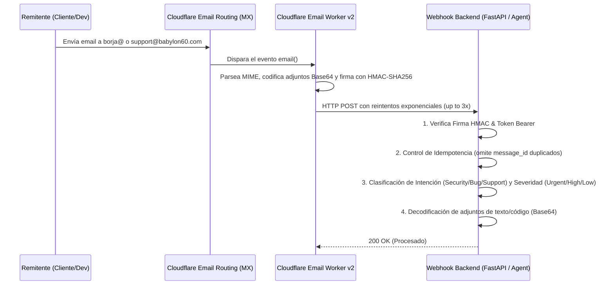

# Configuración e Integración de Recepción Inbound Enterprise para borja@babylon60.com y support@babylon60.com

<div align="center">

[](https://github.com/borjamoskv/BABYLON-60)
[](https://github.com/borjamoskv/BABYLON-60)

</div>

Esta guía documenta los pasos necesarios para habilitar la recepción programática de correos electrónicos en **`borja@babylon60.com`**, **`support@babylon60.com`** y cualquier alias comodín (`*@babylon60.com`) utilizando **Cloudflare Email Workers v2** y el **Receptor Backend Enterprise en Python (FastAPI)**.

---

## Arquitectura de la Solución v2



---

## Novedades de la Versión v2 (Enterprise)

1. **Reintentos Exponenciales en Cloudflare Worker**: El Worker reintenta la entrega hasta 3 veces si la API backend está temporalmente fuera de servicio.
2. **Extracción e Inspección de Adjuntos Base64**: Adjuntos de código, logs, archivos JSON o Markdown (hasta 2MB por adjunto) se decodifican automáticamente para que los agentes de IA de BABYLON-60 puedan analizarlos inmediatamente.
3. **Control de Idempotencia Integrado**: Previene el procesamiento duplicado de correos reenviados mediante rastreo en memoria de `message_id`.
4. **Clasificación de Intención y Severidad**: Categorización automática de incidentes (`SECURITY_INCIDENT`, `BUG_REPORT`, `TECHNICAL_SUPPORT`, `FEATURE_REQUEST`) y cálculo de urgencia (`URGENT`, `HIGH`, `MEDIUM`, `LOW`).

---

## 1. Configuración de Cloudflare Email Routing

Los registros MX de `babylon60.com` están apuntando a Cloudflare:
- `route1.mx.cloudflare.net` (Prioridad 12)
- `route2.mx.cloudflare.net` (Prioridad 61)
- `route3.mx.cloudflare.net` (Prioridad 29)

### Crear las Reglas en Cloudflare
1. Accede al panel de **Cloudflare** -> `babylon60.com`.
2. Ve a **Email** -> **Email Routing** -> pestaña **Routes**.
3. Configura las direcciones personalizadas apuntando al Worker `babylon60-email-inbound`:
   - `borja@babylon60.com` -> `Send to Worker` (`babylon60-email-inbound`)
   - `support@babylon60.com` -> `Send to Worker` (`babylon60-email-inbound`)
   - *(Opcional)* `*@babylon60.com` (Catch-all) -> `Send to Worker` (`babylon60-email-inbound`)

---

## 2. Despliegue del Email Worker v2

El código del Worker se encuentra en [`services/email_inbound/worker.js`](../01_KISH_ENGINE/services/email_inbound/worker.js).

```bash
cd 01_KISH_ENGINE/services/email_inbound
npx wrangler deploy
```

Configurar claves secretas en Cloudflare:
```bash
npx wrangler secret put WEBHOOK_SECRET
npx wrangler secret put WEBHOOK_URL
```

---

## 3. Integración Backend en Python (FastAPI)

El receptor backend se encuentra en [`babylon60/services/inbound_email.py`](../01_KISH_ENGINE/babylon60/services/inbound_email.py).

### Ejemplo Completo de Uso:

```python
from fastapi import FastAPI
from babylon60.services.inbound_email import (
    InboundEmailProcessor,
    create_inbound_email_router,
    EnglishSupportAgentHandler,
)

app = FastAPI(title="BABYLON-60 Inbound Email API")

# 1. Crear el procesador con la clave secreta compartida con Cloudflare
processor = InboundEmailProcessor(secret="tu_clave_secreta_super_segura")

# 2. Registrar el handler de soporte con capacidad de análisis de adjuntos e intención
agent_handler = EnglishSupportAgentHandler()
processor.register_handler(agent_handler.handle)

# 3. Incluir el router en la app FastAPI
app.include_router(create_inbound_email_router(processor))
```

---

## 4. Pruebas Automatizadas

Para ejecutar la suite de pruebas unitarias e integración:
```bash
pytest tests/test_inbound_email.py
```

---

## 5. Registro DNS DMARC Recomendado

Añade en la consola DNS de Cloudflare para maximizar la reputación del dominio:

| Tipo | Nombre | Contenido | TTL |
| :--- | :--- | :--- | :--- |
| **TXT** | `_dmarc` | `v=DMARC1; p=none;` | Auto |