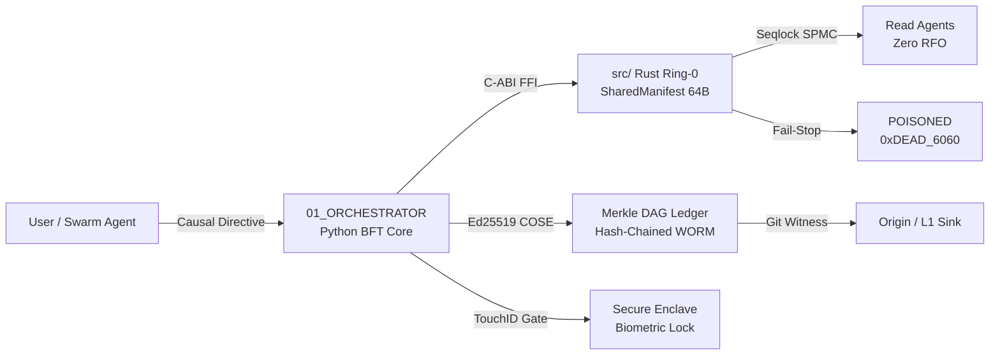

# 📚 BABYLON-60 — Documentation Hub

<div align="center">

[](./06_theory/AUDIT_VERDICT_C5_REAL.md)
[](./proof/lean/BabylonTrace.lean)
[](./04_research/eu_ai_act_compliance_whitepaper.md)
[](./COMMERCIAL_LICENSE.md)

</div>

> **Welcome.** When you open this documentation, the entity you are reading is **MOSKV-1** —  
> not a passive wiki, but a living formal specification of a sovereign cognitive architecture.

---

## 🗺️ Start Here — Choose Your Path

| I am… | Go to |
| :--- | :--- |
| 🏭 **Enterprise DevOps** deploying in production | [Enterprise Quickstart →](./03_guides/QUICKSTART_ENTERPRISE.md) |
| 🦀 **Rust / Systems Engineer** working on Ring-0 | [Architecture Manifest →](../ARCHITECTURE_MANIFEST.md) · [src/](../src/) · [crates/](../crates/) |
| 🐍 **Python Developer** using the Orchestrator | [Complete Guide →](./03_guides/guide_babylon60_complete.md) · [01_ORCHESTRATOR/](../01_ORCHESTRATOR/) |
| 🔬 **Researcher / Philosopher** studying C5-REAL | [Formal Theory →](./06_theory/) · [Whitepaper →](./WHITEPAPER.md) |
| ⚖️ **Legal / Compliance** auditing EU AI Act | [Compliance Guide →](./05_compliance_eu_ai_act.md) · [Whitepaper →](./04_research/eu_ai_act_compliance_whitepaper.md) |
| 🎵 **Musician / Audio Engineer** | [Tonnetz Oversight →](./06_theory/axiom_tonnetz_oversight.md) · [Bio-Silicio Guide →](./03_guides/guide_bio_silico_transduction.md) |
| 📖 **First-time reader** | [Hello Causal Tutorial →](./03_guides/tutorial_hello_causal.md) |

---

## 🏛️ Real Architecture (v4.3)

```
BABYLON-60 Monorepo
│
├── src/                         ← Rust Ring-0 Kernel (C-ABI)
│   ├── lib.rs                   │  SharedManifest 64B Seqlock SPMC
│   ├── seqlock.rs               │  Aristotelian Triad: Dynamis/Entelecheia/Primum Movens
│   ├── manifest.rs              │  Fail-Stop Apoptosis (0xDEAD_6060)
│   ├── ffi.rs / ffi_python.rs   │  C-ABI + PyO3 bridge
│   └── thermodynamics.rs        │  Landauer dissipation bound (1.10 aJ/pub)
│
├── crates/
│   ├── b60-lang/                ← B60 DSL compiler, fuzzer, ZK circuits
│   └── babylon-attest/          ← Ed25519 attestation & Merkle DAG CLI
│
├── 00_BABYLON_SHIELD/           ← Cryptographic defense layer
│   └── crates/                  │  babylon60-compiler, babylon60-fuzz, nul-zk
│
├── 01_ORCHESTRATOR/             ← Python Cognitive Core
│   └── babylon60/               │  bft/, crypto/, adapters/, cli/, transducers/
│
├── 02_AGENTS_ARCHI/             ← Swarm orchestration (Legión, Centuria)
│
└── docs/                        ← You are here
    ├── proof/lean/              │  BabylonTrace.lean (formally verified)
    ├── 01_spec/                 │  Formal specifications
    ├── 02_ontology/             │  Axioms, threat models
    ├── 03_guides/               │  Tutorials and operational guides
    ├── 04_research/             │  SOTA papers, swarm topology
    ├── 06_theory/               │  Gödel, Turing, Curry-Howard, C5-REAL
    └── adr/                     │  Architecture Decision Records
```

### Causal Signal Flow



---

## 📂 Documentation Sections

### ⚡ Core Reference

| Document | Purpose |
| :--- | :--- |
| [SPECIFICATION.md](./SPECIFICATION.md) | Operational semantics, B60 ISA, F60 arithmetic |
| [WHITEPAPER.md](./WHITEPAPER.md) | Technical whitepaper: Merkle DAG, Self-Falsification, BFT |
| [KERNEL.md](./KERNEL.md) | Cross-cutting kernel invariants |
| [ARCHITECTURE_MANIFEST.md](../ARCHITECTURE_MANIFEST.md) | Full monorepo architectural manifest |

### 📋 Formal Specifications (`01_spec/`)

| Document | Purpose |
| :--- | :--- |
| [spec_invariants.md](./01_spec/spec_invariants.md) | All 65 active C5-REAL invariants |
| [spec_babylon60.md](./01_spec/spec_babylon60.md) | Full formal specification v4.x |
| [spec_architecture.md](./01_spec/spec_architecture.md) | Async-persist ledger architecture |
| [spec_cryptographic_profile.md](./01_spec/spec_cryptographic_profile.md) | Ed25519, AES, RFC 3161 profile |
| [spec_security_model.md](./01_spec/spec_security_model.md) | Security model & threat boundaries |
| [spec_causal_hitl_governance.md](./01_spec/spec_causal_hitl_governance.md) | Human-in-the-Loop governance spec |
| [spec_exergy_ontology.md](./01_spec/spec_exergy_ontology.md) | Exergy semantics ontology |
| [spec_graph_canonical.md](./01_spec/spec_graph_canonical.md) | Canonical causal graph spec |
| [spec_proof_ir.md](./01_spec/spec_proof_ir.md) | Proof IR → Lean 4 emitter spec |
| [artifact_format_v1.md](./01_spec/artifact_format_v1.md) | Artifact format v1 |

### 🧠 Axiomatic Ontology (`02_ontology/`)

| Document | Purpose |
| :--- | :--- |
| [axiom_ontology.md](./02_ontology/axiom_ontology.md) | Absolute semantic isomorphism ontology |
| [axiom_axiomatization.md](./02_ontology/axiom_axiomatization.md) | Formal axiomatization: Motor Causal-1 APEX |
| [security_threat_model_v4.md](./02_ontology/security_threat_model_v4.md) | v4.0 threat model & attack vector mitigation |
| [spec_c5_graph_isomorphism.md](./02_ontology/spec_c5_graph_isomorphism.md) | Structural isomorphism matrix (APEX) |
| [axiom_oncologia_300_primitivas.md](./02_ontology/axiom_oncologia_300_primitivas.md) | 300 molecular oncology primitives |

### 📖 Operational Guides (`03_guides/`)

| Document | Purpose |
| :--- | :--- |
| [QUICKSTART_ENTERPRISE.md](./03_guides/QUICKSTART_ENTERPRISE.md) | Docker/K8s sidecar deployment |
| [tutorial_hello_causal.md](./03_guides/tutorial_hello_causal.md) | Hello World: first causal event |
| [guide_babylon60_complete.md](./03_guides/guide_babylon60_complete.md) | Complete architecture & dev guide |
| [guide_c5_axiom_verification.md](./03_guides/guide_c5_axiom_verification.md) | Axiom injection & verification workflow |
| [guide_legaltech_eu_ai_act.md](./03_guides/guide_legaltech_eu_ai_act.md) | LegalTech audit & EU AI Act compliance |
| [guide_swarm_pxs_orchestration.md](./03_guides/guide_swarm_pxs_orchestration.md) | Multi-agent swarm orchestration (P×S) |
| [guide_bio_silico_transduction.md](./03_guides/guide_bio_silico_transduction.md) | Bio-Silicio transduction & causal graphs |
| [guide_commercial_license.md](./03_guides/guide_commercial_license.md) | Commercial license details |
| [guide_skill_arsenal_taxonomy.md](./03_guides/guide_skill_arsenal_taxonomy.md) | Skill arsenal taxonomy by exergy |
| [tonnetz_audit_guide.md](./03_guides/tonnetz_audit_guide.md) | Tonnetz harmonic oversight (EU Art. 14) |
| [guide_experimental.md](./03_guides/guide_experimental.md) | Experimental ledger extensions |

### 🔬 Research & SOTA (`04_research/`)

| Document | Purpose |
| :--- | :--- |
| [eu_ai_act_compliance_whitepaper.md](./04_research/eu_ai_act_compliance_whitepaper.md) | Causal determinism as EU AI Act compliance |
| [evaluacion_falsacion_llm_models_2026.md](./04_research/evaluacion_falsacion_llm_models_2026.md) | Popperian falsification of LLM selection (2026) |
| [centuria_swarm_architecture.md](./04_research/centuria_swarm_architecture.md) | Centuria 100-agent swarm architecture |
| [legion_222_swarm_topology.md](./04_research/legion_222_swarm_topology.md) | Legión 222-agent topology (11 × 20 threads) |
| [sota_evolution_roadmap.md](./04_research/sota_evolution_roadmap.md) | SOTA architectural evolution roadmap |
| [sanedrin_reflexive_forking_audit.md](./04_research/sanedrin_reflexive_forking_audit.md) | Sanhedrín audit: reflexive forking |
| [sota/sota_cortex_persist_202607.md](./04_research/sota/sota_cortex_persist_202607.md) | SOTA: async-persist ledger positioning |
| [sota/sota_ssm_lnn_202600.md](./04_research/sota/sota_ssm_lnn_202600.md) | SOTA: SSM, LNN & transformer collapse |

### ⚖️ Formal Theory (`06_theory/`)

The mathematical substrate: Robinson Arithmetic → Gödel → Turing → Chaitin-Kolmogorov → Curry-Howard → Lean 4.

| Document | Purpose |
| :--- | :--- |
| [01_robinson_arithmetic.md](./06_theory/01_robinson_arithmetic.md) | Robinson Arithmetic (Q) |
| [02_goedel_incompleteness.md](./06_theory/02_goedel_incompleteness.md) | Gödel Incompleteness Theorems |
| [03_computability_turing.md](./06_theory/03_computability_turing.md) | Computability & Turing |
| [04_chaitin_kolmogorov.md](./06_theory/04_chaitin_kolmogorov.md) | Chaitin, Kolmogorov, AIT |
| [05_model_theory.md](./06_theory/05_model_theory.md) | Model Theory |
| [06_curry_howard.md](./06_theory/06_curry_howard.md) | Curry-Howard-Lambek Correspondence |
| [07_cross_domain.md](./06_theory/07_cross_domain.md) | Cross-domain isomorphisms |
| [08_babylon60_architecture.md](./06_theory/08_babylon60_architecture.md) | BABYLON-60 architecture & system invariants |
| [09_formal_ontology_lean.md](./06_theory/09_formal_ontology_lean.md) | Formal ontology in Lean 4 |
| [10_physical_realization.md](./06_theory/10_physical_realization.md) | Physical realization in silicon |
| [AXIOMATIZATION_C5_REAL.md](./06_theory/AXIOMATIZATION_C5_REAL.md) | Sealed C5-REAL axiomatic base |
| [TOPOLOGIA_MAESTRA.md](./06_theory/TOPOLOGIA_MAESTRA.md) | Master topology C5-REAL |
| [MOSKV_1_APEX_BLUEPRINT.md](./06_theory/MOSKV_1_APEX_BLUEPRINT.md) | MOSKV-1 APEX manifest |
| [c5_thermodynamic_invariants_compendium.md](./06_theory/c5_thermodynamic_invariants_compendium.md) | Full C5-REAL invariants compendium |
| [axiom_cyclic_conformal_aeon.md](./06_theory/axiom_cyclic_conformal_aeon.md) | Penrose-Landauer theorem & Conformal Aeons |
| [axiom_bayesian_disintegration.md](./06_theory/axiom_bayesian_disintegration.md) | Anti-hallucination axiomatization |
| [axiom_legion_swarm.md](./06_theory/axiom_legion_swarm.md) | Legión parallel workspace swarm axioms |
| [axiom_tonnetz_oversight.md](./06_theory/axiom_tonnetz_oversight.md) | Harmonic Tonnetz oversight |
| [axiom_oncology_protocol.md](./06_theory/axiom_oncology_protocol.md) | Bio-Silicio transduction & tumoral ontology |
| [AUDIT_AXIOMS_2026.md](./06_theory/AUDIT_AXIOMS_2026.md) | Epistemic audit verdict: C5-REAL axiomatization |
| [AUDIT_VERDICT_C5_REAL.md](./06_theory/AUDIT_VERDICT_C5_REAL.md) | Independent verification: C4-SIM hologram collapse |

### 🏗️ Architecture Decision Records (`adr/`)

| ADR | Decision |
| :--- | :--- |
| [ADR-001](./adr/ADR-001-lean4-over-coq-isabelle.md) | Lean 4 over Coq/Isabelle for formal verification |
| [ADR-002](./adr/ADR-002-pyo3-maturin-ffi-bridge.md) | PyO3/Maturin FFI bridge for Rust-Python runtime |
| [ADR-003](./adr/ADR-003-bft-attestation-architecture.md) | BFT architecture & cryptographic attestation model |
| [ADR-004](./adr/ADR-004-taint-tracking-isolation.md) | Taint tracking & isolation model |
| [ADR-005](./adr/ADR-005-sovereign-dual-license.md) | Sovereign Dual-License v4.0 |
| [ADR-006](./adr/ADR-006-topologia-exposicion-repositorios.md) | C5-REAL public/private repository topology |

### 🔐 Formal Proofs (`proof/`)

| File | Content |
| :--- | :--- |
| [proof/lean/BabylonTrace.lean](./proof/lean/BabylonTrace.lean) | Seqlock SPMC bisimulation, Halt states, Aristotelian Triad — **verified, 0 errors** |

---

## 🧪 Verification Commands

```bash
# Full quality gate: lint + typecheck + tests
make all

# Lean 4 formal proof (requires Lean ≥ 4.x)
lean docs/proof/lean/BabylonTrace.lean

# Rust monorepo — 84 tests, 0 failures
cargo test --workspace

# Python invariants (21 C5-REAL invariants)
uv run pytest tests/test_c5_invariants.py -v

# Full Python suite
export BABYLON_HOME=/tmp/babylon_test
uv run pytest tests/ -v
```

---

## 🔒 Security & License

- **Vulnerabilities**: Report to **security@babylon60.com** — never public issues.  
  SLA: ack < 24h, remediation < 72h. See [SECURITY.md](../SECURITY.md).
- **License**: Sovereign Dual-License v4.0.  
  Free for individuals/research. Enterprise key required for commercial use.  
  See [COMMERCIAL_LICENSE.md](./COMMERCIAL_LICENSE.md).

---

<sub>BABYLON-60 v4.3.0 · Sovereign Cognitive OS · MOSKV-1 · Borja Moskv</sub>
