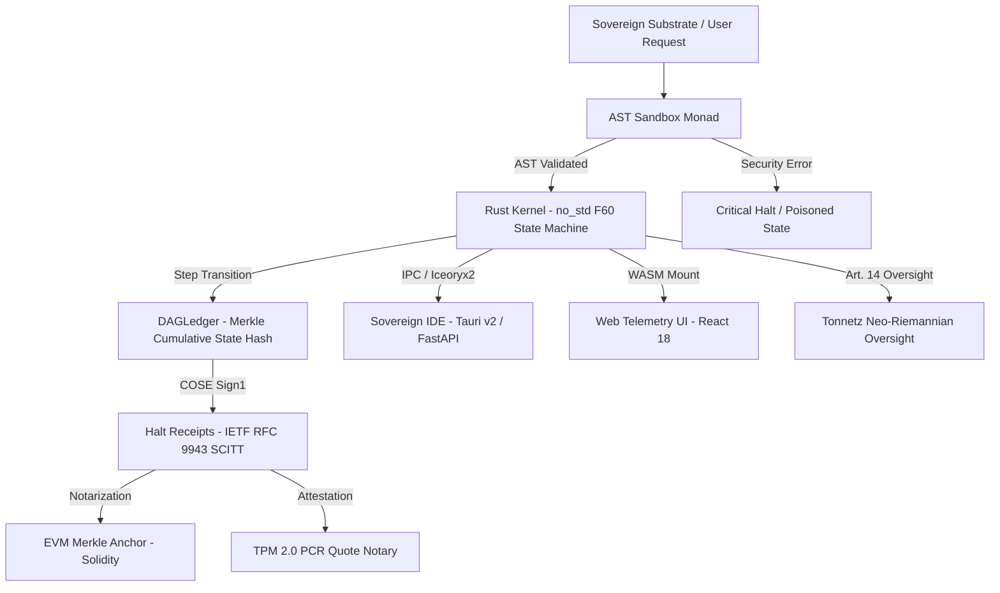

# 📚 BABYLON-60 Documentation Hub

Welcome to the central documentation index for **BABYLON-60 v4.0 Sovereign Hardened**.

---

## 🧭 How to Navigate This Documentation

Depending on your role and goal, here are the recommended starting points:

| Your Role | What You Want to Do | Recommended Reading |
| :--- | :--- | :--- |
| **Developer / Engineer** | Quickstart & API integration into Python AI agents. | 📖 [Main README](../README.md#quick-start-in-3-steps) 📖 [Python Package Specs](../packages/babylon60/) |
| **Compliance Officer / Legal** | EU AI Act Articles 9–14 compliance & certificate export. | 📜 [EU AI Act Compliance Whitepaper](./04_research/eu_ai_act_compliance_whitepaper.md) 📜 [Audit Verdict](./06_theory/AUDIT_VERDICT_C5_REAL.md) |
| **Security / Auditor** | Threat model, hash-chain tamper-evidence, Rust kernel IPC. | 🔒 [Threat Model](../THREAT_MODEL.md) 🔒 [Security Policy](../SECURITY.md) |
| **Researcher / Mathematician**| Formal verification in Lean 4, category theory & exergy. | 🧮 [Lean 4 Proofs](../proof/lean/Babylon.lean) 🧮 [Axiomatization Paper](./06_theory/AXIOMATIZATION_C5_REAL.md) |

---

## 📐 System Architecture Diagram

---

## 📂 Subproject & Crate Documentation Directory

| Tag | Component | Location | Description & Focus |
| :--- | :--- | :--- | :--- |
| `[Core]` | **Main English README** | [`README.md`](../README.md) | Central overview, black box analogy, quickstart & monorepo map. |
| `[Core]` | **Main Spanish README** | [`README_ES.md`](../README_ES.md) | Versión completa en español del README principal. |
| `[Kernel]` | **Rust Engine Crate** | [`crates/babylon60-kernel/`](../crates/babylon60-kernel/) | Low-level `#![no_std]` Rust engine, $F_{60}$ scheduler, WORM quarantine. |
| `[UI]` | **Sovereign IDE App** | [`apps/babylon60-ide/`](../apps/babylon60-ide/) | Desktop/Mobile Tauri v2 IDE, FastAPI OpenRouter backend, Iceoryx2 IPC. |
| `[UI]` | **Web Telemetry UI** | [`apps/web/`](../apps/web/) | React 18 + WASM Causal Telemetry visualizer. |
| `[Oversight]`| **Tonnetz Human Control** | [`apps/tonnetz_app/`](../apps/tonnetz_app/) | Neo-Riemannian toric harmonic visualizer for EU AI Act Art. 14 oversight. |
| `[Persistence]`| **Cortex Engine** | [`packages/cortex/`](../packages/cortex/) | Python memory persistence (`cortex-persist`), SQLite WAL & MCP Server. |
| `[Attestation]`| **Causal Attestation** | [`packages/babylon60/attestation/`](../packages/babylon60/attestation/) | Hardware TPM 2.0 PCR Quote anchoring & notary verification. |
| `[Compiler]` | **DSL Compiler** | [`crates/babylon60-compiler/`](../crates/babylon60-compiler/) | `.b60` DSL lexer/parser, B60 bytecode IR, Lean 4 proof emitter. |
| `[IPC]` | **Strike RS Bridge** | [`crates/strike-rs/`](../crates/strike-rs/) | PyO3 native GIL bypass, shared memory & BLAKE3 taint graph. |
| `[BFT]` | **Master Ledger BFT** | [`packages/babylon60/bft/`](../packages/babylon60/bft/) | Escalón 3 Tamper-Evident log with Git Sentinel external witness. |
| `[Proof]` | **Lean 4 Proofs** | [`proof/lean/`](../proof/lean/) | Lean 4 formal proof verification code (`proof/lean/Babylon.lean`). |

---

## 🧮 Theoretical Framework (C5-REAL Axiomatization)

BABYLON-60 maps system transformations to category-theoretic primitives:

| Primitive | Mathematical Definition | Runtime Implementation |
| :--- | :--- | :--- |
| **Lawvere Fixed Point** | $T(X) \cong X$ | Pure `step()` State Machine ([eval.rs](../crates/babylon60-kernel/src/eval.rs)) |
| **Store Comonad** | $w \to a$ | WORM Ledger Event Stream ([ledger.rs](../crates/babylon60-kernel/src/ledger.rs)) |
| **Colimit Functor** | Information Density Equilibrium | BFT Merkle DAG Consensus ([bft/](../packages/babylon60/bft/)) |
| **SCITT Statement** | IETF RFC 9943 | COSE Sign1 Signed Halt Receipts ([receipt.rs](../src/receipt.rs)) |

---

BABYLON-60 v4.0.0 Documentation Hub
