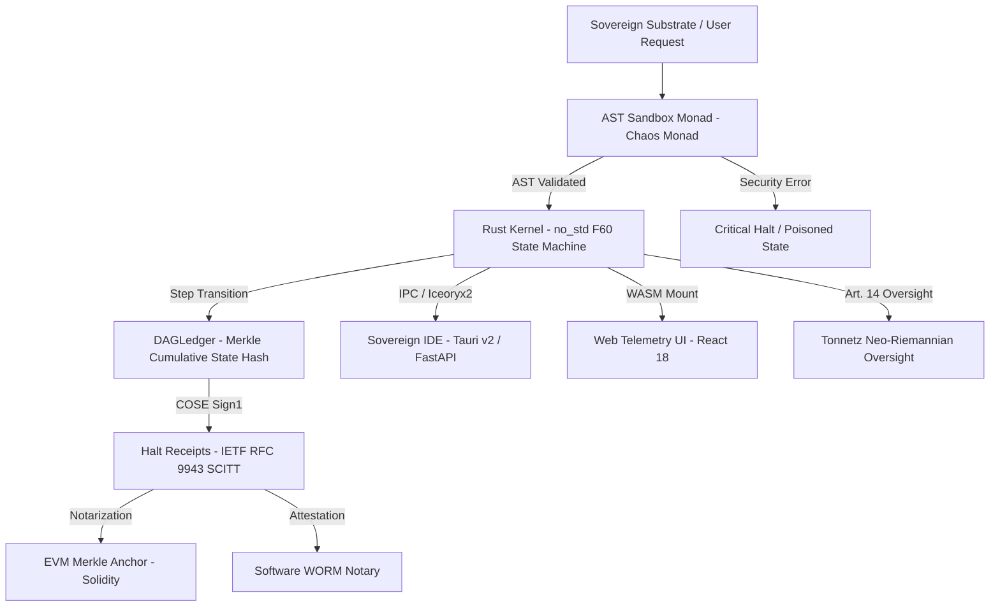

# 📚 BABYLON-60 Documentation Hub (v4.0 Sovereign Hardened)

<div align="center">

[](./06_theory/AUDIT_VERDICT_C5_REAL.md)
[](./06_theory/AXIOMATIZATION_C5_REAL.md)
[](./STATUS.md)

</div>

Welcome to the central documentation index for **BABYLON-60 v4.0 Sovereign Hardened**.

[](../README.md)
[](./04_research/eu_ai_act_compliance_whitepaper.md)
[](../proof/lean/Babylon.lean)
[](./00_MANIFESTO.md)
[](#-c5-real-epistemological-framework)

---

## 📐 Topological & Causal Architecture



---

## 🧮 C5-REAL Epistemological Framework

BABYLON-60 abandons hardware-dependent physical intuition to embrace a category-theoretic foundation for cognitive computer systems:

- **Transformations over States**: Morphisms ($A \to B$) are the sole primitive. States are Lawvere fixed points ($T(X) \cong X$), memory is a Store Comonad, and context is a Bayesian Optic Lens.
- **Parametric Information Invariance**: Chentsov's Theorem and the Free Energy Principle ($\delta \int F dt = 0$) govern all state reductions.
- **Architectural Corollaries**: Event sourcing = Colimit Functors, CQRS = Adjoint Functor Pairs, CRDTs = Join-Semilattices, and Merkle DAGs = Natural Isomorphisms.

### Mathematical Mapping Matrix

| Category-Theoretic Primitive | Thermodynamic Equivalent | BABYLON-60 Runtime Mechanism |
| :--- | :--- | :--- |
| **Lawvere Fixed Point** ($T(X) \cong X$) | Minimum Entropy State ($S_{\text{min}}$) | Pure `step()` State Machine ([eval.rs](../crates/babylon60-kernel/src/eval.rs)) |
| **Store Comonad** ($w \to a$) | Free Energy Dissipation | WORM Ledger Event Stream ([ledger.rs](../crates/babylon60-kernel/src/ledger.rs)) |
| **Colimit Functor** | Information Density Equilibrium | BFT Merkle DAG Consensus ([bft/](../packages/babylon60/bft/)) |
| **Natural Isomorphism** | Isomorphic State Transition | F# $\leftrightarrow$ Rust Transpiler ([causal_isomorphism/](../experiments/causal_isomorphism/)) |
| **SCITT Statement** (IETF RFC 9943) | Exergy Certificate ($\Xi$) | COSE Sign1 Signed Halt Receipts ([receipt.rs](../src/receipt.rs)) |

---

## 📂 Subproject Documentation Index

| Tag | Component | Directory | Focus & Key Mechanisms |
| :--- | :--- | :--- | :--- |
| `[Core]` | **Root Sovereign Substrate** | [`README.md`](../README.md) | Central overview, architecture diagram, moat pillars, live quickstart. |
| `[Core]` | **Spanish Main README** | [`README_ES.md`](../README_ES.md) | Versión completa en español del README principal. |
| `[Kernel]` | **Rust Kernel Engine** | [`kernel/`](../crates/babylon60-kernel/) | Low-level `#![no_std]` Rust engine, $F_{60}$ scheduler, WORM quarantine. |
| `[UI]` | **Sovereign IDE** | [`babylon60-ide/`](../apps/babylon60-ide/) | Desktop/Mobile Tauri v2 IDE, FastAPI OpenRouter backend, Iceoryx2 IPC. |
| `[UI]` | **Tauri Substrate** | [`src-tauri/`](../apps/src-tauri/) | Tauri v2 desktop integration layer & native system bridges. |
| `[UI]` | **Web Telemetry UI** | [`web/`](../apps/web/) | React 18 + WASM Causal Telemetry visualizer & FSA API mount. |
| `[Oversight]` | **Tonnetz Human Oversight**| [`tonnetz_app/`](../apps/tonnetz_app/) | Neo-Riemannian toric harmonic graph visualizer (EU AI Act Art. 14). |
| `[Persistence]`| **Cortex Substrate** | [`cortex/`](../packages/cortex/) | Python memory persistence (`cortex-persist`), SQLite WAL, MCP Server. |
| `[Attestation]`| **Causal Attestation** | [`attestation/`](../packages/babylon60/attestation/) | Software WORM causal anchoring & P2P notary verification. (TPM Roadmap) |
| `[Compiler]` | **DSL Compiler** | [`compiler/`](../packages/babylon60/compiler/) | `.b60` DSL lexer/parser, B60 bytecode IR, Lean 4 proof emitter. |
| `[IPC]` | **Strike RS Engine** | [`strike_rs/`](../crates/strike-rs/) | PyO3 native GIL bypass, Iceoryx2 shared memory, BLAKE3 taint graph. |
| `[BFT]` | **Master Ledger BFT** | [`babylon60/bft/`](../packages/babylon60/bft/) | Escalón 3 Tamper-Evident log with Git Sentinel external witness. |
| `[Web3]` | **EVM On-Chain Notary** | [`anvil_yung/`](../legacy_exergy/) | Foundry smart contracts for EVM Merkle root notarization. |
| `[Web3]` | **Bitcoin L1 Sink** | [`L1_sink/`](../packages/cortex/L1_sink/) | On-chain Bitcoin `OP_RETURN` transaction hashes and anchor receipts. |
| `[Transpiler]`| **Transpiler (F# -> Rust)**| [`causal_isomorphism/`](../experiments/causal_isomorphism/)| Functional F# domain kernel transpiler & linear type checker. |
| `[Transpiler]`| **F# Domain Kernel** | [`domain_kernel/`](../legacy_exergy/) | F# IRP automata domain model (`IRPAutomata.fs`). |
| `[Proof]` | **Lean 4 Formal Proofs** | [`proof/`](../proof/) | Lean 4 formal proof theorems (`proof/lean/Babylon.lean`). |
| `[Proof]` | **Proof IR Crate** | [`proof_ir/`](../crates/babylon60-kernel/) | Rust AST to Lean 4 proof IR compiler crate. |
| `[Proof]` | **Zero-Knowledge Kernel** | [`proof_kernel/`](../legacy_exergy/NUL-ZK/) | NUL-ZK zero-knowledge state boundary kernels. |
| `[Fuzz]` | **Cargo Fuzzing Targets** | [`fuzz/`](../crates/) | Fuzzing suite for AST parsing, binary encoding, and $F_{60}$ boundaries. |
| `[Meta]` | **Lisp Metamembrane** | [`lisp_metamembrane/`](../legacy_exergy/) | Clojure/EDN Lisp metamembrane substrate for non-linear symbolic inference. |
| `[Simulation]`| **Continuous Timeline IR** | [`timeline_ir/`](../legacy_exergy/) | Continuous-time state graph simulation kernel ($State(t)$). |
| `[Clinical]` | **APEX Clinical Copilot** | [`apex_trials/`](../docs/04_research/) | Deterministic clinical-trial protocol amendment-risk copilot & fitted weights. |
| `[Execution]`| **Ultrathink Engine** | [`ultrathink/`](../packages/cortex/) | Zero-friction forced execution scheduler & thermodynamic collapse controller. |
| `[Ops]` | **Legion Swarm & Scripts**| [`scripts/`](../scripts/) | Legión 222 swarm runner (`scripts/unified_legion.py`), Centuria commanders. |

---

## 📄 Core Specifications & Regulatory Papers

- **[Foundational Manifesto v4.0](./00_MANIFESTO.md)**: Core thesis, 4 moat pillars, commercial ROI, and Engineer's Oath.
- **[Formal Specification v4.0](./SPECIFICATION.md)**: Operational semantics, B60 ISA, F60 exact arithmetic, Proof IR.
- **[Technical Whitepaper v1.0](./WHITEPAPER.md)**: Deep tech paper covering F60, Merkle DAG Ledger, Self-Falsification Engine.
- **[EU AI Act Compliance Whitepaper](./04_research/eu_ai_act_compliance_whitepaper.md)**: Comprehensive mapping for Articles 9, 10, 11, 12, 13 & 14 of Regulation (EU) 2024/1689.
- **[Análisis de Falsación Popperiana en Selección de LLMs (2026)](./04_research/evaluacion_falsacion_llm_models_2026.md)**: Evaluación comparativa de modelos (Gemini Ultra, Kimi K3, Claude 3.5 Sonnet, DeepSeek R1).
- **[Topología de Enjambre Legión 222 Agentes](./04_research/legion_222_swarm_topology.md)**: Especificación de escalado masivo (11 Procesos $\times$ 20 Hilos) para pruebas de estrés termodinámico.

---

## 🚀 Go-To-Market & Commercial Data Room (`docs/05_gtm/`)

- **[Pitch Deck v4.0 (11 Slides)](./05_gtm/PITCH_DECK.md)**: Executive pitch presentation for enterprise B2B sales and investor due diligence.
- **[Valuation Strategy](./05_gtm/VALUATION_STRATEGY.md)**: Comprehensive valuation analysis ($8M to $400M exit scenarios).
- **[Forensic Quarantine PoC Spec](./05_gtm/forensic_quarantine_poc_spec.md)**: 7-day non-intrusive shadow sidecar PoC specification for enterprise CISOs.
- **[CISO Cold Email Playbook](./05_gtm/ciso_cold_email_playbook.md)**: High-conversion B2B outreach templates in ES, EN, and DE.
- **[Enterprise PoC Term Sheet](./05_gtm/enterprise_poc_agreement_term_sheet.md)**: Commercial evaluation contract protecting IP (`BABYLON60_LICENSE_KEY`).
- **[VC Data Room Manifest](./05_gtm/vc_data_room_manifest.md)**: Index mapping all 5 virtual data room due diligence folders for Seed round VCs.

---

## 🛡️ Security & Pre-Generated Compliance Audits (`docs/02_ontology/` & `docs/audits/`)

- **[Security Threat Model v4.0](./02_ontology/security_threat_model_v4.md)**: Phase II threat model, redaction layer, grace period, and bounds.
- **[Security Policy](../SECURITY.md)**: Vulnerability reporting policy and SLA.
- **[Sample Compliance Certificates](./audits/)**: Pre-generated compliance reports for **ES (AESIA)**, **DE (BSI)**, **FR (CNIL)**, **IT (AgID)**, and **EN (Global/NIST)**.

---

## 🧪 Local Verification & Verification Commands

```bash
# 1. Rust Kernel Engine Unit & Integration Tests
cargo test -p babylon60-kernel

# 2. Python Security Suite & AST Sandbox Isolation Tests
pytest tests/test_ast_sandbox_evasion.py

# 3. Legion Swarm 222 Agent Execution (11 Cores x 20 Threads)
python3 scripts/legion_222_agentes.py

# 4. Lean 4 Formal Verification Integrity Verification
bash ./scripts/verify_lean_proofs.sh
```

---

<sub>BABYLON-60 v4.0.0 Sovereign Hardened · Documentation Hub · Borja Moskv</sub>
