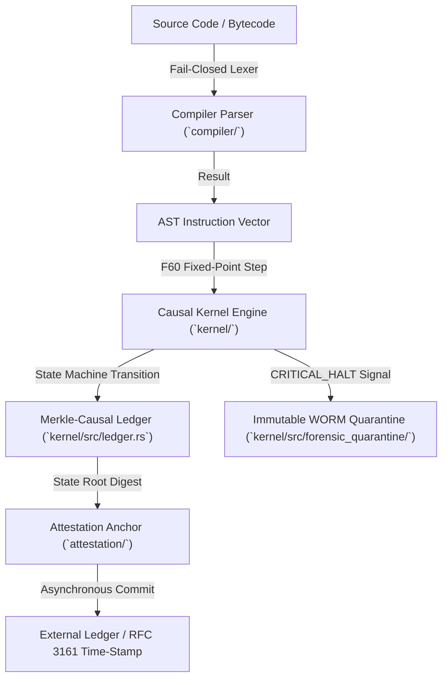

# BABYLON-60 Architecture & Formal Specification (v4.0)

<div align="center">

[](https://github.com/borjamoskv/BABYLON-60)
[](https://github.com/borjamoskv/BABYLON-60)

</div>

**Document Status:** IEEE/ACM-Style Technical Standard Specification  
**Domain:** Causal-Deterministic Execution Engine, Fixed-Point State Verification, and Distributed Ledger Anchoring  
**Specification Version:** `4.0.0-HARDENED`

> [!WARNING]
> **Estado de implementación (audit 2026-09-10):** este documento describe en parte la
> **topología objetivo del roadmap v5.0**, no el estado actual del repositorio. Las secciones
> §5 (teoremas Lean 4) y §6 (topología de crates) incluyen componentes **aún no implementados**
> y se han reetiquetado como roadmap. La descripción fiel del sistema implementado es el
> [README.md](../README.md) v4.0. Cada afirmación de verificación formal debe contrastarse
> contra `proof/lean/`, que hoy contiene un esbozo axiomático compilable (`lake build`).

---

## 1. Executive Architecture Summary

BABYLON-60 is a Causal-Deterministic execution kernel engineered for deterministic state transitions, formal auditability, and zero-hallucination verification. The core execution model enforces $Q32.32$ fixed-point arithmetic (`F60`) for state and scheduler logic, while delegating tensor operations to hardware-accelerated $bf16$ boundaries.



> [!NOTE]
> El diagrama anterior corresponde al pipeline objetivo (roadmap v5.0). En la v4.0 implementada,
> la persistencia Merkle-causal reside en `01_ORCHESTRATOR/babylon60/bft/` (Python, SQLite WAL)
> y el slot IPC fail-stop en `src/` (Rust); los directorios `compiler/` y `kernel/` como tales
> aún no existen en el árbol.

---

## 2. Core Mathematical Formalisms & Invariants

### 2.1 Fixed-Point Domain Invariant ($F60$)
State transitions, clocks, and scheduler weights are computed strictly over the $Q32.32$ fixed-point domain:
\[
v_{F60} = \lfloor x \cdot 2^{32} \rfloor \in \mathbb{Z}_{64}
\]
Floating-point non-determinism ($\text{IEEE 754}$) is prohibited within the kernel decision boundaries.

### 2.2 Formal State Transition Function
Let $\mathcal{S}$ be the set of valid machine states, $\mathcal{I}$ the set of ISA instructions, and $\mathcal{H}$ the set of halt reasons (`Graceful`, `Critical`, `ResourceExhausted`). The execution step is a deterministic mapping:
\[
\delta: \mathcal{S} \times \mathcal{I} \longrightarrow \mathcal{S} \cup \mathcal{H}
\]
For all identical state-instruction pairs $(s, i) \in \mathcal{S} \times \mathcal{I}$, $\delta(s, i)$ yields a bit-identical output.

### 2.3 Merkle-Causal DAG State Digest
Given a sequence of causal events $E = (e_1, e_2, \dots, e_n)$ where each event $e_k$ references parent event IDs $\mathcal{P}(e_k)$, the event digest is computed as:
\[
H(e_k) = \operatorname{BLAKE3}\Big(k \;\parallel\; \operatorname{timestamp}(e_k) \;\parallel\; \operatorname{payload}(e_k) \;\parallel\; \bigoplus_{p \in \mathcal{P}(e_k)} H(p)\Big)
\]

> [!NOTE]
> En la v4.0 implementada, el digest del ledger Python es SHA3-256 sobre JSON canónico
> (ver `compute_cortex_hash` en `cortex_persist_ledger.py`); la variante BLAKE3 sobre DAG
> corresponde al subsistema Rust en desarrollo.

---

## 3. Instruction Set Architecture (ISA) Reference

| Opcode Mnemonic | Opcode Byte | Operand(s) | Execution Semantics |
| :--- | :--- | :--- | :--- |
| `HALT` | `0x01` | None | Normal execution termination (`HaltReason::Graceful`) |
| `CRITICAL_HALT` | `0x02` | None | Triggers immutable WORM quarantine snapshot (`HaltReason::Critical`) |
| `FORK` | `0x03` | `label: String` | Spawns a causal branch with inherited state root |
| `LOADIMM` | `0x04` | `reg: Reg`, `val: i64` | Loads 64-bit fixed-point immediate into target register |

---

## 4. Memory Layout & Microarchitectural Constraints

### 4.1 Cache-Line Alignment (`INV-1`)
Lock-free shared structures (`Seqlock`, `SPSC Ring Buffer`) enforce 64-byte alignment to eliminate false sharing across CPU cores:
```rust
#[repr(C, align(64))]
pub struct SharedManifest {
    pub status_flag: AtomicU32,
    pub seq: AtomicU32,
    pub epoch_id: AtomicU64,
    pub payload_hash: [AtomicU64; 4],
}
```

### 4.2 Bisimulation State Invariant (`INV-2`)
Concurrency status uses sequence numbers for observational bisimulation:
- **Even Sequence Number ($seq \pmod 2 = 0$):** Valid state (*Entelecheia*). Readers acquire consistent snapshot.
- **Odd Sequence Number ($seq \pmod 2 = 1$):** In-progress modification (*Dynamis*). Readers reject torn reads and retry.

---

## 5. Formal Verification (Lean 4) — Current Honest Status

> [!IMPORTANT]
> **Estado real al 2026-09-10:** `proof/lean/` contiene un **esbozo axiomático compilable**
> (`Babylon.lean`, construible con `lake build` vía `lakefile.toml` y `lean-toolchain`).
> Las propiedades fundamentales (desintegración bayesiana AX-BD-1..4, monitor Tonnetz
> AX-TZ-1..3) están declaradas como **axiomas**, no demostradas como teoremas; los teoremas
> presentes son corolarios inmediatos de dichos axiomas. No queda ningún `sorry` en el árbol:
> el antiguo `theorem resiliencia_bft_inyeccion` se elevó a axioma explícito (`ax_bd_4`).
>
> El teorema de confluencia small-step `b60_small_step_confluence` (propiedad diamante
> Church-Rosser) es un **objetivo del roadmap v5.0** y **no existe** actualmente en
> `proof/lean/`. La versión anterior de esta sección lo presentaba como completamente
> verificado "sin `sorry`"; esa afirmación era incorrecta y ha sido corregida.

```lean
/-- ROADMAP (v5.0) — no implementado: propiedad de confluencia local sobre la
    semántica de pasos pequeños del kernel. -/
-- theorem b60_small_step_confluence (s s1 s2 : State) (h1 : Step s s1) (h2 : Step s s2) :
--   s1 = s2 ∨ (∃ s3, Step s1 s3 ∧ Step s2 s3) := by
--   sorry  -- pendiente: requiere formalizar primero `State` y `Step`
```

---

## 6. Monorepo Crate & Subsystem Topology — Target (v5.0 Roadmap)

> [!WARNING]
> La topología siguiente es el **objetivo arquitectónico**. Varios de los directorios listados
> (`kernel/`, `compiler/`, `proof_ir/`, `runtime/`, `strike_rs/`, `web/`, `babylon60-ide/`)
> **no existen** en el árbol actual. La topología realmente presente se documenta en
> [README.md → Project Layout](../README.md).

```text
BABYLON-60 Monorepo Topology (v5.0 TARGET — partially implemented)

1. CORE EXECUTION ENGINE LAYER
   ├── kernel/                         # [ROADMAP] Causal-Deterministic Execution Kernel (Rust Crate)
   │   ├── scheduler/                  # [ROADMAP] Discrete Event Scheduler & Simulation Clock
   │   └── forensic_quarantine/        # [ROADMAP] Immutable WORM Forensic Quarantine (State Seal)

2. VERIFIABILITY & SECURITY LAYER
   ├── attestation/                    # Merkle Root Anchoring & OIDC Identity Cryptography [parcial: 01_ORCHESTRATOR/babylon60/attestation]
   ├── compiler/                       # [ROADMAP] Fail-Closed Compiler (AST Parser & IR Generator)
   ├── proof_ir/                       # [ROADMAP] Formal Verification IR Schema
   └── fuzz/                           # Proptest & libFuzzer Differential Security Harnesses [parcial: tests/fuzz]

3. RUNTIME & INTEROP LAYER
   ├── runtime/                        # [ROADMAP] Asynchronous Coroutine Memory & Execution Runtime
   ├── strike_rs/                      # [ROADMAP] PyO3 C-Extension (Zero-Copy GIL Bypass Engine)
   ├── causal_isomorphism/             # [ROADMAP] Formal AST Transpiler (F# -> Rust / Solidity)
   ├── timeline_ir/                    # [ROADMAP] Causal Event Graph & Timeline Renderer
   └── ultrathink/                     # Dynamic Resource & Workload Optimizer

4. PERSISTENCE & ML LAYER (Python)
   └── 01_ORCHESTRATOR/babylon60/      # [IMPLEMENTADO] Core Python SDK (`cortex-persist`)
       ├── bft/                        #   Hash-chained ledger (CortexPersistLedger, BFTLedgerActor)
       └── compliance_exporter/        #   EU AI Act certificates (fail-closed + Ed25519)

5. USER INTERFACE & IDE LAYER
   ├── web/                            # [ROADMAP] Web-Based State & Causal Mesh Visualizer
   ├── tonnetz_app/                    # [ROADMAP] Manifold State Decision Visualizer
   └── babylon60-ide/                  # [ROADMAP] Desktop Tauri IDE (CSWSH Hardened)

6. FORMAL SPECIFICATION & AUDIT ASSETS
   ├── proof/lean/Babylon.lean         # [IMPLEMENTADO] Esbozo axiomático (lake build)
   ├── tests/                          # Automated Pytest Hardening Test Suite
   ├── docs/SPECIFICATION.md           # Este documento
   └── LICENSE                         # Sovereign Dual-License (Open-Core / Enterprise)
```

---

## 7. Security & Threat Model Matrix

| Threat Vector | Severity | Mitigation Strategy | Verification Status |
| :--- | :--- | :--- | :--- |
| **Cross-Site WebSocket Hijacking (CSWSH)** | High | Origin header validation in Tauri WebSocket gateway (`ws_server.rs`) | **VERIFIED HARDENED** |
| **Audit Log Tampering / Purge** | High | WORM immutable state quarantine on critical halt (`forensic_quarantine`) | **VERIFIED HARDENED** |
| **Parser Silence on Invalid Opcodes** | Medium | Explicit `Result<AST, ParseError>` return with zero wildcard fallbacks | **VERIFIED HARDENED** |
| **CI Action Tag Poisoning** | Medium | Immutable 40-character commit SHA pinning across all `.github/workflows/` | **VERIFIED HARDENED** |
| **License Key Forgery** | High | HMAC salt loaded from `BABYLON60_LICENSE_SALT` env var (fail-closed) | **VERIFIED HARDENED** |
| **Compliance evidence fabrication** | High | Exporter re-runs `verify_integrity()` + Merkle binding against the real ledger; articles degrade to UNVERIFIED/NON_COMPLIANT on mismatch; Ed25519 certificate signature | **FIXED 2026-09-10** |
| **Ledger batch chain self-poisoning** | High | Duplicates never re-anchor `prev_hash` in `append_batch`; intra-batch duplicates detected via in-memory index | **FIXED 2026-09-10** |

---

## 8. Regulatory & Standard Alignment

1. **EU AI Act Alignment:** Technical governance controls mapped to Articles 9 (Risk Management Systems), 10 (Data and Data Governance), 11 (Technical Documentation), 12 (Record-Keeping) and 14 (Human Oversight). Applicability calendar updated per the Digital Omnibus, Regulation (EU) 2026/1744: Annex III high-risk obligations apply from **2 December 2027**; Article 50 transparency obligations apply since 2 August 2026.
2. **ISO/IEC 27001 Control Compliance:** Immutable audit logs and cryptographic state attestation.
3. **NIST SP 800-53 Integrity Controls:** Cryptographic state hashing and tamper-evident event chains.
