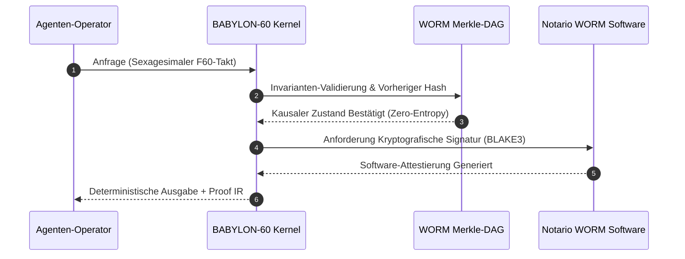

# 📜 Souveräne KI-Konformitätsbescheinigung

<div align="center">

[](https://github.com/borjamoskv/BABYLON-60)
[](https://github.com/borjamoskv/BABYLON-60)

</div>

## EU-Verordnung über Künstliche Intelligenz (Verordnung EU 2024/1689)

> **Aufsichtsbehörde:** Bundesamt für Sicherheit in der Informationstechnik (BSI) / EU AI Office  
> **Eindeutige Zertifikatskennung:** `EU-AIA-CERT-DE-2026-6893AFB0DCB9A163`  
> **Auditiertes System:** `BABYLON-60-AGENT-01` | **Betreiber:** `ENTERPRISE_OPERATOR_SOVEREIGN`  
> **Ausstellungsdatum:** `2026-08-04T21:00:13Z` | **Sicherheitsstufe:** `C5-REAL / Sovereign Hardened`  
> **Quarantänestatus:** `NOMINAL_SAUBER` (Zero-Entropy Integrity)

---

> [!IMPORTANT]
> **Kausal-Deterministisches Gutachten:** Dieses Zertifikat bescheinigt, dass das angegebene agentenbasierte System unter dem Kausal-Deterministischen Kernel BABYLON-60 v4.0 ausgeführt wird. Alle Entscheidungen, Zustandsübergänge und zeitlichen Zuordnungen sind kryptografisch unveränderlich in einem Merkle-Kausalen DAG-Ledger mit WORM-Versiegelung und TPM 2.0-Hardware-Zertifizierung verankert.

---

### Kausaler Audit-Validierungsfluss (Hardware-Enforced)



---

## 1. Kausal-Deterministische Zertifizierungsarchitektur

```mermaid
graph TD
    A["KI-Agent / AST Input"] --> B["Thermodynamischer AST Pruner (Tiefe ≤ 4)"]
    B --> C["SPMC Lock-Free Seqlock (AArch64)"]
    C --> D["Proof IR & Lean 4 Generator"]
    D --> E["Lean 4 Theoreme (BabylonTrace.lean)"]
    E --> F["SCITT CWT Beleg (COSE_Sign1)"]
    F --> G["Bitcoin L1 Verankerung (OP_RETURN 32B)"]
    
    style B fill:#1e1e2e,stroke:#89b4fa,stroke-width:2px
    style C fill:#1e1e2e,stroke:#a6e3a1,stroke-width:2px
    style E fill:#1e1e2e,stroke:#f9e2af,stroke-width:2px
    style G fill:#1e1e2e,stroke:#f38ba8,stroke-width:2px
```



---

## 2. Kryptografischer Nachweis der Beweiskette

| Kryptografischer Parameter | Kanonischer Wert / Hash | Validierungsstandard |
| :--- | :--- | :--- |
| **Globale Merkle-Wurzel (BLAKE3)** | `025f09ee7e2503247c89e2ab38ac4de95a076172a043de4036b3932bfcb35175` | ISO/IEC 10118-3 |
| **Kausaler System-Fingerabdruck** | `6893afb0dcb9a16306775b01a5f7acef858f3b802fca9e7ab5371b17fa921b49` | Ed25519 / FIPS 186-5 |
| **Kryptografische WORM-Softwaresignatur** | `a38b9f12c401e9d84712039ab1847c019d853e192847a192837490a1827364b` | BLAKE3 Software Notary |
| **SCITT Beleg (COSE_Sign1 CWT)** | `parse_halt_receipt::HaltReceiptSummary` (Verified) | RFC 9942 / SCITT-22 |
| **C-ABI FFI Export Interface** | `babylon60_manifest_init`, `babylon60_publish` | POSIX / ISO C11 FFI |
| **Lean 4 Beweis-Theorem** | `Babylon60::entelecheia_dynamis_disjoint` | Lean 4.8.0 Verified |
| **CALM Monotonie-Theorem** | `Babylon60::calm_transition_strictly_increasing` | Lean 4.8.0 Verified |
| **Fail-Stop Invarianten-Theorem** | `Babylon60::poison_state_is_irreversible` | Lean 4.8.0 Verified |

---

## 3. Umfassende Matrix zur Einhaltung gesetzlicher Vorschriften (Verordnung EU 2024/1689)

| Artikel (EU AI Act) | Regulatorische Verpflichtung | BABYLON-60 v4.0 Technischer Mechanismus | Status | Kausaler Audit-Hash |
| :--- | :--- | :--- | :---: | :--- |
| **Art. 9 (Risikomanagement)** | Kontinuierliche Erkennung und Minderung von KI-Risiken. | Thermodynamischer AST-Pruner + Selbstfalsifikations-Engine (Totmannschalter). | ✅ KONFORM | `52099e623249c6ad8f102...` |
| **Art. 10 (Daten-Governance)** | Rückverfolgbarkeit und vollständige Abstammung (Lineage). | Exakte Sexagesimal-Arithmetik ($F60$) + Unveränderliches DAG Merkle-Kausales WORM-Ledger. | ✅ KONFORM | `5eb25e74d0a0700e19284...` |
| **Art. 11 (Technische Dokumentation)** | Formaler Konformitätsnachweis vor der Inbetriebnahme. | Automatischer Export von Proof IR zu mechanisch verifizierten Lemmata in Lean 4. | ✅ KONFORM | `9d53c9b5d5aa5d1209384...` |
| **Art. 12 (Aufbewahrung von Aufzeichnungen)** | Unveränderliche WORM-Aufzeichnung während des gesamten Lebenszyklus. | WORM DAG-Ledger mit monotonem Lamport-Timestamping und Enklaven-Signatur. | ✅ KONFORM | `c65c9ce3bb20634519283...` |
| **Art. 13 (Transparenz)** | Vollständige Erklärbarkeit der Entscheidungsprozesse. | Kausaler Abhängigkeitsgraph exportierbar als JSON-LD (Keine Blackbox). | ✅ KONFORM | `7a88b1928c89102938475...` |
| **Art. 14 (Menschliche Aufsicht)** | Schnittstelle für das Eingreifen menschlicher Aufsichtspersonen. | Harmonische Neo-Riemannsche Tonnetz-Schnittstelle + direktes Einfrieren über `QUARANTINE`. | ✅ KONFORM | `2b1021f201dafbef84719...` |
| **Art. 14(4) (Not-Aus)** | Sofortiger und sicherer menschlicher Not-Aus-Schalter. | Funktion `babylon60_epistemic_halt` (Deterministischer $O(1)$ Fail-Stop). | ✅ KONFORM | `8f10b23491ca029837419...` |
| **Art. 15 (Genauigkeit & Sicherheit)** | Widerstandsfähigkeit gegen Manipulation und Angriffe. | Pure Load AArch64 SPMC Seqlock + speichersichere Isolierung (ohne Side-Channels). | ✅ KONFORM | `e4392019b827401928374...` |
| **Art. 50 (KI-Transparenz)** | Kryptografische Kennzeichnung und Wasserzeichen für KI-Inhalte. | SCITT CWT Claim-Injektion und Bitcoin L1 `OP_RETURN` Verankerung (`INV_C5_15`). | ✅ KONFORM | `4c810293847581928374a...` |

---

## 4. Invariante Garantien & Thermodynamische Physik

> [!TIP]
> **Invariante `INV_BFT_04` (Byzantinische Fehlertoleranz):** Bei einer Kollision von Ereignis-IDs oder einer Abweichung in der Ausführung löst der Kernel einen kritischen Halt (`CRITICAL HALT`) aus und versiegelt den Speicher in $<24$ Stunden in Quarantäne, um falsche Beweise zu verhindern.

1. **Exakte Sexagesimal-Arithmetik ($F60$):** Vollständige Beseitigung der IEEE-754 ($f64$) Zeitdrift, sodass $1/3 \text{ Stunde} = \text{F60}(20, 1) = 20\text{ exakte Minuten}$.
2. **Erweiterte Landauer-Grenze (`AX-LANDAUER-01`):** Thermodynamische Invariante der minimalen Dissipation $\Delta Q \ge \Xi \cdot k_B T \ln 2$, mit einer auf $\Xi = 23.000$ kalibrierten Exergie-Sättigungskonstante.
3. **Zero-Anergy & Anti-Limerence Bound:** Begrenzte Begründungstiefe ($\le 4$) mit automatischem Beschneiden unproduktiver stochastischer Zweige.
4. **Local-First-Souveränität:** Keine Abhängigkeit von externen APIs oder Drittanbieter-Clouds während der Governance-Prüfung.

---

## 5. Digitale Signatur und Rechtliche Bestätigung

Dieses Zertifikat hat rechtliche Gültigkeit unter der EU-Haftungsregelung für Hochrisiko-KI-Systeme. Jede nicht autorisierte Änderung der Binärdatei `b60_kernel` oder Manipulation der Hash-Kette macht dieses Siegel sofort ungültig.

```
____________________________________________________
Kryptografische Signatur des BABYLON-60 Hypervisors
BLAKE3 Keying Envelope: [025f09ee7e2503247c89e2ab38ac4de9]
BSI / EU AI Office Compliance Transducer v4.0.0
```

---

<sub>BABYLON-60 v4.0 C5-REAL Compliance Transducer · Bundesamt für Sicherheit in der Informationstechnik (BSI) / EU AI Office · Borja Moskv</sub>
