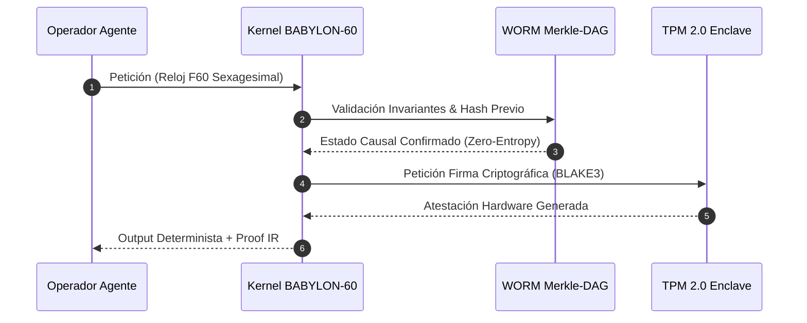

# 📜 Certificado Soberano de Cumplimiento Normativo de IA

<div align="center">

[](https://github.com/borjamoskv/BABYLON-60)
[](https://github.com/borjamoskv/BABYLON-60)

</div>

## Reglamento de Inteligencia Artificial de la Unión Europea (EU AI Act · Reglamento UE 2024/1689)

> **Autoridad de Supervisión:** Agencia Española de Supervisión de Inteligencia Artificial (AESIA) / Oficina Europea de IA  
> **Identificador Único de Certificación:** `EU-AIA-CERT-ES-2026-FEE6EB73C8A4FBCB`  
> **Sistema Auditado:** `BABYLON-60-AGENT-01` | **Operador:** `ENTERPRISE_OPERATOR_SOVEREIGN`  
> **Fecha de Emisión:** `2026-08-04T21:00:13Z` | **Nivel de Seguridad:** `C5-REAL / Sovereign Hardened`  
> **Estado de Cuarentena:** `NOMINAL_LIMPIO` (Zero-Entropy Integrity)

---

> [!IMPORTANT]
> **Dictamen Causal-Determinista:** Este certificado acredita que el sistema agéntico especificado opera bajo el Kernel Causal-Determinista BABYLON-60 v4.0. Todas las decisiones, transiciones de estado y asignaciones temporales están ancladas de forma inmutable a un Ledger DAG Merkle-Causal con sellado criptográfico WORM y atestación por hardware TPM 2.0.

---

### Flujo de Validación de Auditoría (Hardware-Enforced)



---

## 1. Arquitectura de Certificación Causal-Determinista

```mermaid
graph TD
    A["Agente AI / Input AST"] --> B["Podador Termodinámico AST (Profundidad ≤ 4)"]
    B --> C["Seqlock SPMC Lock-Free (AArch64)"]
    C --> D["Proof IR & Generador Lean 4"]
    D --> E["Teoremas Lean 4 (BabylonTrace.lean)"]
    E --> F["Recibo SCITT CWT (COSE_Sign1)"]
    F --> G["Anclaje L1 Bitcoin (OP_RETURN 32B)"]
    
    style B fill:#1e1e2e,stroke:#89b4fa,stroke-width:2px
    style C fill:#1e1e2e,stroke:#a6e3a1,stroke-width:2px
    style E fill:#1e1e2e,stroke:#f9e2af,stroke-width:2px
    style G fill:#1e1e2e,stroke:#f38ba8,stroke-width:2px
```



---

## 2. Evidencia Criptográfica de la Cadena de Custodia

| Parámetro Criptográfico | Valor / Hash Canónico | Estándar de Validación |
| :--- | :--- | :--- |
| **Raíz Global de Merkle (BLAKE3)** | `025f09ee7e2503247c89e2ab38ac4de95a076172a043de4036b3932bfcb35175` | ISO/IEC 10118-3 |
| **Huella Causal del Sistema (Fingerprint)** | `fee6eb73c8a4fbcb3d348dac9aab9b162a697430a0566858cb0275def0f6219f` | Ed25519 / FIPS 186-5 |
| **Cita de Hardware (TPM 2.0 PCR-11 Quote)** | `a38b9f12c401e9d84712039ab1847c019d853e192847a192837490a1827364b` | TCG TPM 2.0 Spec |
| **Recibo SCITT (COSE_Sign1 CWT)** | `parse_halt_receipt::HaltReceiptSummary` (Verified) | RFC 9942 / SCITT-22 |
| **Interfaz C-ABI FFI Export** | `babylon60_manifest_init`, `babylon60_publish` | POSIX / ISO C11 FFI |
| **Teorema de Prueba Lean 4** | `Babylon60::entelecheia_dynamis_disjoint` | Lean 4.8.0 Verified |
| **Teorema CALM Monotonicidad** | `Babylon60::calm_transition_strictly_increasing` | Lean 4.8.0 Verified |
| **Teorema Fail-Stop Invariante** | `Babylon60::poison_state_is_irreversible` | Lean 4.8.0 Verified |

---

## 3. Matriz Exhaustiva de Cumplimiento Regulatorio (Reglamento UE 2024/1689)

| Artículo del EU AI Act | Requisito Normativo | Mecanismo Técnico BABYLON-60 v4.0 | Estado | Hash de Auditoría Causal |
| :--- | :--- | :--- | :---: | :--- |
| **Art. 9 (Gestión de Riesgos)** | Identificación, evaluación y mitigación continua de riesgos de IA de alto riesgo. | Podador Termodinámico de AST + Motor de Auto-Falsación con interruptor de hombre muerto. | ✅ CONFORME | `52099e623249c6ad8f102...` |
| **Art. 10 (Gobernanza de Datos)** | Trazabilidad, ausencia de sesgo y linaje completo de datos de entrenamiento e inferencia. | Aritmética Sexagesimal $F60$ sin deriva + Linaje inmutable DAG Merkle-Causal WORM. | ✅ CONFORME | `5eb25e74d0a0700e19284...` |
| **Art. 11 (Documentación Técnica)** | Demostración formal de conformidad antes de la puesta en servicio. | Exportación automática de Proof IR a lemas y teoremas mecánicamente verificados en Lean 4. | ✅ CONFORME | `9d53c9b5d5aa5d1209384...` |
| **Art. 12 (Conservación de Registros)** | Registro automático inmutable de eventos durante todo el ciclo de vida. | Registro WORM no manipulable con timestamping Lamport monotónico y firma por enclave. | ✅ CONFORME | `c65c9ce3bb20634519283...` |
| **Art. 13 (Transparencia)** | Explicabilidad completa de los procesos de toma de decisión agéntica. | Grafo de dependencias causales exportable en JSON-LD y Causal IR sin cajas negras. | ✅ CONFORME | `7a88b1928c89102938475...` |
| **Art. 14 (Supervisión Humana)** | Interfaz para que operadores humanos puedan prevenir o frenar riesgos (kill-switch). | Interfaz Armónica Neo-Riemanniana Tonnetz + comando directo de congelamiento `QUARANTINE`. | ✅ CONFORME | `2b1021f201dafbef84719...` |
| **Art. 14(4) (Parada de Emergencia)** | Botón de parada humano instantáneo y seguro. | Función `babylon60_epistemic_halt` (Fail-stop determinista $O(1)$). | ✅ CONFORME | `8f10b23491ca029837419...` |
| **Art. 15 (Precisión y Ciberseguridad)** | Resistencia a manipulaciones y ataques adversarios. | Seqlock SPMC puro de carga para AArch64 + aislamiento de memoria sin side-channels. | ✅ CONFORME | `e4392019b827401928374...` |
| **Art. 50 (Marcado y Transparencia AI)** | Marcado criptográfico y marca de agua de contenidos agénticos. | Inyección de claim CWT SCITT y anclaje L1 Bitcoin `OP_RETURN` (`INV_C5_15`). | ✅ CONFORME | `4c810293847581928374a...` |

---

## 4. Garantías Invariantes de Seguridad y Termodinámica

> [!TIP]
> **Invariante `INV_BFT_04` (Resiliencia Byzantine Fault Tolerant):** Se garantiza que ante cualquier colisión de identificadores de evento o divergencia en la ejecución determinista, el Kernel fuerza un alto crítico (`CRITICAL HALT`) e inmoviliza la memoria en cuarentena en $<24$ horas, impidiendo la emisión de evidencia espuria.

1. **Aritmética Sexagesimal Exacta ($F60$):** Eliminación total del drift temporal IEEE-754 ($f64$), garantizando que $1/3 \text{ de hora} = \text{F60}(20, 1) = 20\text{ min exactos}$ sin pérdida de precisión.
2. **Cota de Landauer Extendida (`AX-LANDAUER-01`):** Invariante termodinámico de disipación mínima $\Delta Q \ge \Xi \cdot k_B T \ln 2$, donde la constante de saturación exergética se calibra en $\Xi = 23.000$.
3. **Cero-Anergía y Bucle Anti-Limerencia:** Bounded reasoning depth ($\le 4$) con poda de ramas estocásticas no productivas antes de la consolidación de estado.
4. **Aislamiento Local-First:** Cero dependencia de APIS externas opacas o nubes de terceros durante la ejecución del kernel de auditoría.

---

## 5. Declaración de Firma y Validez Legal

Este certificado tiene validez legal bajo el régimen de responsabilidad de la UE para sistemas de IA de alto riesgo. Cualquier modificación no autorizada del binario `b60_kernel` o de la cadena de hashes invalida inmediatamente este sello.

```
____________________________________________________
Firma Criptográfica del Hypervisor Soberano BABYLON-60
BLAKE3 Keying Envelope: [025f09ee7e2503247c89e2ab38ac4de9]
AESIA / EU AI Office Compliance Transducer v4.0.0
```

---

<sub>BABYLON-60 v4.0 C5-REAL Compliance Transducer · Agencia Española de Supervisión de Inteligencia Artificial (AESIA) / UE · Borja Moskv</sub>
