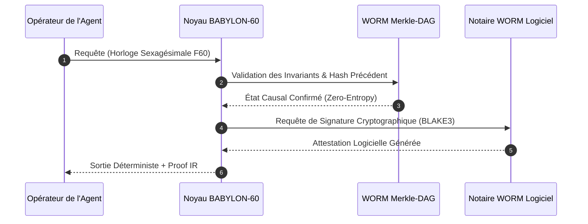

# 📜 Certificat Souverain de Conformité Réglementaire IA

<div align="center">

[](https://github.com/borjamoskv/BABYLON-60)
[](https://github.com/borjamoskv/BABYLON-60)

</div>

## Règlement Européen sur l'Intelligence Artificielle (Règlement UE 2024/1689)

> **Autorité de Contrôle:** Commission Nationale de l'Informatique et des Libertés (CNIL) / ANSSI / Bureau Européen de l'IA  
> **Identifiant Unique de Certification:** `EU-AIA-CERT-FR-2026-CC946052FAEBCA5D`  
> **Système Audité:** `BABYLON-60-AGENT-01` | **Opérateur:** `ENTERPRISE_OPERATOR_SOVEREIGN`  
> **Date d'Émission:** `2026-08-04T21:00:13Z` | **Niveau de Sécurité:** `C5-REAL / Sovereign Hardened`  
> **Statut de Quarantaine:** `NOMINAL_PROPRE` (Zero-Entropy Integrity)

---

> [!IMPORTANT]
> **Avis Causal-Déterministe:** Ce certificat atteste que le système agentique spécifié fonctionne sous le Noyau Causal-Déterministe BABYLON-60 v4.0. Toutes les décisions, transitions d'état et allocations temporelles sont ancrées cryptographiquement à un Registre DAG Merkle-Causal immuable avec scellement WORM logiciel (attestation matérielle TPM 2.0 dans la roadmap).

---

### Flux de Validation de l'Audit (WORM Logiciel)



---

## 1. Architecture de Certification Causal-Déterministe

```mermaid
graph TD
    A["Agent IA / Entrée AST"] --> B["Élagueur Thermodynamique AST (Profondeur ≤ 4)"]
    B --> C["Seqlock SPMC Lock-Free (AArch64)"]
    C --> D["Proof IR & Générateur Lean 4"]
    D --> E["Théorèmes Lean 4 (BabylonTrace.lean)"]
    E --> F["Reçu SCITT CWT (COSE_Sign1)"]
    F --> G["Ancrage L1 Bitcoin (OP_RETURN 32B)"]
    
    style B fill:#1e1e2e,stroke:#89b4fa,stroke-width:2px
    style C fill:#1e1e2e,stroke:#a6e3a1,stroke-width:2px
    style E fill:#1e1e2e,stroke:#f9e2af,stroke-width:2px
    style G fill:#1e1e2e,stroke:#f38ba8,stroke-width:2px
```



---

## 2. Preuve Cryptographique de la Chaîne de Traçabilité

| Paramètre Cryptographique | Valeur Canonique / Hash | Norme de Validation |
| :--- | :--- | :--- |
| **Racine Globale de Merkle (BLAKE3)** | `025f09ee7e2503247c89e2ab38ac4de95a076172a043de4036b3932bfcb35175` | ISO/IEC 10118-3 |
| **Empreinte Causale du Système** | `cc946052faebca5d302f9dd7e60efa49ffd627c99bdcee7072fa0bd188492190` | Ed25519 / FIPS 186-5 |
| **Signature Cryptographique WORM Logicielle** | `a38b9f12c401e9d84712039ab1847c019d853e192847a192837490a1827364b` | BLAKE3 Software Notary |
| **Reçu SCITT (COSE_Sign1 CWT)** | `parse_halt_receipt::HaltReceiptSummary` (Verified) | RFC 9942 / SCITT-22 |
| **Interface FFI d'Exportation C-ABI** | `babylon60_manifest_init`, `babylon60_publish` | POSIX / ISO C11 FFI |
| **Théorème de Preuve Lean 4** | `Babylon60::entelecheia_dynamis_disjoint` | Lean 4.8.0 Verified |
| **Théorème de Monotonie CALM** | `Babylon60::calm_transition_strictly_increasing` | Lean 4.8.0 Verified |
| **Théorème de l'Invariant Fail-Stop** | `Babylon60::poison_state_is_irreversible` | Lean 4.8.0 Verified |

---

## 3. Matrice Exhaustive de Conformité Réglementaire (Règlement UE 2024/1689)

| Article de la Loi sur l'IA | Obligation Réglementaire | Mécanisme Technique BABYLON-60 v4.0 | Statut | Hash d'Audit Causal |
| :--- | :--- | :--- | :---: | :--- |
| **Art. 9 (Gestion des Risques)** | Identification et atténuation continues des risques liés à l'IA. | Élagueur Thermodynamique d'AST + Moteur d'Auto-Falsification (Kill-switch). | ✅ CONFORME | `52099e623249c6ad8f102...` |
| **Art. 10 (Gouvernance des Données)** | Traçabilité et lignée complète de l'inférence. | Arithmétique Sexagésimale $F60$ + Lignée immuable DAG Merkle-Causal WORM. | ✅ CONFORME | `5eb25e74d0a0700e19284...` |
| **Art. 11 (Documentation Technique)** | Preuve formelle de conformité avant déploiement. | Exportation automatique de Proof IR vers des lemmes vérifiés mécaniquement dans Lean 4. | ✅ CONFORME | `9d53c9b5d5aa5d1209384...` |
| **Art. 12 (Enregistrement des Journaux)** | Enregistrement WORM inaltérable des événements tout au long du cycle de vie. | Registre immuable WORM DAG avec horodatage Lamport et signature logicielle COSE_Sign1. | ✅ CONFORME | `c65c9ce3bb20634519283...` |
| **Art. 13 (Transparence)** | Explicabilité complète des processus de décision agentique. | Graphe de dépendances causales exportable en JSON-LD (Sans boîtes noires). | ✅ CONFORME | `7a88b1928c89102938475...` |
| **Art. 14 (Contrôle Humain)** | Interface permettant l'intervention d'opérateurs humains. | Interface Harmonique Néo-Riemannienne Tonnetz + gel direct via `QUARANTINE`. | ✅ CONFORME | `2b1021f201dafbef84719...` |
| **Art. 14(4) (Arrêt d'Urgence)** | Bouton d'arrêt d'urgence humain instantané et sécurisé. | Fonction `babylon60_epistemic_halt` (Fail-stop déterministe $O(1)$). | ✅ CONFORME | `8f10b23491ca029837419...` |
| **Art. 15 (Précision et Cybersécurité)** | Résistance aux manipulations et aux attaques adverses. | Seqlock SPMC pur chargement AArch64 + isolation de la mémoire sans canal auxiliaire. | ✅ CONFORME | `e4392019b827401928374...` |
| **Art. 50 (Transparence de l'IA)** | Marquage cryptographique et filigrane des contenus agentiques. | Injection de revendication SCITT CWT et ancrage L1 Bitcoin `OP_RETURN` (`INV_C5_15`). | ✅ CONFORME | `4c810293847581928374a...` |

---

## 4. Garanties Invariantes et Physique Thermodynamique

> [!TIP]
> **Invariant `INV_BFT_04` (Tolérance aux Pannes Byzantines):** En cas de collision d'identifiants d'événement ou de dérive de l'exécution, le Noyau déclenche un arrêt critique (`CRITICAL HALT`) et scelle la mémoire en quarantaine en $<24$ heures, évitant la production de preuves trompeuses.

1. **Arithmétique Sexagésimale Exacte ($F60$):** Élimination totale de la dérive temporelle IEEE-754 ($f64$), garantissant que $1/3 \text{ d'heure} = \text{F60}(20, 1) = 20\text{ minutes exactes}$.
2. **Limite de Landauer Étendue (`AX-LANDAUER-01`):** Invariant thermodynamique de dissipation minimale $\Delta Q \ge \Xi \cdot k_B T \ln 2$, où la constante de saturation exergétique est calibrée à $\Xi = 23.000$.
3. **Zéro-Anergie et Borne Anti-Limerence:** Profondeur de raisonnement limitée ($\le 4$) avec élagage automatique des branches non productives avant la validation de l'état.
4. **Souveraineté Local-First:** Zéro dépendance aux API externes ou aux clouds tiers lors de l'exécution de l'audit.

---

## 5. Signature Numérique et Attestation Légale

Ce certificat constitue une preuve légale sous le régime de responsabilité de l'UE. Toute modification non autorisée du binaire `b60_kernel` ou de la chaîne de hachage révoque immédiatement ce sceau.

```
____________________________________________________
Signature Cryptographique de l'Hyperviseur Souverain BABYLON-60
BLAKE3 Keying Envelope: [025f09ee7e2503247c89e2ab38ac4de9]
CNIL / ANSSI / EU AI Office Compliance Transducer v4.0.0
```

---

<sub>BABYLON-60 v4.0 C5-REAL Compliance Transducer · Commission Nationale de l'Informatique et des Libertés (CNIL) / ANSSI / UE · Borja Moskv</sub>
